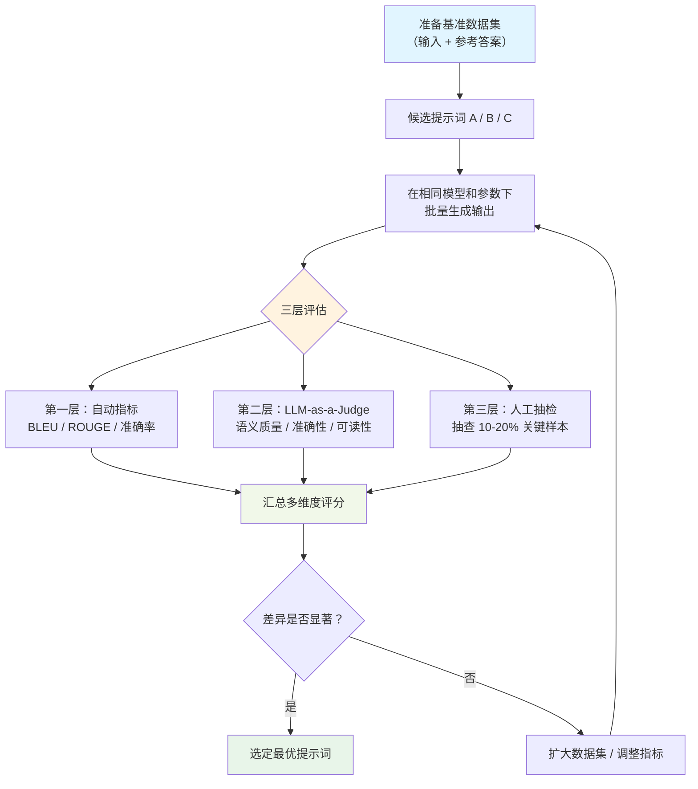

# 提示词评估（Prompt Evaluation）

## 概念解释

提示词评估（Prompt Evaluation）是一套用来量化"提示词到底好不好用"的科学方法。它把原本凭感觉判断的"这个提示词效果不错"变成可以用数字说话的"这个提示词在 200 个测试样本上准确率 87%、可读性评分 4.2/5"。

为什么需要它？因为 LLM 的输出具有非确定性——同一个提示词跑 10 次可能得到 10 个不同的回答。如果只凭人眼看几个案例就做决策，很容易犯"以偏概全"的错误：提示词 A 在你随手测的 3 个问题上表现好，但面对真实用户的 1000 种问法时可能一塌糊涂。

提示词评估在 Agent/AI 系统中扮演"质量检测员"的角色。它贯穿提示词的整个生命周期：开发阶段用评估来选最优版本，上线后用评估来监控性能退化，模型升级时用评估来验证兼容性。没有评估体系的提示词优化就像蒙眼开车——你不知道自己是在前进还是在倒退。

## 关键结构

提示词评估由三根支柱撑起，缺一不可：

| 结构 | 作用 | 说明 |
|------|------|------|
| 评估指标（Metrics） | 定义"好"的标准 | 确定用什么数字来衡量提示词质量 |
| 基准数据集（Benchmark Dataset） | 提供"考试题" | 一组代表真实场景的标准化测试样本 |
| 评估方法（Evaluation Method） | 决定"谁来打分" | 自动评估、LLM-as-a-Judge、人工评估三种路径 |

### 结构 1：评估指标

评估指标分两大类：

**自动指标**——机器算出来的分数，不需要人参与：
- **准确率（Accuracy）**：输出和标准答案完全一致的比例，适合分类、信息抽取等有明确答案的任务
- **BLEU / ROUGE**：衡量生成文本和参考文本的词汇重叠程度。BLEU 看精确率（生成了多少正确的词），ROUGE 看召回率（参考答案里的词被覆盖了多少）
- **语义相似度（Cosine Similarity）**：通过向量计算输出和参考答案在语义空间的距离，适合没有唯一标准答案的开放式任务
- **BERTScore**：基于预训练模型的语义匹配分数，比 BLEU/ROUGE 更能捕捉同义替换

**人工指标**——需要人来判断的分数：
- **Likert 评分**：评估者在 1-5 分之间打分
- **二元判断**：合格/不合格，通过/不通过
- **相对排序**：对多个输出排名次，判断哪个最好

### 结构 2：基准数据集

基准数据集就是提示词的"模拟考试卷"。一份合格的数据集要满足：

- **代表性**：覆盖真实使用场景中的各种难度和边界情况
- **适度规模**：小任务至少 100-200 个样本，泛化测试 500+ 以上
- **标注明确**：每个样本都有清晰的预期输出或评判标准
- **多元化**：样本来源、风格、难度要分布均衡，不能都是"简单题"

### 结构 3：评估方法

三种评估路径，适用场景不同：

- **自动评估**：用算法计算分数（BLEU、ROUGE 等），速度快、成本低、可复现，但捕捉不了细微的语义差异
- **LLM-as-a-Judge**：用另一个 LLM 充当评审，兼具语义理解能力和自动化效率，是当前主流方案
- **人工评估**：人类评估者逐条打分，准确度最高，但贵、慢、评估者之间一致性难保证

## 核心原理

### 原理说明

提示词评估的核心逻辑是"控制变量的对比实验"：

1. **固定基准**：准备一组标准化的测试输入和参考答案
2. **控制变量**：只改变被测试的提示词，保持模型、温度、其他参数不变
3. **批量执行**：让每个候选提示词在全部测试样本上跑一遍，收集输出
4. **多维打分**：用自动指标 + LLM-as-a-Judge + 人工抽检三层评估，得到多维度分数
5. **统计分析**：计算平均分、标准差、分类别表现，判断差异是否统计显著
6. **迭代优化**：根据评估结果定位弱项，针对性修改提示词，再重新评估

其中，LLM-as-a-Judge 是当前最重要的评估方法。它的工作方式是：给一个"评委模型"（通常是 GPT-4 或 Claude 等能力较强的模型）一段结构化的评估提示（Evaluation Prompt），包含评估标准（Rubric）、原始输入、参考答案和待评输出，让评委模型按评分维度逐项打分并给出理由。研究显示，GPT-4 作为评委与人类专家的判断一致性约为 80%，已经接近人类评估者之间的一致性水平。

2025 年的新进展包括：**RocketEval**（ICLR 2025）通过三阶段框架（生成逐条核查清单 -> 轻量模型逐项评分 -> 汇总计算），让 Mistral-Nemo 级别的小模型也能达到与 GPT-4o 相当的评估质量，Spearman 相关性达到 0.986。**G-Eval** 让 LLM 先通过链式思考（Chain-of-Thought）生成评估步骤，再按步骤打分，提高了评估的可解释性和一致性。

### Mermaid 图解



图解要点：
- 三层评估形成互补：自动指标提供基线分数，LLM-as-a-Judge 捕捉语义质量，人工抽检纠正机器评估的偏差
- "差异是否显著"这一步至关重要——如果两个提示词的分数差距在误差范围内，盲目选择"分数高 0.01"的那个没有意义
- 整个流程是循环的：评估结果不理想时回到数据集和指标设计环节重新调整

### 运行示例

以下示例展示用 LLM-as-a-Judge 方法评估两个提示词版本的核心逻辑。

基于 openai==1.3.0 验证（截至 2026-03）

```python
from openai import OpenAI
from pydantic import BaseModel

client = OpenAI()


class EvaluationScore(BaseModel):
    accuracy: int
    completeness: int
    readability: int
    avg: float


# 两个候选提示词
prompts = {
    "v1_基础版": "你是一个客服机器人。用友善的语气回答用户的问题。",
    "v2_结构化版": (
        "你是一个专业的客服机器人。请：\n"
        "1. 准确理解用户的问题\n"
        "2. 提供具体的解决方案或信息\n"
        "3. 使用清晰、专业的语言\n"
        "4. 如果无法完全解决，提供进一步的联系方式"
    ),
}

# 基准测试样本（实际应有 100+ 条）
test_cases = [
    {"input": "请问你们的退货流程是什么？", "reference": "14天无理由退货，登录账户选择商品申请即可"},
    {"input": "订单显示已发货但没有物流信息", "reference": "物流信息通常有2-4小时延迟，建议稍后刷新"},
]

# LLM-as-a-Judge 评估函数
def judge_response(user_input: str, reference: str, response: str) -> EvaluationScore:
    """用 LLM 对单条回复进行多维度评分"""
    judge_prompt = f"""请评估以下客服回复的质量。

【用户问题】{user_input}
【参考答案】{reference}
【待评回复】{response}

按以下维度打分（1-5 分）：
- accuracy：回答是否准确
- completeness：信息是否完整
- readability：表述是否清晰易懂

请只返回 JSON 对象，字段为 accuracy、completeness、readability、avg。"""

    completion = client.chat.completions.parse(
        model="gpt-4o-2024-08-06",
        messages=[{"role": "user", "content": judge_prompt}],
        response_format=EvaluationScore,
        temperature=0,  # 评估时设为 0 以提高一致性
    )
    message = completion.choices[0].message
    if not message.parsed:
        raise ValueError(f"评委模型未返回结构化结果：{message.refusal}")
    return message.parsed


# 对每个提示词版本执行评估
for name, prompt in prompts.items():
    scores = []
    for case in test_cases:
        # 用候选提示词生成回复
        resp = client.chat.completions.create(
            model="gpt-4o-mini",
            messages=[
                {"role": "system", "content": prompt},
                {"role": "user", "content": case["input"]}
            ],
            temperature=0.7
        )
        output = resp.choices[0].message.content or ""
        # LLM-as-a-Judge 打分
        score = judge_response(case["input"], case["reference"], output)
        scores.append(score)

    avg = sum(s.avg for s in scores) / len(scores)
    print(f"{name}：平均分 {avg:.2f}/5")
```

代码对应的核心机制：每个候选提示词在相同的测试样本上生成回复，再由独立的评委模型按统一标准打分。`temperature=0` 用于评分环节以保证一致性，而生成环节保留 `temperature=0.7` 以模拟真实使用场景。实际生产中测试样本应扩展到 100+ 条，并加上按类别的分层分析。

## 易混概念辨析

| 概念 | 与提示词评估的区别 | 更适合关注的重点 |
|------|---------------------|------------------|
| 模型评估（Model Evaluation） | 评估的是模型本身的能力（如 MMLU 跑分），不针对特定提示词 | 模型选型、版本对比 |
| 提示词优化（Prompt Optimization） | 优化是"改进提示词"的动作，评估是"衡量改进效果"的度量 | 修改策略、迭代方法 |
| A/B 测试（A/B Testing） | A/B 测试是在线上真实流量中对比效果，评估可以在离线数据集上进行 | 上线后的用户行为数据 |
| 基准测试（Benchmarking） | 基准测试通常用标准数据集评估模型通用能力，提示词评估关注特定提示词在特定任务上的表现 | 通用能力排名 |

核心区别：

- **提示词评估**：聚焦于"这个提示词在这个任务上的效果如何"，是提示词维度的质量度量
- **模型评估**：聚焦于"这个模型的整体能力如何"，是模型维度的能力度量
- **提示词优化**：评估提供数据支撑，优化负责执行改进，两者是"测量"和"改造"的关系

## 适用边界与局限

### 适用场景

1. **多版本提示词选型**：有 2 个以上候选提示词需要做决策时，评估框架帮助用数据说话，避免拍脑袋选择
2. **模型升级兼容性验证**：从 GPT-3.5 升级到 GPT-4、或从 OpenAI 切换到 Claude 时，用评估判断原有提示词是否需要调整
3. **生产环境持续监控**：提示词上线后用户问法多样化、数据分布漂移，需要持续评估来发现性能退化
4. **团队协作规范化**：多人团队编写提示词时，评估框架提供统一的质量标准，避免各自为战

### 不适合的场景

1. **一次性简单任务**：如果只是写一个临时提示词用一次，搭建评估框架的成本远大于收益
2. **高度创意性任务**：写诗、创作故事等任务的"好坏"极度主观，自动指标和 LLM-as-a-Judge 都难以准确衡量

### 局限性

1. **数据集质量天花板**：评估结果的上限由基准数据集的质量决定。如果数据集不代表真实场景，评估分数再高也没意义
2. **LLM-as-a-Judge 的已知偏差**：长度偏差（倾向给更长的回复打高分）、风格偏差（偏好与自身训练风格相似的输出）、自我偏好（如 Claude 当评委时可能更偏好 Claude 的输出）、位置偏差（在配对比较中倾向选第一个选项）
3. **指标与真实体验的鸿沟**：有时评估指标全绿，但用户实际使用时并不满意——这就是"指标陷阱"。评估只是代理指标，最终要看真实用户反馈
4. **评估本身的成本**：使用 LLM-as-a-Judge 每次评估都要调 API，大规模评估的成本和延迟不容忽视

## 常见误区

| 常见误区 | 正确理解 |
|----------|----------|
| 一个指标就能评估提示词质量 | 不同指标衡量不同维度。一个提示词可能准确率高但可读性差，必须用多维度指标组合来评估 |
| LLM-as-a-Judge 的评分就是真理 | LLM 评估本身有偏差（长度偏差、风格偏差、自我偏好等），需要定期用人工评估来校准。不同 LLM 对同一输出的打分可能差异明显 |
| 基准数据集越大越好 | 关键是代表性和多样性，不是规模。100 个覆盖各类场景的高质量样本，比 1000 个同质化样本更有价值 |
| 评估指标高 = 用户体验好 | 典型的"代理指标陷阱"。必须同时收集真实用户反馈，评估分数只是参考，不是终审 |
| 人工评估一定比自动评估准 | 人工评估准确但贵、慢、且评估者之间的一致性难保证。最优方案是"自动批量筛选 + 人工关键抽检"的分级组合 |

## 思考题

<details>
<summary>初级：提示词评估中"三层评估"分别指什么？为什么需要三层而不是只用一层？</summary>

**参考答案：**

三层评估指：自动指标（BLEU/ROUGE/准确率）、LLM-as-a-Judge（语义质量评分）、人工抽检（关键样本人工复核）。只用一层不够是因为各层有互补性：自动指标快但浅，只能比较词汇层面的匹配；LLM-as-a-Judge 能理解语义但有系统性偏差；人工评估最准确但无法覆盖全量样本。三层组合才能兼顾效率、深度和准确性。

</details>

<details>
<summary>中级：你正在用 LLM-as-a-Judge 评估一组提示词，发现评委模型总是给更长的回复打更高分，即使长回复含有冗余信息。你该如何应对？</summary>

**参考答案：**

这是 LLM-as-a-Judge 的"长度偏差"问题。应对方法包括：(1) 在评估提示中明确加入"长度不影响评分，冗余信息应扣分"的指令；(2) 在评估维度中单独加一项"简洁性"指标；(3) 将评估拆为多个独立维度（准确性、完整性、简洁性）分别打分，再加权汇总；(4) 用不同的评委模型（如 GPT-4 和 Claude）分别评估，交叉验证；(5) 对一定比例的样本做人工复核，校准 LLM 评委的偏差。

</details>

<details>
<summary>中级/进阶：你的客服机器人提示词上线 3 个月后，用户投诉增多，但离线评估分数没有下降。请分析可能原因并设计应对方案。</summary>

**参考答案：**

最可能的原因是"数据分布漂移"：3 个月来用户的问法、关注点发生了变化（比如新促销活动带来新类型的咨询），但基准数据集还是旧的，评估覆盖不到新场景。应对方案：(1) 从生产日志中采样最近的用户问题，更新基准数据集；(2) 按时间维度对比评估分数变化趋势；(3) 对用户投诉的具体 case 做根因分析，识别是哪类问题出了问题；(4) 建立持续监控机制，每周自动从线上流量采样评估，设置性能告警阈值。

</details>

## 参考资料

1. Confident AI. "LLM Evaluation Metrics: The Ultimate LLM Evaluation Guide." https://www.confident-ai.com/blog/llm-evaluation-metrics-everything-you-need-for-llm-evaluation
2. Evidently AI. "LLM-as-a-Judge: A Complete Guide to Using LLMs for Evaluations." https://www.evidentlyai.com/llm-guide/llm-as-a-judge
3. Langfuse. "LLM-as-a-Judge Evaluation: Complete Guide." https://langfuse.com/docs/evaluation/evaluation-methods/llm-as-a-judge
4. Sebastian Raschka. "Understanding the 4 Main Approaches to LLM Evaluation." https://magazine.sebastianraschka.com/p/llm-evaluation-4-approaches
5. Anthropic Engineering. "Demystifying Evals for AI Agents." https://www.anthropic.com/engineering/demystifying-evals-for-ai-agents
6. Maxim AI. "Prompt Evaluation Frameworks: Measuring Quality, Consistency, and Cost at Scale." https://www.getmaxim.ai/articles/prompt-evaluation-frameworks-measuring-quality-consistency-and-cost-at-scale/
