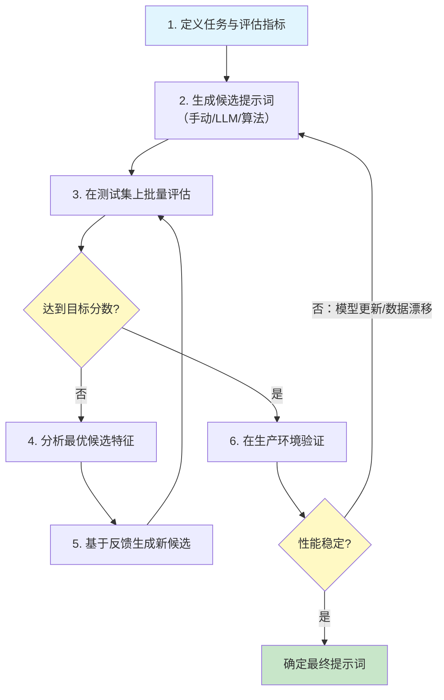
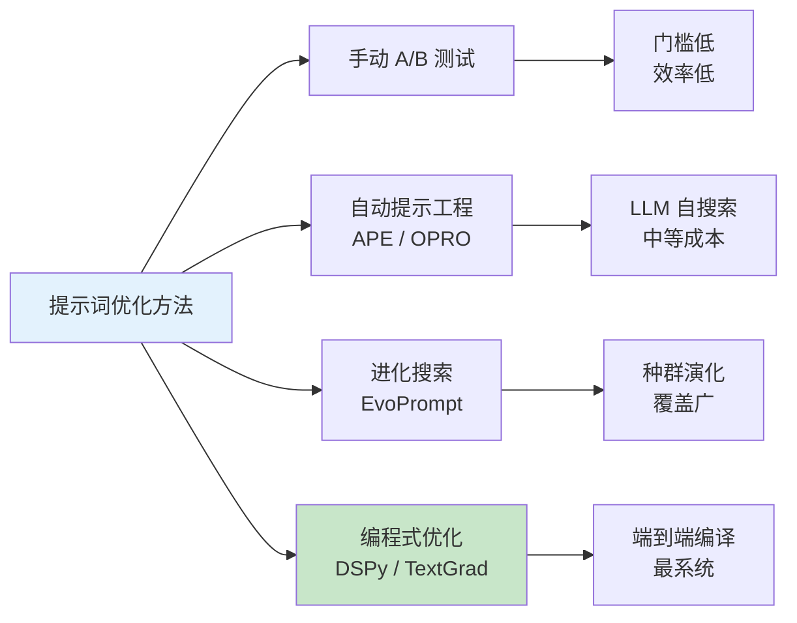

# 提示词优化（Prompt Optimization）

## 概念解释

提示词优化是指通过系统化的方法，让同一个 LLM 在同一个任务上产出更好结果的过程。它的核心思想是把提示词从"手工艺品"变成"可调参数"——就像训练神经网络时调整权重一样，只不过这里调整的是自然语言文本。

为什么需要它？因为手动写提示词有三个天然瓶颈：一是效率低，工程师凭经验反复试错，几天才能找到一个"还行"的版本；二是不可复现，同一个人换个时间写可能结果完全不同；三是不可迁移，换个模型版本或换个任务，之前的提示词大概率失效。提示词优化就是为了解决这三个问题而诞生的。

与传统的 Prompt Engineering（手写提示词技巧）不同，提示词优化强调的是"闭环"——有明确的评估指标、有自动化的搜索过程、有可量化的改进幅度。它不取代手工设计，而是在手工设计的基础上加入科学的优化循环，让提示词质量可度量、可持续改进。

## 关键结构

提示词优化由四个相互依赖的组成部分构成，缺少任何一个都会导致优化过程失效：

| 结构 | 作用 | 说明 |
|------|------|------|
| 评估体系 | 衡量提示词的好坏 | 没有评估就没有方向，是优化的基石 |
| 候选生成 | 批量产出提示词变体 | 决定搜索空间的广度 |
| 搜索算法 | 在候选中找到最优解 | 决定优化效率和收敛速度 |
| 验证监控 | 在真实环境中确认效果 | 防止过拟合测试集 |

### 结构 1：评估体系

评估体系决定了"什么算好"。常见的评估手段分三层：

- **自动化指标**：准确率、F1、BLEU/ROUGE 等。计算快、成本低，适合在优化循环中高频使用。
- **LLM-as-Judge（LLM 当评委）**：用一个强模型（如 GPT-4o、Claude）给另一个模型的输出打分。比自动指标更灵活，但成本更高。
- **人工标注**：作为"金标准"校准前两者。在关键项目中不可替代。

测试集的质量同样关键——需要覆盖简单、复杂、边界等多种场景，通常 100~1000 条样本即可。

### 结构 2：候选生成

候选生成的方式直接决定了搜索空间：

- **手动设计**：工程师凭经验写几个变体。效率低但质量稳定，适合作为起始点。
- **LLM 批量生成**：让 LLM 一次性产出 50~100 个变体。简单高效但质量参差不齐。
- **变异演化**：从当前最优提示词出发，通过改写、增删、重组等方式衍生新候选（APE、EvoPrompt 等方法的核心思路）。
- **参数化搜索**：将提示词的某些成分（示例数量、输出格式、角色设定等）参数化，用网格搜索或贝叶斯优化来调优（OPRO、MIPROv2 等方法的核心思路）。

### 结构 3：搜索算法

搜索算法决定了如何从大量候选中高效找到最优解：

- **贪心搜索**：每轮保留 Top-K，从它们出发生成下一轮。简单有效，是多数工程实践的首选。
- **进化算法**：将提示词看作"基因"，通过交叉、变异、选择进行演化。搜索空间覆盖更广，避免局部最优。
- **贝叶斯优化**：建立性能分布的概率模型，智能选择下一个评估点。DSPy MIPROv2 采用此方法。
- **文本梯度**：用 LLM 的反馈模拟"梯度"，沿反馈方向迭代改进提示词。TextGrad 的核心思路。

### 结构 4：验证监控

找到"最优提示词"之后，还需要在生产环境中验证：

- 对比优化前后在真实数据上的表现差异
- 持续监控性能指标，防止因模型更新或数据漂移导致效果衰退
- 一旦性能下降超过阈值，触发重新优化流程

## 核心原理

### 原理说明

提示词优化的本质是在一个**离散且高维的自然语言空间**中进行搜索。与神经网络优化不同，提示词空间无法直接求梯度，因此需要借助启发式搜索或 LLM 自身的语言理解能力来探索。

整个优化过程形成一个闭环：

1. **定义目标**：明确任务类型和评估指标（准确率、可读性、用户满意度等）
2. **生成候选**：通过手动设计、LLM 生成或算法变异，产出一批提示词候选
3. **批量评估**：在测试集上运行每个候选，收集性能数据
4. **分析反馈**：找出表现最好的候选，分析其共同特征
5. **迭代改进**：基于反馈生成新一轮候选，重复步骤 3~4
6. **收敛确认**：当改进幅度低于阈值或达到目标分数时停止，进入生产验证

优化目标可以形式化为：$\arg\max_p \text{Score}(p)$，其中 $p$ 是提示词，Score 是评估函数。实际工程中通常还需要平衡多个维度（准确率、成本、延迟等），形成多目标优化问题。

### Mermaid 图解



上图展示了提示词优化的完整闭环。有两个关键回路需要注意：

- **内循环**（节点 3→4→5→3）：核心优化循环，通过反复评估和改进逼近最优解。这个循环通常执行 5~20 轮。
- **外循环**（节点 7→2）：生产环境监控回路。当模型版本更新或数据分布发生变化时，自动触发重新优化。

### 运行示例

以下用伪代码展示提示词优化的核心循环逻辑：

```python
# 提示词优化核心循环（伪代码）
# 展示评估-搜索-迭代的基本机制

from typing import List, Callable

def optimize_prompt(
    initial_prompts: List[str],       # 初始候选提示词
    evaluate: Callable,               # 评估函数：prompt → 分数
    generate_variants: Callable,      # 变体生成函数：prompts → 新候选
    max_rounds: int = 10,             # 最大迭代轮数
    target_score: float = 0.9,        # 目标分数
    top_k: int = 3                    # 每轮保留的最优数量
) -> str:
    """贪心搜索策略的提示词优化"""

    candidates = initial_prompts

    for round_num in range(max_rounds):
        # 第一步：评估所有候选
        scored = [(p, evaluate(p)) for p in candidates]
        scored.sort(key=lambda x: x[1], reverse=True)

        best_prompt, best_score = scored[0]
        print(f"第 {round_num + 1} 轮 | 最优分数: {best_score:.3f}")

        # 达到目标分数，提前终止
        if best_score >= target_score:
            return best_prompt

        # 第二步：保留 Top-K，生成新变体
        top_prompts = [p for p, s in scored[:top_k]]
        candidates = generate_variants(top_prompts)

    return best_prompt
```

`evaluate` 函数封装了"在测试集上运行提示词并计算分数"的逻辑。`generate_variants` 函数封装了候选生成策略（可以是 LLM 生成、规则变异或进化算法）。实际框架如 DSPy 在此基础上加入了贝叶斯优化、Few-Shot 自动选择等更复杂的机制。

## 四大优化方法详解

提示词优化经历了从手动到自动的演进，目前工业界和学术界主流的方法可归纳为以下四类：



### 方法 1：手动 A/B 测试

最基础的优化方式。准备两个或多个提示词版本，在相同测试集上评估，选表现更好的。

- **适合场景**：项目初期快速验证、测试集规模小（<50 条）
- **典型流程**：写 2~3 个变体 → 在 10~20 条样本上跑 → 人工比较输出质量
- **局限**：搜索空间极小（人能想到的变体有限），无法系统化扩展

### 方法 2：自动提示工程（APE / OPRO）

用 LLM 自己来生成和评估提示词，形成自动化闭环。

**APE（Automatic Prompt Engineer）**：让 LLM 生成大量提示词候选，逐一评估后选择最优。APE 发现的 Zero-Shot CoT 提示词比人工设计的"Let's think step by step"效果更好。

**OPRO（Optimization by PROmpting）**：将优化过程本身编码为一个 meta-prompt，每轮把历史候选及其分数作为上下文，让 LLM 基于这些历史"轨迹"提出新候选。在 GSM8K 数学推理上，OPRO 将零样本准确率从 71.8% 提升到 80.2%。

### 方法 3：进化搜索（EvoPrompt）

借鉴生物进化算法，将提示词视为"基因"，通过交叉、变异、自然选择机制进行种群演化。

- **交叉**：将两个高分提示词的不同部分组合成新候选
- **变异**：对高分提示词进行局部改写（增删语句、替换措辞等）
- **选择**：保留每代中表现最好的个体，淘汰低分者

EvoPrompt 在 BBH（Big-Bench Hard）上比 APE 最高提升 25%，但优化轨迹的稳定性不如 OPRO。

### 方法 4：编程式优化（DSPy / TextGrad）

最新一代方法，将提示词优化融入编程范式，实现端到端的自动编译。

**DSPy**：斯坦福团队开发的框架，核心理念是"编程而非提示"。开发者用 Signature（签名）定义输入输出，用 Module 组装逻辑流水线，然后交给 Optimizer 自动编译出最优提示词。其旗舰优化器 **MIPROv2** 采用三阶段流程：

1. **Bootstrapping（引导）**：运行程序收集高质量的输入输出示例
2. **Grounded Proposal（有据提案）**：结合代码结构、数据特征和示例，批量生成候选指令
3. **Bayesian Search（贝叶斯搜索）**：用贝叶斯优化在候选空间中高效搜索最优组合

实测效果：在 HotPotQA 上，MIPROv2 将 ReAct Agent 的准确率从 24% 提升到 51%。

**TextGrad**：斯坦福团队开发、发表在 Nature 上的框架。它借鉴反向传播的思路，用 LLM 的文本反馈模拟"梯度"，沿反馈方向迭代改进提示词。TextGrad 能将 GPT-3.5 的推理性能推到接近 GPT-4 的水平。

### 方法对比速览

| 方法 | 搜索策略 | 自动化程度 | 典型成本 | 适合场景 |
|------|---------|-----------|---------|---------|
| 手动 A/B | 人工枚举 | 低 | 极低 | 项目初期快速验证 |
| APE / OPRO | LLM 自搜索 | 中 | $5~20 | 单任务提示词调优 |
| EvoPrompt | 进化算法 | 中高 | $10~50 | 需要广覆盖搜索的复杂任务 |
| DSPy MIPROv2 | 贝叶斯优化 | 高 | $2~50 | 多模块 Agent 管线的系统优化 |
| TextGrad | 文本梯度下降 | 高 | $10~50 | 复合 AI 系统的端到端优化 |

## 易混概念辨析

| 概念 | 与提示词优化的区别 | 更适合关注的重点 |
|------|-------------------|------------------|
| Prompt Engineering | 手动设计提示词的技巧和方法论 | 写出好提示词的经验法则 |
| Prompt Tuning | 在模型嵌入层添加可训练的连续向量 | 模型参数层面的轻量微调 |
| Fine-Tuning（微调） | 修改模型内部权重以适应特定任务 | 当提示词优化无法达到要求时的升级方案 |
| Context Engineering | 管理整个上下文窗口的内容组织 | 比提示词优化范围更广，涉及全部输入信息管理 |

核心区别：

- **提示词优化**：在不修改模型参数的前提下，通过系统化搜索找到最优的自然语言提示词
- **Prompt Engineering**：提示词优化的子集，侧重手动设计技巧；提示词优化在其基础上加入了自动化搜索
- **Prompt Tuning**：虽然名字相近，但操作的对象完全不同——Prompt Tuning 调的是连续向量（需要梯度计算），提示词优化调的是离散文本
- **Fine-Tuning**：修改模型内部权重，成本和复杂度远高于提示词优化，但效果上限也更高

## 适用边界与局限

### 适用场景

1. **有明确评估指标的任务**：QA 系统（准确率）、代码生成（通过率）、分类任务（F1 分数）等。评估指标越清晰，优化效果越好。
2. **需要适配模型更新的系统**：当基础模型升级（如 GPT-4 → GPT-4o）时，优化流程可以快速在新模型上重跑，几小时内完成重新适配。
3. **多模块 Agent 管线**：使用 DSPy 等框架，可以同时优化管线中每个模块的提示词，整体效果远优于逐个手动调试。
4. **需要跨语言/跨模型部署的场景**：编程式优化框架（DSPy）的 Signature 可以跨模型复用，同一套定义在 GPT-4o、Claude、Llama 上都能自动编译出适配的提示词。

### 不适合的场景

1. **没有评估标准的开放式创作**：写诗、写小说等没有客观"对错"的任务，难以定义评估函数，优化循环无法形成闭环。
2. **一次性使用的简单任务**：如果只是写一封邮件或翻译一段话，搭建优化流程的成本远超手动调试。
3. **对延迟极度敏感的实时场景**：优化编译本身需要 100~500 次 LLM 调用（10~30 分钟），不适合需要即时响应的场景。

### 局限性

1. **评估质量是天花板**：如果评估指标设计有偏差或测试集不够代表性，优化出来的"最优提示词"在生产环境中可能表现不佳。评估体系本身的建设往往比优化过程更难。
2. **过拟合风险**：优化过程可能学到的是"适应测试集的特殊措辞"而非"真正有效的通用策略"。需要用独立的验证集来检测过拟合。
3. **跨模型不可迁移**：在 OpenAI 模型上优化的提示词，换到开源模型（如 Llama、Qwen）上大概率需要重新优化。
4. **成本随规模线性增长**：100 个候选 x 100 条测试样本 = 10,000 次 API 调用。如果用高端模型做评估，成本会非常可观。

## 常见误区

| 常见误区 | 正确理解 |
|----------|----------|
| 提示词越长越详细效果越好 | 优化的目标是找到"最小充分"的提示词——简洁但完整。冗余信息可能分散模型注意力，反而降低性能 |
| 一个优化好的提示词可以通用于所有模型 | 不同模型对提示词的敏感度和偏好不同。GPT-4o 上最优的提示词在 Claude 或 Llama 上未必最优，需要针对具体模型单独优化 |
| 有了自动优化就不需要手动设计了 | 手动设计提供高质量的起始点和搜索方向，自动优化在此基础上进行系统探索。两者互补，不是替代关系 |
| 优化的唯一目标是准确率 | 真实应用需要平衡准确率、成本、延迟、可解释性等多个维度。单一指标优化可能导致其他维度严重劣化 |
| 自动优化出的提示词一定比人写的好 | 自动优化的优势在于搜索效率，但如果评估指标有偏差或测试集质量差，优化结果可能朝错误方向收敛 |

## 思考题

<details>
<summary>初级：提示词优化的四个核心组成部分是什么？为什么"评估体系"被称为基石？</summary>

**参考答案：**

四个核心组成部分是：评估体系、候选生成、搜索算法、验证监控。

评估体系是基石，因为没有评估就没有优化方向——搜索算法需要评估分数来判断哪个候选更好，候选生成需要评估反馈来决定改进方向，验证监控需要评估指标来检测性能衰退。如果评估体系有偏差，整个优化链条都会朝错误方向运行。

</details>

<details>
<summary>中级：APE、OPRO、EvoPrompt 三种方法分别适合什么场景？如果你要优化一个 RAG 系统的检索提示词，会选择哪种方法？为什么？</summary>

**参考答案：**

- APE 适合快速获得比人工设计更好的基线提示词，操作简单，成本低。
- OPRO 适合需要沿优化轨迹逐步改进的场景，收敛更稳定。
- EvoPrompt 适合搜索空间复杂、需要广覆盖探索的任务。

对于 RAG 系统的检索提示词，建议选择 OPRO 或 DSPy MIPROv2。原因：RAG 检索质量有明确的评估指标（召回率、相关性分数），且检索提示词通常需要精细调优而非大范围探索。OPRO 的渐进式优化轨迹适合这种精细调优需求。如果 RAG 管线包含多个模块（查询改写、检索、生成），则 DSPy MIPROv2 可以同时优化所有模块的提示词。

</details>

<details>
<summary>进阶：某公司的客服 QA 系统在 GPT-4 上优化后准确率达到 92%，但切换到开源模型 Llama-3 后准确率骤降到 68%。请分析可能的原因，并设计一个应对方案。</summary>

**参考答案：**

原因分析：
1. **跨模型不可迁移**：在 GPT-4 上优化的提示词利用了 GPT-4 特有的理解模式和指令跟随能力，Llama-3 的能力分布不同。
2. **格式敏感性差异**：GPT-4 对结构化指令（如 Markdown 格式、编号步骤）的响应更稳定，Llama-3 可能对此不敏感或响应模式不同。
3. **上下文处理差异**：两个模型对长上下文和 Few-Shot 示例的利用效率不同。

应对方案：
1. 在 Llama-3 上重新运行优化流程（使用相同的评估体系和测试集），针对 Llama-3 的特点重新搜索最优提示词。
2. 使用 DSPy 的 Signature 机制——定义一次输入输出规范，分别在 GPT-4 和 Llama-3 上编译出各自的最优提示词。
3. 评估 Llama-3 在该任务上的能力上限。如果优化后仍无法达标，考虑对 Llama-3 进行领域微调，或退回使用 GPT-4。

</details>

## 参考资料

1. Zhou, Y. et al. (2023). "Large Language Models Are Human-Level Prompt Engineers." ICLR 2023. https://arxiv.org/abs/2211.01910
2. Yang, C. et al. (2023). "Large Language Models as Optimizers (OPRO)." https://arxiv.org/abs/2309.03409
3. Guo, Q. et al. (2023). "EvoPrompt: Connecting Large Language Models with Evolutionary Algorithms Yields Powerful Prompt Optimizers." https://arxiv.org/abs/2309.08532
4. Khattab, O. et al. (2023). "DSPy: Compiling Declarative Language Model Calls into Self-Improving Pipelines." https://github.com/stanfordnlp/dspy
5. Yuksekgonul, M. et al. (2024). "TextGrad: Automatic 'Differentiation' via Text." Published in Nature. https://arxiv.org/abs/2406.07496
6. DSPy MIPROv2 官方文档. https://dspy.ai/api/optimizers/MIPROv2/
7. Prompt Engineering Guide - APE 技术. https://www.promptingguide.ai/techniques/ape
