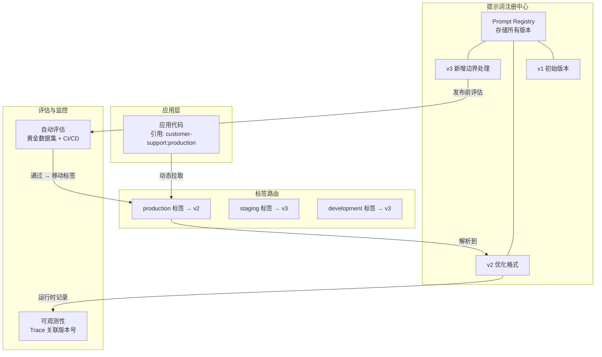

# 提示词版本管理（Prompt Versioning）

## 概念解释

提示词版本管理，就是把提示词当成"软件产品"来管理——每次修改都有版本号，每个版本都有变更记录，不同环境用不同版本，出了问题能秒级回滚。

为什么需要它？因为提示词和普通代码不一样：改了一个字，模型输出可能完全变样；而且 LLM 的输出本身就有随机性，你很难靠肉眼判断"改了之后到底变好还是变差了"。如果没有版本管理，一次手滑修改就可能让线上系统全面翻车，而且你都不知道改了什么、怎么改回去。

传统做法是把提示词硬编码在代码里，用 Git 管文本变更。这只能解决"文本改了什么"的问题，但解决不了"改了之后效果怎么样""线上用的是哪个版本""怎么在不停机的情况下切回旧版本"这些 LLM 特有的问题。提示词版本管理在文本 diff 的基础上，补齐了环境隔离、性能追踪、灰度发布、快速回滚这四块拼图。

在 Agent / AI 系统中，提示词版本管理属于 LLMOps 的基础设施层。它不是某个高深的算法，而是一套工程规范和工具链——就像后端开发离不开 CI/CD 一样，LLM 应用开发离不开提示词版本管理。

## 关键结构

提示词版本管理的完整体系由五个核心部分组成：

| 结构 | 作用 | 说明 |
|------|------|------|
| 版本标识 | 给每个版本贴唯一编号 | 采用语义化版本号（X.Y.Z），一眼区分大改、小优化、修 Bug |
| 变更日志 | 记录每次改了什么、为什么改 | 出问题时快速定位"哪次改动搞砸的" |
| 环境隔离 | 开发 / 测试 / 生产各用各的版本 | 开发者可以大胆试错，不影响线上用户 |
| 性能追踪 | 用数据衡量每个版本的好坏 | 准确率、延迟、成本、满意度——用数字说话 |
| 回滚机制 | 出问题时秒级切回旧版本 | 金丝雀发布、特性开关、蓝绿部署等策略 |

### 结构 1：版本标识（Version ID）

采用语义化版本号 `X.Y.Z`，规则如下：

- **X（主版本号）**：提示词的整体策略或结构发生重大变化。例如从"直接回答"改为"先推理再回答"，版本号从 v1.x.x 升到 v2.0.0。
- **Y（次版本号）**：新增能力或优化逻辑，但不改变整体框架。例如补充了对边界情况的处理，版本号从 v2.0.x 升到 v2.1.0。
- **Z（补丁号）**：修改拼写错误、调整措辞等微调。版本号从 v2.1.0 升到 v2.1.1。

除了版本号，每个版本还应记录创建时间、创建人、状态（开发中 / 测试中 / 生产中 / 已归档）等元数据。

### 结构 2：变更日志（Changelog）

每次版本变更需要记录四项信息：

1. **改了什么**：增加了哪些指令、删除了哪些示例、调了哪些参数
2. **为什么改**：用户投诉？指标下降？新增需求？
3. **预期效果**：期望准确率提升 5%、期望响应更简洁等
4. **审核信息**：谁审核的、有什么反馈意见

变更日志是根因分析的核心依据——线上出问题时，回溯日志就能定位到"3 天前 Bob 加了一条指令导致的"。

### 结构 3：环境隔离（Environment Isolation）

三个环境各司其职：

- **开发环境（Dev）**：高频试错，可以用最新的不稳定版本
- **测试环境（Staging）**：用真实数据验证，与生产结构一致但数据隔离
- **生产环境（Prod）**：只用通过所有检验的稳定版本

提示词从开发到生产的过程叫做"晋升"（Promotion）：Dev → Staging → Prod。Langfuse 等工具通过 Label 机制实现这个流程——给版本打上 `development`、`staging`、`production` 标签即可，无需改代码。

### 结构 4：性能追踪（Performance Tracking）

每个版本至少跟踪四个指标：

- **准确率**：回答是否正确、是否符合预期
- **延迟**：从请求到响应的耗时
- **成本**：Token 消耗和 API 调用费用
- **用户满意度**：用户打分或隐式反馈

通过对比不同版本的指标数据，就能用数字回答"v2.1.0 到底比 v2.0.0 好不好"这个问题。

### 结构 5：回滚机制（Rollback）

三种常用回滚策略：

- **金丝雀发布（Canary）**：先让 5%-10% 的流量用新版本，观察没问题再逐步扩大
- **特性开关（Feature Flag）**：通过配置项切换版本，不需要重新部署
- **蓝绿部署（Blue-Green）**：新旧版本同时运行，用负载均衡瞬间切换

## 核心原理

### 原理说明

提示词版本管理的核心机制是"提示词与代码解耦 + 标签路由"：

1. **提示词脱离代码**：提示词不再硬编码在应用代码里，而是存储在独立的注册中心（Prompt Registry）。应用代码只引用一个提示词名称和标签（如 `customer-support:production`），运行时动态拉取。

2. **版本不可变**：每次修改生成新版本（v1 → v2 → v3...），已创建的版本内容永不改动。这保证了可追溯性——某个 Trace 记录的版本号 v2，过了三个月回头查，内容和当时完全一样。

3. **标签路由**：标签（Label）是"指向某个版本的指针"。生产环境的标签 `production` 指向 v2，测试环境的标签 `staging` 指向 v3。把 `production` 标签从 v2 移到 v3，就完成了发布；移回 v2，就完成了回滚。整个过程不需要改代码、不需要重新部署。

4. **评估闭环**：每个版本上线前，用"黄金数据集"（50-200 条已标注的测试用例）自动跑评估。评估方式分三层：确定性检查（格式、长度等）、LLM-as-Judge 评分（语义质量）、非功能检查（延迟、成本）。评估不通过就阻止发布。

5. **可观测性串联**：每次 API 调用都记录使用的提示词版本号。出问题时，可以按版本号过滤 Trace，快速定位是哪个版本引入的 Bug。

### Mermaid 图解



图解说明：

- **提示词注册中心**是所有版本的存储仓库，版本一旦创建就不可修改。
- **标签路由**是版本选择的核心枢纽——应用不关心具体版本号，只关心"生产该用哪个"。
- **发布 = 移动标签**：把 `production` 标签从 v2 指向 v3 就完成了上线，反过来就是回滚。
- 评估在发布前自动运行，可观测性在运行时持续记录，两者形成闭环。

### 运行示例

以下示例用 Langfuse SDK 演示提示词版本管理的核心操作：创建版本、打标签、按标签拉取。

```python
# 基于 langfuse==3.x 文档核实（截至 2026-03）
import os
from langfuse import get_client

# Langfuse Python SDK 会从环境变量读取鉴权配置
# export LANGFUSE_PUBLIC_KEY="..."
# export LANGFUSE_SECRET_KEY="..."
# export LANGFUSE_BASE_URL="https://cloud.langfuse.com"
assert os.getenv("LANGFUSE_PUBLIC_KEY")
assert os.getenv("LANGFUSE_SECRET_KEY")

langfuse = get_client()

# 1. 创建提示词的第一个版本
langfuse.create_prompt(
    name="customer-support",            # 提示词名称
    type="text",
    prompt="你是一个友好的客服助手。请简洁回答用户问题。",
    labels=["development"],             # 初始标签：开发环境
)

# 2. 创建优化后的第二个版本
langfuse.create_prompt(
    name="customer-support",
    type="text",
    prompt="""你是一个专业且友好的客服助手。
规则：
1. 回答控制在 2-3 句话以内
2. 不确定时主动说明并推荐官方文档
3. 敏感问题转交人工客服""",
    labels=["staging"],                 # 标签：测试环境
)

# 3. 应用代码中按标签拉取（生产环境只需这一行）
prompt = langfuse.get_prompt("customer-support", label="staging")
print(prompt.prompt)  # 输出第二个版本的内容

# 4. 验证通过后，把 production 标签移到最新版本即完成发布
# 回滚只需把 production 标签移回旧版本
```

代码中 `create_prompt` 每次调用都会自动创建新版本（v1, v2...），版本内容不可变。`get_prompt` 按标签拉取，应用代码不需要硬编码版本号。发布和回滚都是标签的移动操作，不涉及代码变更或重新部署。

## 易混概念辨析

| 概念 | 与提示词版本管理的区别 | 更适合关注的重点 |
|------|----------------------|-----------------|
| Git 版本控制 | Git 管理文本 diff，不关心 LLM 输出质量；提示词版本管理在文本 diff 基础上补齐了性能追踪、环境隔离、标签路由 | 代码层面的变更追踪 |
| Prompt Engineering | Prompt Engineering 关注"怎么写好提示词"；版本管理关注"写好的提示词怎么安全发布、怎么追踪效果" | 提示词内容的设计和优化技巧 |
| 提示词评估（Prompt Evaluation） | 评估是判断"这个版本好不好"的手段；版本管理是管理整个生命周期的体系，评估只是其中一个环节 | 评估指标设计和评测方法论 |
| A/B 测试 | A/B 测试是版本管理体系中的一种验证手段，用于对比两个版本的表现；版本管理是更大的框架，包含存储、发布、回滚等完整流程 | 流量分配和统计显著性检验 |

核心区别：

- **提示词版本管理**：关注提示词从创建到退役的完整生命周期管理
- **Git 版本控制**：只解决文本变更追踪，不解决 LLM 特有的非确定性和环境隔离问题
- **Prompt Engineering**：解决"内容怎么写"，版本管理解决"内容怎么安全上线"
- **提示词评估**：版本管理体系中的一个环节，负责回答"这个版本能不能上线"

## 适用边界与局限

### 适用场景

1. **生产环境的 LLM 应用**：任何直接服务用户的 AI 功能（客服、搜索、内容生成等），都需要版本管理来保证上线安全和快速回滚
2. **多人协作的提示词优化**：产品经理调提示词、工程师做发布——角色分离后，版本管理是协调两边的桥梁
3. **跨模型适配**：同一功能在 GPT-4、Claude、Gemini 上需要不同版本的提示词，版本管理可以为每个模型绑定独立的最优版本
4. **合规审计要求**：金融、医疗等行业需要追溯"某个时间点线上用的是什么提示词"，版本管理的不可变历史天然满足审计需求

### 不适合的场景

1. **个人实验和原型阶段**：一个人快速试想法时，用记事本记录就够了，引入完整的版本管理反而拖慢节奏
2. **一次性脚本或内部工具**：不面向用户、不需要持续迭代的提示词，管理成本大于收益

### 局限性

1. **非确定性带来的评估难度**：LLM 输出有随机性，同一版本跑两次可能结果不同。判断"新版本是否更好"需要在足够大的样本上做统计检验，成本比传统单元测试高得多
2. **前期基础设施投入**：需要搭建注册中心、评估流水线、可观测性工具等基础设施，对小团队来说有一定门槛
3. **标准化与灵活性的矛盾**：过于严格的版本管理流程可能限制快速创新——每次调一个字都要走评审发布流程，会让迭代变慢

## 常见误区

| 常见误区 | 正确理解 |
|----------|----------|
| 把提示词放在 Git 里就算版本管理了 | Git 只管文本 diff。真正的提示词版本管理还需要环境隔离、性能追踪、标签路由、自动评估等能力，这些 Git 做不到 |
| 新版本一定比旧版本好 | LLM 输出有随机性，单个样本的"改进"可能只是运气好。需要在黄金数据集（50-200 条）上跑统计检验，才能判断新版本是否真的更优 |
| 等线上出问题了再做版本管理 | 版本管理是预防性措施。等出了问题才想建，你会发现没有历史版本可回滚、没有变更记录可追溯，只能手忙脚乱地"凭记忆"修复 |
| 提示词版本管理只是工程师的事 | 在成熟团队中，产品经理和领域专家负责提示词内容迭代，工程师负责发布和基础设施。版本管理平台的 UI 让非技术人员也能直接修改和审核提示词 |

## 思考题

<details>
<summary>初级：为什么提示词版本管理不能只靠 Git？</summary>

**参考答案：**

Git 能追踪提示词的文本变更（谁改了什么），但它做不到以下四点：

1. **环境隔离**：Git 没有"开发 / 测试 / 生产"的概念，无法让不同环境用不同版本
2. **性能追踪**：Git 不知道某个版本的准确率是多少、延迟是多少
3. **动态切换**：用 Git 切版本需要改代码并重新部署，无法做到秒级回滚
4. **非确定性评估**：Git 没有内置的评估能力来判断"这次修改到底是改好了还是改坏了"

所以 Git 是基础层（管文本变更），但需要在其上叠加专门的提示词管理工具来补齐这些能力。

</details>

<details>
<summary>中级：你的客服系统上线了提示词 v2.0，第二天用户投诉率上升了 15%。请设计排查流程。</summary>

**参考答案：**

排查分三步：

1. **确认因果关系**：查可观测性系统，对比 v1.0 和 v2.0 的指标（准确率、满意度、投诉率）。确认投诉率上升和版本切换是否在同一时间点，排除其他变量（如模型服务商侧的变更、用户问题分布变化）。

2. **定位具体问题**：查看 v2.0 的变更日志，对比 v1.0 和 v2.0 的提示词文本 diff。用投诉对话的真实输入重跑 v1.0 和 v2.0，对比输出差异，找到导致投诉的具体改动。

3. **决策与执行**：如果确认是 v2.0 导致的，立即将 `production` 标签回滚到 v1.0（秒级操作）。然后在开发环境修复问题，创建 v2.1 版本，通过评估后再重新发布。

</details>

<details>
<summary>中级/进阶：如果你的 LLM 应用同时支持 GPT-4 和 Claude 两个模型，且同一功能在两个模型上需要不同的提示词，你会如何设计版本管理方案？</summary>

**参考答案：**

设计要点：

1. **命名空间隔离**：每个提示词名称加模型后缀，如 `customer-support-gpt4` 和 `customer-support-claude`，各自独立版本线。

2. **共享标签体系**：两条版本线共享同一套标签（development / staging / production），保证发布流程统一。

3. **独立评估数据集**：黄金数据集的"参考答案"可以通用，但评估阈值按模型分别设定（不同模型的基线水平不同）。

4. **联动回滚策略**：如果一个模型的新版本出问题需要回滚，另一个模型不受影响。但如果底层业务逻辑变更（如新增了一种拒答规则），两条版本线需要同步更新。

5. **对比看板**：在可观测性系统中建一个跨模型对比视图，随时掌握同一功能在不同模型上的表现差异。

</details>

## 参考资料

1. [Prompt Versioning & Management Guide - LaunchDarkly](https://launchdarkly.com/blog/prompt-versioning-and-management/)
2. [Prompt Version Control - Langfuse 官方文档](https://langfuse.com/docs/prompt-management/features/prompt-version-control)
3. [Prompt Versioning: Best Practices - Latitude](https://latitude-blog.ghost.io/blog/prompt-versioning-best-practices/)
4. [Prompt Versioning and Its Best Practices 2025 - Maxim AI](https://www.getmaxim.ai/articles/prompt-versioning-and-its-best-practices-2025/)
5. [Top Open-Source Prompt Management Platforms 2026 - Agenta](https://agenta.ai/blog/top-open-source-prompt-management-platforms)
6. [Prompt Registry - MLflow](https://mlflow.org/prompt-registry)
