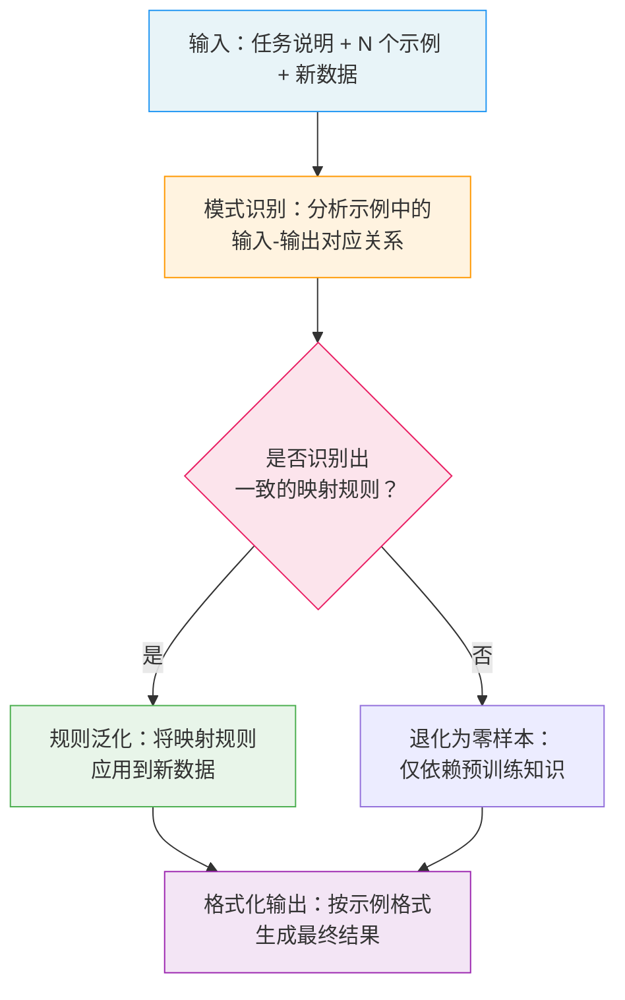

# 少样本提示（Few-Shot Prompting）

## 概念解释

Few-Shot Prompting（少样本提示）是一种在提示词中嵌入 2-5 个输入-输出示例，让大语言模型从这些示例中"领会"任务规律，然后将规律应用到新问题上的技术。它本质上是在利用 LLM 天生的 In-Context Learning（上下文学习，简称 ICL）能力——模型不需要修改参数、不需要重新训练，仅凭 prompt 里的几个例子就能理解你想做什么。

在 Few-Shot 出现之前，让模型做特定任务主要有两条路：一条是 Zero-Shot（零样本），直接下指令但不给例子，模型经常理解偏差、格式混乱；另一条是 Fine-Tuning（微调），用大量标注数据重新训练模型参数，效果好但成本高，换个任务就得重来。Few-Shot Prompting 在两者之间找到了平衡点：用极少的示例就能大幅提升输出质量，同时保持零成本切换任务的灵活性。

这项技术在 Agent 系统中应用广泛：Agent 调用工具时需要输出特定格式的 JSON，用 Few-Shot 给几个格式示例就能稳定输出格式；RAG 系统中对检索结果的摘要生成、多轮对话中的意图分类，都是 Few-Shot 的典型应用场景。

## 关键结构

Few-Shot Prompting 的效果取决于三个核心要素的配合：

| 要素 | 作用 | 关键考量 |
|------|------|----------|
| 示例（Examples） | 向模型展示"输入长什么样、输出该怎么写" | 质量 > 数量，2-5 个高质量示例通常最优 |
| 示例选择策略（Selection） | 决定从候选池中挑哪些例子给模型看 | 相似度匹配 + 多样性采样效果最好 |
| 格式一致性（Consistency） | 保证所有示例和真实输入的格式完全统一 | 结构、符号、长度、语言风格都要一致 |

### 要素 1：示例（Examples）

每个示例是一个完整的"任务演示"，包含输入和期望输出两部分。示例的选择遵循三个标准：

- **代表性**：示例应覆盖任务的典型情况。比如情感分类任务，正面、负面、中立三类至少各一个。
- **清晰性**：输入和输出的对应关系一目了然，不存在歧义。
- **多样性**：示例之间有差异，避免模型只学到某个特殊模式。

### 要素 2：示例选择策略（Selection）

实际应用中有四种常见策略：

- **随机选择**：从示例池中随机抽取，简单但不稳定。
- **相似度匹配**：用 Embedding 计算待处理数据和候选示例的相似度，选最接近的。效果好，但需要额外计算。
- **多样性采样**：优先选择彼此差异大的示例，覆盖输入空间的不同区域。
- **难度梯度**：从简单到复杂排列示例，帮助模型逐步理解。

实践中，相似度匹配 + 多样性采样的组合效果最好。

### 要素 3：格式一致性（Consistency）

格式不一致是 Few-Shot 失败的首要原因。必须统一的方面包括：

- **结构一致**：所有示例用相同的输入-输出格式（如都用"输入：... 输出：..."）。
- **符号一致**：分类标签统一用一套表述（用"正面"就别混入"积极"）。
- **长度一致**：避免某个示例的输出特别长或特别短，误导模型对输出长度的预期。

## 核心原理

### 原理说明

Few-Shot Prompting 的工作机制可以分为四步：

**第 1 步：组装提示词。** 将任务说明、示例和待处理数据按固定顺序拼接。顺序通常是：系统指令 → 示例 1 → 示例 2 → ... → 新数据。

**第 2 步：模式识别。** 模型接收完整提示词后，分析所有示例中输入和输出之间的对应关系，推断出一个隐含的映射规则。比如看到三组"评论文本 → 情感标签"的示例，模型会推断任务是"情感分类"。

**第 3 步：规则泛化。** 模型将推断出的映射规则应用到新数据上。这个过程不修改模型参数，所有"学习"都发生在单次推理的上下文窗口内，推理结束后模型不会记住这些示例。

**第 4 步：格式化输出。** 模型按照示例中展示的输出格式生成结果。这也是 Few-Shot 的重要价值——通过示例隐式地定义了输出规范。

关键点在于：模型并不是真正在"学习"，而是在利用预训练阶段积累的语言理解能力，将示例作为"参照物"来约束自己的输出。研究表明，示例中的标签是否正确对结果的影响远小于预期，真正重要的是示例定义的标签空间（有哪些类别）和输入文本的分布。

### Mermaid 图解



图中的关键流转：当示例质量高、格式一致时，模型在第 2 步就能准确识别映射规则，输出质量接近甚至达到微调水平。但如果示例之间格式混乱或与新数据差异过大，模型可能无法识别有效规则，退化为零样本表现。

### 运行示例

以下示例展示 Few-Shot Prompting 的核心结构——如何将示例嵌入 prompt 并调用 API。

```python
# 基于 openai>=1.0.0 验证（截至 2026-03）
import os
from openai import OpenAI

client = OpenAI(api_key=os.getenv("OPENAI_API_KEY"))

# Few-Shot 的核心：示例作为 message 序列嵌入对话
few_shot_messages = [
    # 示例 1：正面
    {"role": "user", "content": "文本：这家餐厅的饭菜真好吃，服务也很周到！"},
    {"role": "assistant", "content": "情感：正面"},
    # 示例 2：负面
    {"role": "user", "content": "文本：产品质量差，已经坏了，非常失望。"},
    {"role": "assistant", "content": "情感：负面"},
    # 示例 3：中立
    {"role": "user", "content": "文本：还不错，但也没什么特别的。"},
    {"role": "assistant", "content": "情感：中立"},
]

# 待分类的新数据
new_input = "文本：这个软件很好用，推荐给大家！"
few_shot_messages.append({"role": "user", "content": new_input})

# 调用 API，模型会参照示例格式输出
response = client.chat.completions.create(
    model="gpt-4o-mini",
    messages=few_shot_messages,
    temperature=0,    # 降低随机性，保证分类稳定
    max_tokens=20
)

print(response.choices[0].message.content)
# 输出：情感：正面
```

上述代码中，`few_shot_messages` 列表就是 Few-Shot 的全部结构：三组 user-assistant 对话作为示例，最后一条 user 消息是待处理的新数据。模型会模仿示例中 assistant 的输出格式（"情感：正面/负面/中立"）来回答。

## 易混概念辨析

| 概念 | 与 Few-Shot Prompting 的区别 | 更适合关注的重点 |
|------|------|------|
| Zero-Shot Prompting（零样本提示） | 不提供任何示例，完全依赖模型预训练知识 | 任务简单、模型能力强时优先考虑，省 token |
| Fine-Tuning（微调） | 用大量数据修改模型参数，效果更好但成本高 | 精度要求极高、任务固定、有充足标注数据时选择 |
| Chain-of-Thought（思维链） | 关注的是推理过程的展示，不是输入-输出示例 | 复杂推理任务，可与 Few-Shot 组合使用 |
| Many-Shot Prompting（多样本提示） | 使用数百甚至数千个示例，需要超长上下文窗口 | 2024 年研究热点，适合上下文窗口足够大的模型 |

核心区别：

- **Few-Shot Prompting**：用少量示例定义任务，核心是"示例引导"
- **Zero-Shot Prompting**：不给例子只给指令，核心是"指令描述"。对于简单任务或能力强的模型，好的零样本指令有时甚至优于差的 Few-Shot
- **Fine-Tuning**：改变模型本身，核心是"参数更新"。Few-Shot 是在推理时临时生效，Fine-Tuning 是永久改变模型行为
- **Chain-of-Thought**：可以和 Few-Shot 结合（称为 Few-Shot CoT），在示例中同时展示推理步骤

## 适用边界与局限

### 适用场景

1. **文本分类与情感分析**：分类标签明确、输入格式统一，2-3 个示例就能让模型稳定输出。电商评论、客服工单分类等都是典型场景。
2. **信息提取与格式转换**：从非结构化文本中提取结构化字段（人名、日期、金额），或将一种格式转换为另一种。示例能精确定义输入输出的映射关系。
3. **风格模仿与内容生成**：通过示例展示特定的写作风格、语气或术语用法，引导模型按照期望风格生成内容。
4. **Agent 工具调用的输出格式约束**：Agent 需要输出特定格式的 JSON 来调用工具，Few-Shot 示例是最可靠的格式约束手段之一。

### 不适合的场景

1. **需要深度推理的数学/逻辑题**：单纯的 Few-Shot 无法教会模型推理步骤，需要结合 Chain-of-Thought 才有效。
2. **精度要求极高的专业任务**：如医疗诊断、法律判决等，Few-Shot 的性能上限低于微调模型，风险较高。
3. **输入文本超长的任务**：示例会占用上下文窗口空间，如果输入本身就很长（如整篇论文），留给示例的空间可能不够。

### 局限性

1. **示例选择敏感**：换一组示例，输出可能完全不同。目前没有通用的自动选择方法，通常需要人工调试。
2. **上下文窗口限制**：每个示例都消耗 token，模型的上下文窗口决定了能放多少示例。虽然最新模型支持 100K+ token，但示例过多也会引发"过提示"（Over-prompting）问题。
3. **性能上限低于微调**：Few-Shot 的准确率通常比微调低 10-30%。对于生产环境中精度敏感的任务，可能需要微调兜底。

## 常见误区

| 常见误区 | 正确理解 |
|----------|----------|
| "示例越多越好，放 20 个肯定比 5 个强" | 研究表明 2-5 个高质量示例通常是最优区间。超过一定数量后性能增益递减，甚至可能下降（Over-prompting 现象）。具体最优数取决于模型和任务。 |
| "示例的标签必须完全正确才有效" | Min et al.（2022）的研究发现，示例中定义的标签空间和输入分布比单个标签的正确性更重要。当然，正确标签效果更好，但即使标签有少量错误，模型仍能从格式和分布中学到有用信息。 |
| "随便找几个例子放进去就行" | 示例的相关性和多样性至关重要。用"餐厅评论"的示例去做"代码 Bug 分类"，效果会很差。示例应与实际输入的领域和格式尽量接近。 |
| "有了 Few-Shot 就不需要写任务说明了" | 任务说明和示例是互补关系。一个清晰的任务说明 + 少量示例的组合，效果优于大量示例但没有任务说明的情况。 |

## 思考题

<details>
<summary>初级：Zero-Shot、One-Shot、Few-Shot 三者的核心区别是什么？什么情况下 Zero-Shot 反而优于 Few-Shot？</summary>

**参考答案：**

三者的区别在于提示词中包含的示例数量：Zero-Shot 不给示例，One-Shot 给 1 个，Few-Shot 给 2 个以上。当任务足够简单（如基础翻译、常识问答）且模型能力足够强时，Zero-Shot 的效果可能接近甚至优于质量不高的 Few-Shot——因为差的示例可能误导模型，还不如不给。此外，Zero-Shot 节省 token，响应更快。

</details>

<details>
<summary>中级：如果你给模型 5 个情感分类示例，但其中 4 个都是"正面"，只有 1 个是"负面"，会出现什么问题？如何解决？</summary>

**参考答案：**

模型会产生偏向（bias），倾向于将新文本分类为"正面"，因为示例中正面样本占绝对多数。解决方法：(1) 保持各类别的示例数量均衡；(2) 确保示例覆盖所有可能的输出类别；(3) 如果某个类别的示例确实稀缺，可以在任务说明中明确列出所有可能的类别。2025 年 ICCS 的研究（Class-Few-Shot 方法）进一步表明，按类别数量从多到少交替排列示例，能有效缓解类别不平衡问题。

</details>

<details>
<summary>中级/进阶：你正在为一个客服 Agent 设计工单分类功能，候选类别有 8 种。上下文窗口有限，最多放 5 个示例。你会如何选择这 5 个示例？请说明选择策略和理由。</summary>

**参考答案：**

策略：(1) 优先覆盖出现频率最高的 5 个类别，每个类别各一个示例，确保模型见过这些类别的"样子"；(2) 在任务说明中明确列出全部 8 个类别名称，弥补剩余 3 个类别没有示例的缺陷；(3) 选择的 5 个示例应尽量选各类别中最具代表性的典型案例，避免选择边界模糊的工单；(4) 如果系统支持动态示例选择，可以根据用户输入的相似度实时从候选池中选取最相关的 5 个示例，这样在运行时能覆盖更多类别。

</details>

## 参考资料

1. Prompt Engineering Guide. "Few-Shot Prompting." https://www.promptingguide.ai/techniques/fewshot
2. LearnPrompting. "Shot-Based Prompting: Zero-Shot, One-Shot, and Few-Shot Prompting." https://learnprompting.org/docs/basics/few_shot
3. IBM. "What is Few Shot Prompting?" https://www.ibm.com/think/topics/few-shot-prompting
4. PromptHub Blog. "The Few Shot Prompting Guide." https://www.prompthub.us/blog/the-few-shot-prompting-guide
5. PromptHub Blog. "In Context Learning Guide." https://www.prompthub.us/blog/in-context-learning-guide
6. Agarwal et al. "Many-Shot In-Context Learning." arXiv:2404.11018, NeurIPS 2024 Spotlight
