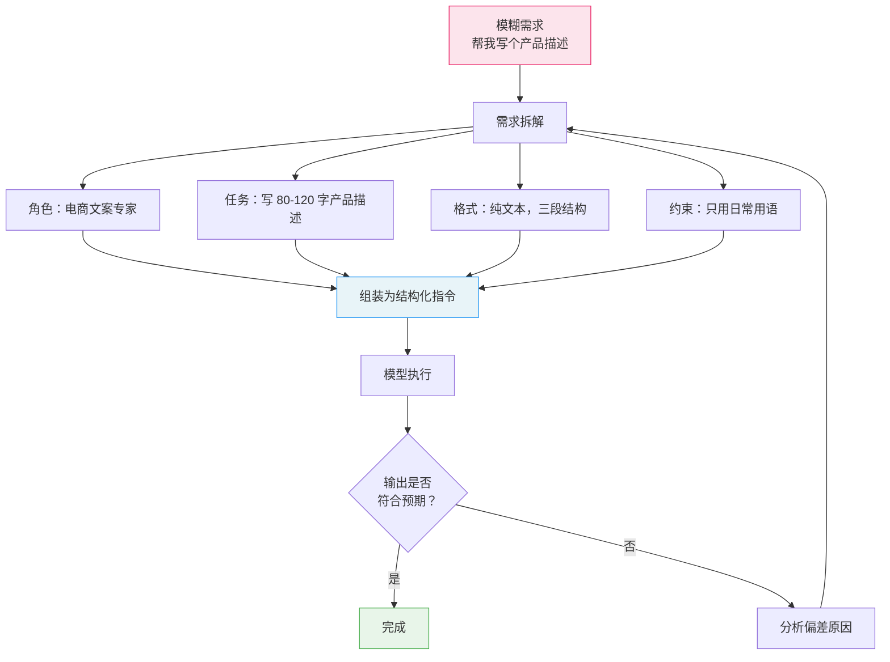

# 指令工程（Instruction Engineering）

## 概念解释

指令工程是指在与大语言模型交互时，通过设计清晰、具体、结构化的指令（Instruction），让模型准确理解你的需求并产出高质量结果的技术。它的核心思路是：与其让模型自己猜你想要什么，不如把需求讲清楚。

为什么需要它？因为大语言模型本质上是"根据上文预测下一个词"的机器。如果你只说"帮我写一篇文章"，模型面对的可能性有无数种——什么主题？写多长？给谁看？用什么语气？结果只能是一篇"中规中矩"的通用文章。但如果你说"用大白话给初中生写一段 100 字以内的文字，解释什么是人工智能"，模型的输出空间被大幅收窄，结果自然更贴合需求。

和传统的"想到什么写什么"不同，指令工程把写提示词变成了一种有章可循的工程实践：它把一个模糊需求拆解为角色、目标、格式、约束等维度，然后用结构化的方式表达出来。Anthropic 官方文档将其比喻为"给一个聪明但没有上下文的新同事写工作说明"——说明越精确，执行结果越好。

## 关键结构

指令工程的核心在于对指令的六个维度进行有意识的设计：

| 维度 | 作用 | 一句话示例 |
|------|------|-----------|
| 角色（Role） | 激活模型特定领域的知识和表达方式 | "你是一个资深数据分析师" |
| 任务（Task） | 告诉模型具体要做什么 | "对这份销售数据做趋势分析" |
| 输出格式（Format） | 约定结果的形式 | "返回 JSON，包含 trend 和 summary 字段" |
| 约束条件（Constraints） | 设定可以做和不可以做的边界 | "只使用日常用语，不超过 200 字" |
| 上下文（Context） | 提供模型需要的背景信息 | "目标读者是没有技术背景的管理者" |
| 示例（Examples） | 用具体的输入-输出对展示期望行为 | 提供一个符合要求的范例 |

### 维度 1：角色（Role）

给模型指定一个身份，相当于告诉它"用谁的视角来完成任务"。说"你是一个儿童教育专家"和直接说"解释光合作用"，模型的用词、深度、类比方式会完全不同。角色不只是装饰，它会影响模型调用哪些预训练知识。

### 维度 2：任务（Task）

任务描述是指令的核心。好的任务描述回答三个问题：做什么、为什么做、做成什么样算好。对比"总结这篇文章"和"用一段不超过 100 字的话总结这篇文章，重点突出对 AI 安全的启示"——后者消除了大量歧义。

### 维度 3：输出格式（Format）

明确告诉模型结果应该长什么样。不说"给我一个列表"，而说"返回一个 JSON 数组，每个元素包含 name（字符串）和 score（数字）两个字段"。格式约束越明确，输出越稳定，下游程序解析也越方便。

### 维度 4：约束条件（Constraints）

约束是指令的"护栏"。核心技巧：**尽量用正向约束代替负向约束**。OpenAI 官方文档明确建议"指令应该聚焦于做什么，而不是不做什么"。例如不说"不要用技术术语"，而说"只使用常见的日常用语"。原因是模型更擅长按正向指令执行，负向指令容易被忽略。

### 维度 5：上下文（Context）

Anthropic 文档指出，给指令补充动机或背景信息能帮助模型更好地理解目标。比如不只说"不要使用省略号"，而说"你的回复会被文字转语音引擎朗读，所以不要使用省略号，因为引擎不知道怎么读它"——解释了原因后，模型会更可靠地遵守规则，甚至能举一反三地避免类似问题。

### 维度 6：示例（Examples）

提供 1-3 个符合要求的输入-输出范例，让模型通过模式匹配理解你的意图。这和 Few-Shot Prompting（少样本提示）是同一原理。Anthropic 建议用 `<example>` 标签包裹示例，帮助模型区分示例和正式指令。

## 核心原理

### 原理说明

指令工程的本质是**缩小模型的输出空间**。大语言模型在每一步预测下一个词时，面对的是一个巨大的概率分布。一条好的指令通过多个维度的约束，把这个分布集中到你想要的区域。

具体过程分为三步：

**第 1 步：需求拆解。** 把一个模糊的需求（"帮我写个文案"）拆解为角色、任务、格式、约束等具体维度。

**第 2 步：结构化表达。** 把各维度用清晰、有序的语言组织成完整的指令。OpenAI 建议用编号列表来表达有顺序的步骤，Anthropic 建议用 XML 标签来区分指令的不同部分。

**第 3 步：迭代优化。** 测试指令的输出效果，找出不符合预期的地方，调整对应的维度。指令设计很少一次成功，迭代是常态。

这三步循环的关键原则是：**清晰优于冗长、正向优于负向、具体优于宽泛**。

### Mermaid 图解



图中的核心逻辑：一个模糊需求经过拆解后变成多个维度的具体约束，组装为结构化指令后交给模型执行。如果输出不符合预期，回到拆解步骤调整对应维度，形成迭代循环。每一轮迭代都在进一步缩小模型的输出空间。

### 运行示例

以下示例展示"同一需求，模糊指令 vs 结构化指令"的区别。

```python
# 基于 openai>=1.0.0 验证（截至 2026-03）
import os
from openai import OpenAI

client = OpenAI(api_key=os.getenv("OPENAI_API_KEY"))

# ---- 模糊指令 ----
vague_prompt = "帮我写个耳机的产品描述。"

# ---- 结构化指令 ----
structured_prompt = """你是一个资深电商文案专家。

任务：为一款无线降噪耳机写产品描述。

要求：
1. 长度 80-120 字
2. 第一句突出核心卖点（降噪 + 音质）
3. 第二句说明适用场景
4. 第三句强调续航优势
5. 使用日常用语，语气亲切

产品信息：主动降噪，续航 30 小时，蓝牙 5.3"""

# 用结构化指令调用
response = client.chat.completions.create(
    model="gpt-4o-mini",
    messages=[{"role": "user", "content": structured_prompt}],
    temperature=0.7,
    max_tokens=200
)
print(response.choices[0].message.content)
```

`vague_prompt` 没有约束任何维度，模型可能输出 50 字也可能输出 500 字，风格也不确定。`structured_prompt` 通过角色、任务、格式约束、正向约束和上下文五个维度把输出空间收窄到一个可控范围内。

## 易混概念辨析

| 概念 | 与指令工程的区别 | 更适合关注的重点 |
|------|-----------------|------------------|
| Prompt Engineering（提示词工程） | 指令工程是提示词工程中的一个子领域，专注于指令本身的设计 | 提示词工程还包括 Few-Shot、CoT、上下文工程等更广的技术集 |
| Few-Shot Prompting（少样本提示） | Few-Shot 靠示例引导模型，指令工程靠清晰的指令文本引导 | 二者经常组合使用：好的指令 + 好的示例效果最佳 |
| Context Engineering（上下文工程） | 上下文工程关注如何组织和管理模型可见的所有信息 | 指令工程关注的是指令本身怎么写，上下文工程关注的是整体信息结构 |

核心区别：

- **指令工程**：聚焦于"怎么把一条指令写清楚"，是最基础的提示词设计技能
- **Few-Shot Prompting**：聚焦于"用示例来教模型"，指令工程中的"示例"维度就是借用了 Few-Shot 的原理
- **Context Engineering**：聚焦于"把什么信息以什么顺序放进上下文窗口"，是更宏观的信息架构问题

## 适用边界与局限

### 适用场景

1. **批量内容生成**：同一套指令处理上千条数据（产品描述、邮件回复），结构化指令保证输出风格一致、可复用
2. **数据提取与格式转换**：从非结构化文本中提取字段并输出为 JSON / 表格，指令中的格式约束直接决定提取准确率
3. **教学与知识讲解**：通过角色和受众约束，让同一概念适配不同水平的读者
4. **Agent 系统的 System Prompt**：Agent 的行为边界、工具使用规则、输出格式全靠 System Prompt 中的指令设计来定义

### 不适合的场景

1. **需求本身极度模糊**：如果连人都说不清"我到底想要什么"，再精细的指令也无法消除歧义
2. **开放式创意探索**：过度约束会压制模型的创造力，写诗、头脑风暴等场景需要适度留白

### 局限性

1. **设计成本不为零**：写一条高质量指令需要理解需求、理解模型行为、反复测试，有学习曲线
2. **跨模型迁移性有限**：为 GPT-4 优化的指令不一定适合 Claude 或开源模型。OpenAI 文档指出 GPT-4.1 对指令的执行"更字面化"，需要针对性调整
3. **增加 token 消耗**：详细的指令本身占用上下文窗口空间，在 token 成本敏感的场景需要权衡

## 常见误区

| 常见误区 | 正确理解 |
|----------|----------|
| "指令越长越详细越好" | 清晰优于冗长。一条 200 字的精准指令往往比 1000 字的啰嗦指令效果好——长指令容易让模型"抓不住重点" |
| "用大量的'不要做 XXX'来限制模型" | 应优先用正向指令（"使用日常用语"比"不要用术语"更有效）。OpenAI 和 Anthropic 的官方文档都明确建议这一点 |
| "写好一条指令就不用改了" | 指令设计是迭代过程。写指令 → 测试 → 分析偏差 → 调整 → 再测试，是正常工作流 |
| "同一条指令在所有模型上都通用" | 不同模型对指令的理解方式不同。比如 GPT-4.1 比前代更"字面化"，Claude 对 XML 标签的响应更好 |

## 思考题

<details>
<summary>初级：请说明"帮我分析这个数据"和"你是一个数据分析师，请用不超过 150 字总结这份销售数据的三个关键趋势，用中文输出"这两条指令的主要区别，各自覆盖了哪些维度？</summary>

**参考答案：**

第一条指令只有模糊的任务描述，没有角色、格式、约束和上下文。第二条覆盖了角色（数据分析师）、任务（总结关键趋势）、格式（不超过 150 字、三个趋势）、约束（用中文）四个维度。维度越多，模型的输出空间越小，结果越可预期。

</details>

<details>
<summary>中级：你需要让模型从用户评论中提取"情感倾向"和"具体问题"两个字段，输出为 JSON。如果模型经常输出多余的解释文字导致 JSON 解析失败，你会如何调整指令？</summary>

**参考答案：**

三个调整方向：(1) 用正向格式约束——"只返回 JSON 对象，不要包含任何其他文字"；(2) 提供一个符合要求的输出示例，让模型通过模式匹配理解期望格式；(3) 使用 OpenAI 的 Structured Outputs（结构化输出）功能或 Anthropic 的 Tool Use，在 API 层面强制输出 JSON schema。如果仍有问题，可以在程序端做后处理，提取响应中的 JSON 部分。

</details>

<details>
<summary>中级/进阶：你在为一个客服 Agent 设计 System Prompt。该 Agent 需要处理退货、咨询、投诉三类问题，且对投诉类需要用特别温和的语气。请设计指令的核心结构，并说明每个维度的设计理由。</summary>

**参考答案：**

核心结构：(1) 角色——"你是 XX 品牌的专业客服代表"，激活客服领域知识和服务意识；(2) 任务——"根据用户消息判断问题类型（退货/咨询/投诉），并给出对应回复"，明确分类 + 回复的两步任务；(3) 约束——"投诉类问题使用温和、共情的语气，先表示理解再给出解决方案"，对特定场景做差异化约束；(4) 格式——"回复以 JSON 格式返回，包含 type（问题类型）和 reply（回复内容）两个字段"，方便下游系统处理；(5) 示例——各类型至少提供一个输入-输出范例，特别是投诉类要展示温和语气的具体写法。设计理由：分类任务需要明确的类别边界，差异化语气需要显式约束而非让模型自行判断，JSON 格式保证程序可解析。

</details>

## 参考资料

1. OpenAI. "Prompt Engineering Guide." https://platform.openai.com/docs/guides/prompt-engineering
2. Anthropic. "Prompting Best Practices." https://docs.anthropic.com/en/docs/build-with-claude/prompt-engineering/claude-4-best-practices
3. Prompt Engineering Guide. https://www.promptingguide.ai/
4. OpenAI. "GPT-4.1 Prompting Guide." https://cookbook.openai.com/examples/gpt4-1_prompting_guide
5. Anthropic. "Prompt Engineering Interactive Tutorial." https://github.com/anthropics/prompt-eng-interactive-tutorial
