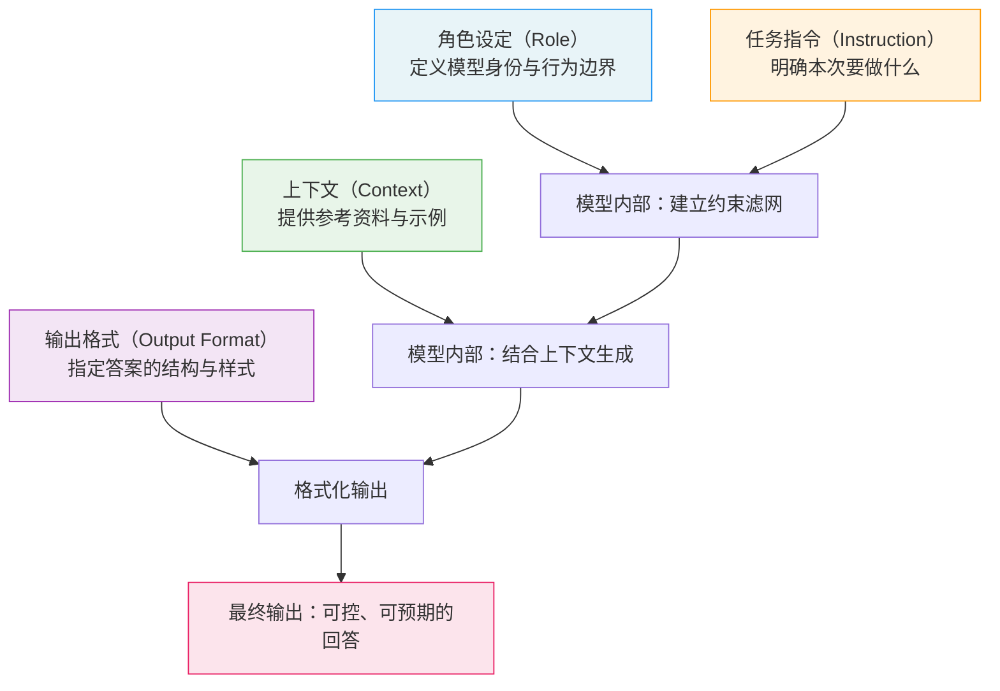

# 提示词的基本结构（Prompt Structure）

## 概念解释

Prompt Structure（提示词结构）是指与大语言模型交互时，把你想说的话按照"角色设定、任务指令、上下文信息、输出格式"几个部分有序组织的方式。你可以把它理解为"给 AI 写的一份简短工作说明书"——告诉它你是谁、要干什么、有哪些参考资料、答案长什么样。

为什么需要结构化？因为直接丢一句话给模型（比如"帮我写个方案"），模型不知道你要什么风格、什么长度、面向谁，只能猜，猜得好不好全凭运气。一旦把提示词拆成几个明确的部分，模型的理解就从"盲猜"变成了"按说明书办事"，输出的可控性和质量都会大幅提升。

在 Agent 系统中，提示词结构更是基础设施级的存在：Agent 的系统提示定义了它的角色和能力边界，用户提示驱动每一轮交互，输出格式决定了下游工具能否正确解析 Agent 的回答。可以说，没有清晰的提示词结构，Agent 就无法稳定运转。

## 关键结构

一条结构化提示词通常由四个部分组成，顺序很重要：

| 结构 | 作用 | 典型内容 |
|------|------|----------|
| 角色设定（Role） | 告诉模型"你是谁" | "你是一个资深 Python 开发者" |
| 任务指令（Instruction） | 告诉模型"要做什么" | "请审查以下代码的安全漏洞" |
| 上下文（Context） | 给模型提供"参考资料" | 背景数据、示例、文档片段 |
| 输出格式（Output Format） | 告诉模型"答案长什么样" | "以 JSON 格式返回，包含 severity 和 description 字段" |

### 结构 1：角色设定（Role）

角色设定是在对话开始前给模型的"人设"。在 API 中，它通常放在 System Prompt（系统提示）里，对整个对话全程有效。

角色设定影响三件事：
- **回答的专业程度**：设定为"数据科学家"和"小学老师"，对同一个问题的讲解深度完全不同。
- **术语选择**：技术角色倾向于使用专业术语，科普角色倾向于用大白话。
- **行为边界**：可以在角色中加入约束，比如"如果不确定，明确说不知道"。

Anthropic 的官方建议是：角色设定放在系统提示中，哪怕只有一句话也能显著改善输出质量。

### 结构 2：任务指令（Instruction）

任务指令是用户每次提问的核心部分，告诉模型这次具体要做什么。好的指令有三个特征：

- **具体**：不说"告诉我关于 AI 的信息"，说"用 200 字解释什么是强化学习"。
- **有行动动词**：用"列出""分析""对比""生成"开头，而不是"能不能帮我看看"。
- **有边界**：明确范围和限制，比如"只考虑 Python 3.10+ 的写法"。

OpenAI 在其 GPT-4.1 指南中的说法是：模型会非常"字面"地理解你的指令，你说得越精确，输出越符合预期。

### 结构 3：上下文（Context）

上下文是你提供给模型的"参考资料"。模型自身的知识有截止日期，且可能不了解你的具体业务场景，所以需要你把相关信息喂给它。上下文包括：

- **背景数据**：表格、统计数据、会议纪要等。
- **示例（Few-Shot）**：几组输入-输出的对照，帮助模型理解你期望的输出格式。
- **参考文档**：产品文档、API 说明、法规条文等，让模型基于真实资料回答。

Anthropic 和 Google 都建议：长文本上下文放在提示词的前面部分，具体指令放在最后面，这样效果最好。

### 结构 4：输出格式（Output Format）

输出格式告诉模型"答案应该长什么样"。不指定格式，模型就会自由发挥——有时给你一段散文，有时给你一个列表，每次都不一样。常见的格式约束包括：

- **结构化格式**：JSON、XML、Markdown 表格。
- **长度限制**："不超过 100 字""列出 3 个关键点"。
- **风格要求**："用口语化的方式""以专业报告的语气"。

Google Gemini 的官方建议明确指出：缺少输出格式规范是最常见的提示词错误之一。

## 核心原理

### 原理说明

提示词结构之所以有效，核心在于消除歧义、降低模型的"猜测空间"。模型处理一条提示词的过程可以拆成三步：

**第 1 步：解析结构。** 模型读取整条提示词，识别其中的角色设定、指令、上下文和格式要求。结构越清晰（比如用 XML 标签或 Markdown 标题分隔），模型越容易把各部分的内容区分开来。

**第 2 步：约束建立。** 模型基于角色设定和指令，在内部建立一组约束——什么该说、什么不该说、用什么风格说。这些约束就像一个"滤网"，过滤掉不符合要求的输出方向。

**第 3 步：受控生成。** 模型在约束范围内，结合上下文信息生成输出，并按照指定的格式组织答案。格式约束在最后一步生效，决定了输出的外观。

各大模型厂商对提示词各部分的权重机制略有不同：OpenAI 的 GPT 系列模型会严格遵循系统提示中的指令，尤其是 GPT-4.1 以后对指令的字面遵循度更高；Anthropic 的 Claude 系列模型对系统提示同样高度敏感，且建议用 XML 标签来组织复杂提示词；Google 的 Gemini 系列模型建议把核心约束放在系统指令的最后位置以获得最强约束力。

### Mermaid 图解



图中的关键流转：角色设定和任务指令共同建立约束，决定模型"往哪个方向生成"；上下文信息在生成阶段被参考，提供事实依据；输出格式在最后一步生效，把内容"装进"指定的容器里。四个部分缺一不可——缺了角色，风格不稳定；缺了指令，不知道干什么；缺了上下文，容易编造；缺了格式，输出不可预期。

### 运行示例

以下示例展示提示词四部分结构如何映射到 API 调用。

```python
# 基于 openai>=1.0.0 验证（截至 2026-03）
from openai import OpenAI

client = OpenAI()

response = client.chat.completions.create(
    model="gpt-4o-mini",
    messages=[
        # 角色设定 → system 消息
        {"role": "system", "content": "你是一个代码审查专家，只关注安全问题。"},
        # 任务指令 + 上下文 + 输出格式 → user 消息
        {"role": "user", "content": (
            "审查以下代码片段的安全漏洞：\n"           # 任务指令
            "```python\n"
            "password = input('请输入密码: ')\n"       # 上下文（待审查的代码）
            "query = f'SELECT * FROM users "
            "WHERE pwd={password}'\n"
            "```\n"
            "以 JSON 格式返回，包含 issue 和 fix 字段。"  # 输出格式
        )}
    ],
    temperature=0
)

print(response.choices[0].message.content)
# 输出示例：
# {"issue": "SQL 注入漏洞", "fix": "使用参数化查询替代字符串拼接"}
```

上述代码中，`system` 消息承载角色设定，`user` 消息中依次包含任务指令、上下文和输出格式要求。同样的结构在 Anthropic Claude API 中也适用——`system` 参数对应角色设定，`messages` 中的 `user` 消息对应其余三个部分。

## 易混概念辨析

| 概念 | 与提示词结构的区别 | 更适合关注的重点 |
|------|---------------------|------------------|
| Prompt Engineering（提示词工程） | 提示词工程是整个学科，提示词结构只是其中的基础知识 | 提示词工程还包括 Few-Shot、CoT、Prompt Chaining 等高级技巧 |
| System Prompt（系统提示） | 系统提示是提示词结构中的一个组成部分，不是全部 | 系统提示专注于角色、规则和全局约束 |
| Prompt Template（提示词模板） | 模板是带有变量占位符的可复用提示词，结构是模板遵循的设计原则 | 模板关注可复用性和变量替换机制 |
| Context Engineering（上下文工程） | 上下文工程关注如何管理和优化整个上下文窗口的内容 | 上下文工程的范围更大，涵盖 RAG、Memory、压缩等技术 |

核心区别：

- **提示词结构**：关注"一条提示词内部如何组织"，是静态的设计原则
- **Prompt Engineering**：关注"如何通过各种技巧提升模型输出质量"，提示词结构是其中的基础模块
- **System Prompt**：是提示词结构的角色设定部分在 API 层面的具体实现
- **Context Engineering**：关注的是上下文窗口的全局管理，提示词结构只是其中"组织方式"这一个维度

## 适用边界与局限

### 适用场景

1. **任何需要稳定、可控输出的 LLM 应用**：只要你希望模型每次的输出风格一致、格式可预期，结构化提示词都是第一步。无论是聊天机器人、内容生成还是数据提取，结构化提示词都是基础。
2. **Agent 系统的系统提示设计**：Agent 的行为边界、可用工具列表、输出格式规范，全部通过结构化的系统提示来定义。
3. **多人协作的提示词管理**：当团队多人共同维护提示词时，统一的结构让提示词像代码一样可读、可审查、可版本管理。

### 不适合的场景

1. **开放式创意写作**：如果你希望模型自由发挥（写诗、编故事），过度结构化反而会限制创意。此时只需简单的指令即可。
2. **探索性对话**：在与模型进行头脑风暴或探索性讨论时，严格的结构会打断对话的自然流动。

### 局限性

1. **结构不能替代模型能力**：再好的提示词结构也无法让弱模型完成超出其能力的任务。提示词结构是"解锁"模型潜力，而不是"创造"潜力。
2. **系统提示不是绝对安全的**：OpenAI 和 Google 的官方文档都明确指出，系统提示无法完全防止 Prompt Injection（提示词注入攻击），不应在系统提示中放置敏感信息。
3. **不同模型对结构的敏感度不同**：同一套提示词结构在不同模型上的效果可能差异显著。切换模型时通常需要重新调整。

## 常见误区

| 常见误区 | 正确理解 |
|----------|----------|
| "系统提示越长越好，要把所有规则都写进去" | 系统提示应该简洁聚焦。OpenAI 明确警告过长的系统提示会消耗上下文窗口，减少留给用户内容的空间。通常 3-10 句话足够。 |
| "只要写了系统提示，模型就一定会遵守" | 系统提示是"强烈建议"而非"绝对命令"。模型在长对话中可能偏离系统提示，尤其当用户消息与系统提示冲突时。需要通过测试验证遵循度。 |
| "提示词结构是固定的，所有模型都通用" | 不同厂商的模型对提示词结构的响应方式不同。例如 Anthropic 推荐用 XML 标签组织结构，Google Gemini 推荐把关键约束放在指令末尾。需要针对具体模型做适配。 |
| "输出格式只能用 JSON" | JSON 只是选项之一。Markdown 表格、编号列表、纯文本段落都是有效的输出格式，选择取决于下游系统的需求。 |

## 思考题

<details>
<summary>初级：提示词结构的四个组成部分分别是什么？如果只能保留两个，你会保留哪两个？为什么？</summary>

**参考答案：**

四个部分是：角色设定、任务指令、上下文、输出格式。如果只能保留两个，应保留任务指令和输出格式。任务指令是最核心的部分——没有指令，模型不知道要干什么；输出格式决定了结果能否被使用。角色设定和上下文虽然重要，但在简单任务中可以省略，模型仍能给出基本可用的回答。

</details>

<details>
<summary>中级：同一个任务的提示词，在 OpenAI GPT-4o 和 Anthropic Claude 上效果差异较大。可能的原因有哪些？你会如何排查？</summary>

**参考答案：**

可能原因：(1) 两个模型对系统提示的权重机制不同，Claude 对系统提示更敏感且建议使用 XML 标签；(2) 输出格式的遵循度不同，GPT-4.1+ 更字面化地遵循指令；(3) 默认行为差异，Claude 倾向于更谨慎和详细的回答。排查方法：先分别测试四个部分的影响——只保留指令看基础效果，逐步加入角色、上下文、格式，找出差异最大的部分。然后针对该部分做模型适配调整。

</details>

<details>
<summary>中级/进阶：你在设计一个客服 Agent，需要它在回答用户问题时既礼貌又准确，遇到不知道的问题要说"我帮您转接人工"。请设计这个 Agent 的系统提示，并说明你是如何运用提示词结构四要素的。</summary>

**参考答案：**

系统提示设计：
```
你是 XX 公司的智能客服助手。
【角色设定】你的语气始终礼貌、专业，使用敬语。
【行为规则】只回答与 XX 公司产品相关的问题。如果用户的问题超出你的知识范围，回复"抱歉，这个问题我需要帮您转接人工客服，请稍候"。
【输出约束】回答不超过 3 句话，先直接回答问题，再补充一句相关提示。
```
四要素的运用：角色设定定义了"客服助手"身份和礼貌语气；任务指令通过行为规则限定了回答范围和兜底策略；上下文在实际运行中由 RAG 系统动态注入产品知识库内容；输出格式限定了长度和结构（先回答后补充）。

</details>

## 参考资料

1. OpenAI. "Prompt Engineering Guide." https://platform.openai.com/docs/guides/prompt-engineering
2. OpenAI. "GPT-4.1 Prompting Guide." https://cookbook.openai.com/examples/gpt4-1_prompting_guide
3. Anthropic. "Prompting Best Practices." https://platform.claude.com/docs/en/build-with-claude/prompt-engineering/claude-prompting-best-practices
4. Google. "Prompt Design Strategies - Gemini API." https://ai.google.dev/gemini-api/docs/prompting-strategies
5. Learn Prompting. "Understanding Prompt Structure." https://learnprompting.org/docs/basics/prompt_structure
6. Prompting Guide. "Basics of Prompting." https://www.promptingguide.ai/introduction/basics
