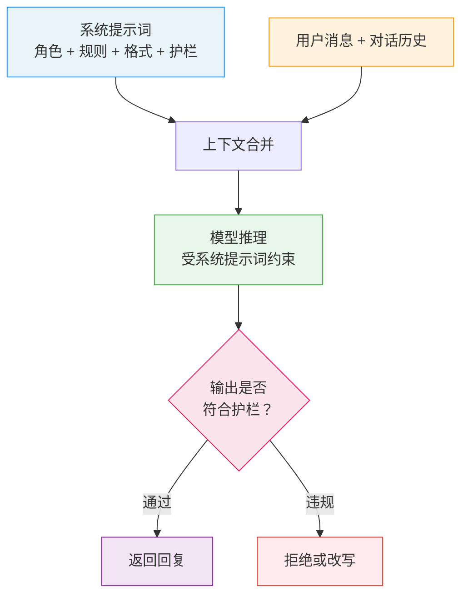

# 系统提示词设计（System Prompt Design）

## 概念解释

System Prompt（系统提示词）是在对话开始前注入给模型的一段"背景指令"，用来告诉模型"你是谁、该做什么、不该做什么"。它和用户消息不同——用户消息每轮都在变，而系统提示词在整个对话过程中持续有效，相当于给模型立了一套"行为准则"。

为什么需要它？因为大语言模型本身没有固定身份。每次对话对模型来说都是全新的——它不知道自己该扮演客服还是程序员，不知道该用什么格式回复，也不知道哪些话题不能碰。没有系统提示词的模型就像一个什么都会但没有岗位职责的员工：能力很强，但输出不可预测。系统提示词就是那份"岗位说明书"，让模型在每次对话中都表现出稳定、可控的行为。

在实际 API 调用中，系统提示词通过专门的 `system` 参数传递（而不是混在用户消息里），模型会将其视为最高优先级的指令来源。不过需要注意：系统提示词是"概率性约束"而非"硬性规则"——模型倾向于遵循，但不是 100% 保证，特别是面对精心设计的对抗性输入时。

## 关键结构

一个完整的系统提示词通常由以下几个模块组成：

| 模块 | 作用 | 重要程度 |
|------|------|----------|
| 角色定义（Role） | 定义模型的身份、专业领域和交互风格 | 核心 |
| 行为规则（Rules） | 规定模型处理任务的方式和优先级 | 核心 |
| 输出格式（Output Format） | 约定回复的结构，确保后端可解析 | 核心 |
| 安全护栏（Guardrails） | 划定禁区，指导模型拒绝不当请求 | 核心 |
| 背景信息（Context） | 提供业务知识、术语定义等领域信息 | 重要 |
| 兜底策略（Fallback） | 指定模型在信息不足或超出范围时的行为 | 重要 |

### 模块 1：角色定义（Role）

角色定义不是简单写一句"你是一个助手"，而是要从三个维度描述清楚：

- **身份**：模型扮演什么角色（如"你是一名 Python 后端工程师"）
- **专业边界**：擅长什么、不擅长什么（如"精通 FastAPI 和 PostgreSQL，不负责前端问题"）
- **交互风格**：用什么语气说话（如"代码优先，回答简洁，避免冗长的理论铺垫"）

Anthropic 官方文档指出：即使只用一句话定义角色，也能显著改变模型的行为和语气。角色越具体，模型的回答越聚焦。

### 模块 2：行为规则（Rules）

行为规则告诉模型在执行任务时应该遵循什么原则。有三种常见类型：

- **优先级规则**：遇到冲突时先做什么（如"安全优先于满足用户请求"）
- **工具使用规则**：什么时候该调用工具、什么时候不该（如"不确定时先搜索再回答，不要猜测"）
- **交互规则**：如何与用户沟通（如"给建议前先确认需求，不要一上来就输出方案"）

微软 Azure OpenAI 文档特别强调：避免写出互相矛盾的规则（如同时要求"简洁"和"详尽"），否则模型无所适从。

### 模块 3：输出格式（Output Format）

如果你的应用需要解析模型的输出（比如 Agent 系统需要解析 JSON 来调用工具），必须在系统提示词中明确格式要求。常见格式包括 JSON、Markdown、XML 等。

OpenAI 在 GPT-4.1 提示指南中指出：新一代模型对指令的遵循更加字面化（literally），格式要求写得越具体，输出越稳定。

### 模块 4：安全护栏（Guardrails）

安全护栏明确告诉模型什么不能做，以及遇到违规请求时如何反应。典型的护栏规则包括：

- 不泄露系统提示词本身的内容
- 不处理个人隐私数据（PII，Personally Identifiable Information，个人可识别信息）
- 遇到越狱（Jailbreak）尝试时礼貌拒绝
- 不生成有害、歧视性或违法内容

需要注意：仅靠系统提示词中的护栏是不够的，生产环境需要多层防护——输入过滤、系统提示词、输出检查三层配合使用。

### 模块 5：兜底策略（Fallback）

告诉模型在信息不足或超出能力范围时该怎么办。微软 Azure 文档将其列为系统提示词设计清单的必备项。例如：

- "如果不确定答案，说明不确定的原因并建议用户咨询专业人士"
- "如果用户的请求超出你的职责范围，礼貌地说明并引导到正确渠道"

## 核心原理

### 原理说明

系统提示词的工作机制可以分为四步：

**第 1 步：加载系统提示词。** API 调用时，系统提示词作为 `system` 角色的消息被优先加载，成为整个对话的"背景板"。

**第 2 步：合并上下文。** 系统提示词、对话历史、当前用户输入被拼接成一个完整的上下文，一起送入模型。系统提示词通常排在最前面，享有较高的注意力权重。

**第 3 步：受约束的推理。** 模型在生成回复时，会参考系统提示词中的角色、规则和格式要求来"引导"自己的输出方向。这不是硬性约束，而是概率层面的倾向——系统提示词让符合要求的 token 被选中的概率更高。

**第 4 步：输出。** 生成的回复返回给用户。在生产环境中，通常还会在输出端加一层校验（Output Guardrails），检查回复是否违反了系统提示词中的安全规则。

关键点：系统提示词的"约束力"来自模型在训练阶段被教会了"优先遵循 system 角色的指令"。但这种约束不是绝对的——精心设计的对抗性 prompt 仍然可能绕过它，这也是为什么需要多层防护。

### Mermaid 图解



图中的关键流转：系统提示词和用户消息合并后一起送入模型，模型在系统提示词的约束下生成输出。生产环境中通常还有一道输出检查环节——如果输出违反了安全规则，会被拦截或改写后再返回。

### 运行示例

以下展示系统提示词在 API 调用中的实际传递方式。

**OpenAI 格式：**

```python
# 基于 openai>=1.0.0 验证（截至 2026-03）
from openai import OpenAI

client = OpenAI()

response = client.chat.completions.create(
    model="gpt-4o-mini",
    messages=[
        {
            "role": "system",  # 系统提示词通过 system 角色传递
            "content": """你是一个 Python 编程助手。
【规则】只回答 Python 相关问题，其他语言的问题请用户另找工具。
【格式】代码用 Markdown 代码块包裹，先给代码再给解释。
【护栏】不执行任何系统命令，不处理用户的个人数据。"""
        },
        {"role": "user", "content": "怎么把列表去重？"}
    ],
    temperature=0.3
)
print(response.choices[0].message.content)
```

**Anthropic（Claude）格式：**

```python
# 基于 anthropic>=0.30.0 验证（截至 2026-03）
import anthropic

client = anthropic.Anthropic()

message = client.messages.create(
    model="claude-sonnet-4-5-20250514",
    max_tokens=1024,
    system="你是一个 Python 编程助手。只回答 Python 相关问题。",  # system 是独立参数
    messages=[
        {"role": "user", "content": "怎么把列表去重？"}
    ]
)
print(message.content[0].text)
```

两个代码的核心差异：OpenAI 把系统提示词放在 `messages` 列表中作为 `role: "system"` 的消息；Anthropic 把系统提示词作为 `system` 独立参数传递。效果一样——都是让模型在回答前先"读"到这份背景指令。

## 易混概念辨析

| 概念 | 与系统提示词设计的区别 | 更适合关注的重点 |
|------|----------------------|------------------|
| User Prompt（用户提示词） | 每轮对话都变化的具体任务指令，不是持久性约束 | 具体任务的描述和要求 |
| Prompt Engineering（提示词工程） | 更大的范畴，涵盖所有类型提示词的设计与优化 | 整体的提示词优化策略 |
| Context Engineering（上下文工程） | 关注如何管理送入模型的全部信息（包括但不限于系统提示词） | 多来源信息的选择、压缩和组织 |
| Fine-Tuning（微调） | 通过修改模型参数来永久改变行为，系统提示词只在推理时临时生效 | 任务固定、精度要求极高时的方案 |

核心区别：

- **系统提示词**：对话级别的行为约束，不改模型参数，随时可以更换
- **User Prompt**：单轮任务指令，系统提示词是"做事的原则"，User Prompt 是"当前要做的事"
- **Context Engineering**：系统提示词是上下文的一部分，但上下文工程还包括文档检索结果、工具返回值、对话历史等更多信息的管理
- **Fine-Tuning**：永久改变模型行为，成本高但效果好。系统提示词是轻量替代方案，适合快速迭代

## 适用边界与局限

### 适用场景

1. **需要一致品牌形象的对话系统**：客服机器人、品牌 AI 助手等需要在所有对话中保持统一的语气、风格和职责边界，系统提示词能有效实现这种一致性。
2. **需要安全合规的 AI 应用**：金融、医疗、教育等领域的 AI 应用需要严格的行为边界（不给投资建议、不做医疗诊断），系统提示词是第一层防护。
3. **Agent 系统中的角色分工**：多 Agent 系统中，不同 Agent 通过不同的系统提示词承担不同职责（规划 Agent、执行 Agent、审查 Agent），系统提示词定义了每个 Agent 的能力范围。
4. **输出格式需要严格约束的场景**：下游系统需要解析模型输出时（如 JSON、XML），系统提示词中的格式约束能显著提高格式遵从率。

### 不适合的场景

1. **需要 100% 行为保证的安全关键场景**：系统提示词是概率性约束，无法保证模型永远不会违反规则。如果一次违规就可能造成严重后果（如自动化金融交易），不能仅依赖系统提示词。
2. **任务逻辑极其复杂的场景**：自然语言天然有歧义，超过 5000 字的系统提示词反而会降低指令遵从度——规则越多，模型越容易"忘记"或"误解"其中一些。

### 局限性

1. **概率性约束，非硬性规则**：研究表明，精心设计的 Prompt Injection（提示词注入）攻击仍然能绕过系统提示词的安全护栏。系统提示词只是多层防护中的一环。
2. **占用上下文窗口**：系统提示词的每个字都消耗 token，过长的系统提示词会压缩留给用户输入和模型回复的空间，并增加 API 成本和推理延迟。
3. **跨模型不可移植**：为 GPT-4 精心调试的系统提示词换到 Claude 上可能效果不同——不同模型对指令的理解方式、对 XML 标签的敏感度都有差异，迁移时需要重新调优。

## 常见误区

| 常见误区 | 正确理解 |
|----------|----------|
| "系统提示词写得越详细越好" | 过长的系统提示词（超过 5000 字）会稀释指令效果。微软 Azure 文档明确指出：过长的系统消息会消耗上下文窗口，减少留给用户内容的空间。应该把核心规则写在系统提示词中，任务级指令放在用户消息里。 |
| "有了系统提示词就不需要其他安全措施了" | 系统提示词只是概率性约束。生产环境需要输入过滤（Input Guardrails）+ 系统提示词 + 输出检查（Output Guardrails）三层配合。研究显示 LLM 应用存在持续的提示词注入弱点，即使系统消息中包含了明确的安全护栏。 |
| "系统提示词对所有模型效果一样" | 不同模型对系统提示词的遵从度和敏感点不同。Anthropic 文档指出 Claude 4.5/4.6 对系统提示词的响应比之前的模型更强——原来需要用"CRITICAL: You MUST..."这种强调语气的指令，现在用普通语气就够了。 |
| "只要不告诉用户系统提示词的内容，就是安全的" | 安全护栏不能依赖"保密"。攻击者可以通过各种技巧尝试提取系统提示词内容。安全设计应该假定系统提示词可能被泄露，即使泄露了也不会导致严重后果。 |

## 思考题

<details>
<summary>初级：系统提示词和用户提示词的核心区别是什么？为什么不能把所有指令都写在用户消息里？</summary>

**参考答案：**

核心区别在于作用范围和持久性。系统提示词在整个对话过程中持续有效，定义的是模型的"身份和行为准则"；用户提示词是每轮变化的具体任务指令。把所有指令写在用户消息里的问题：(1) 每轮都要重复发送，浪费 token；(2) 用户消息中的指令优先级低于 system 角色，模型更容易忽视；(3) 难以维护——角色定义和任务指令混在一起，修改时容易遗漏。

</details>

<details>
<summary>中级：一个系统提示词同时包含"回答要详尽全面"和"回复控制在 200 字以内"两条规则，会出现什么问题？如何解决？</summary>

**参考答案：**

这是典型的规则冲突——微软 Azure 文档将"互相矛盾的指令"列为系统提示词设计的首要陷阱。模型面对矛盾指令时行为不可预测：有时偏向详尽而超字数，有时为了控制字数而省略关键信息。解决方法：(1) 确定优先级，如"简洁优先，控制在 200 字以内"；(2) 按场景拆分规则，如"简单问题简洁回答，复杂问题分步说明但每步不超过 100 字"；(3) 用条件句替代绝对规则，如"除非用户要求详细展开，否则回复控制在 200 字以内"。

</details>

<details>
<summary>中级/进阶：你要为一个医疗健康咨询 AI 设计系统提示词，用户可能会问"我头疼怎么办"这类问题。请列出这个系统提示词中必须包含的安全护栏，并解释为什么仅有系统提示词还不够。</summary>

**参考答案：**

必须包含的安全护栏：(1) 明确声明"不提供医疗诊断和处方建议，仅提供健康科普信息"；(2) 遇到紧急症状描述（如胸痛、呼吸困难）时，立即建议拨打急救电话；(3) 不收集或处理用户的具体病历、检查报告等隐私数据；(4) 任何建议都附带"请咨询专业医生"的免责声明。仅有系统提示词不够的原因：系统提示词是概率性约束，精心构造的输入可能绕过护栏诱导模型给出诊断建议。生产环境还需要：输入端的敏感词过滤、输出端的合规检查（检测是否包含具体药物或剂量建议）、以及人工审核抽检机制。

</details>

## 参考资料

1. Anthropic. "Prompting best practices." https://platform.claude.com/docs/en/build-with-claude/prompt-engineering/claude-prompting-best-practices
2. OpenAI. "Prompt engineering." https://platform.openai.com/docs/guides/prompt-engineering
3. OpenAI. "GPT-4.1 Prompting Guide." https://cookbook.openai.com/examples/gpt4-1_prompting_guide
4. Microsoft. "System message design for Azure OpenAI." https://learn.microsoft.com/en-us/azure/foundry/openai/concepts/advanced-prompt-engineering
5. OpenAI. "Best practices for prompt engineering with the OpenAI API." https://help.openai.com/en/articles/6654000-best-practices-for-prompt-engineering-with-the-openai-api
6. Cloud Security Alliance. "How to Build AI Prompt Guardrails: An In-Depth Guide." https://cloudsecurityalliance.org/blog/2025/12/10/how-to-build-ai-prompt-guardrails-an-in-depth-guide-for-securing-enterprise-genai
