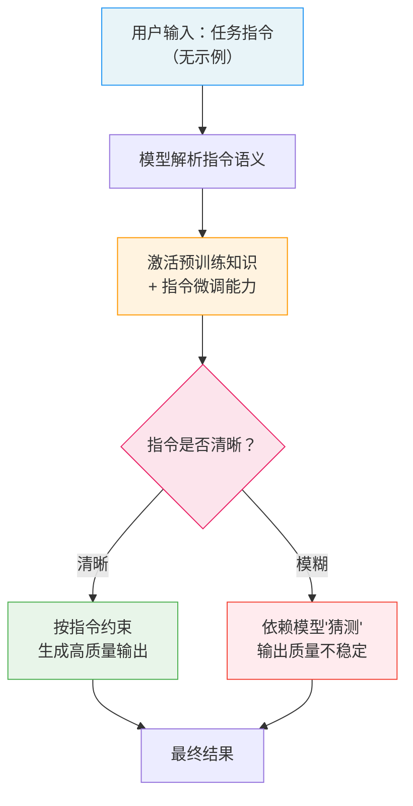

# 零样本提示（Zero-Shot Prompting）

## 概念解释

Zero-Shot Prompting（零样本提示）是一种不提供任何示例、仅用自然语言指令告诉大语言模型"做什么"的提示方式。你直接说"把这段话翻译成英文"或"判断这条评论是正面还是负面"，模型就凭预训练阶段积累的知识来完成任务——不需要给它看任何"正确答案的样子"。

这种方式能行得通，是因为现代 LLM（Large Language Model，大语言模型）在预训练时已经读过互联网上海量的文本，见过各种各样的任务形式。翻译、分类、摘要、问答……这些任务的"解法"已经编码在模型的参数里了。零样本提示本质上就是用一句清晰的指令，把模型内部已有的能力"激活"出来。

在零样本提示出现之前，让模型做特定任务主要有两条路：一条是 Fine-Tuning（微调），用大量标注数据重新训练模型，效果好但成本高；另一条是 Few-Shot Prompting（少样本提示），在提示词里塞几个例子帮模型理解，但每次调用都要多花 token。零样本提示是最轻量的选择——不需要额外数据、不消耗额外 token，一句指令直接上手。

## 关键结构

零样本提示的效果好不好，取决于指令本身的设计质量。一条有效的零样本指令通常包含以下维度：

| 维度 | 作用 | 说明 |
|------|------|------|
| 任务指令（Task Instruction） | 告诉模型"做什么" | 最核心的部分，必须明确、无歧义 |
| 角色设定（Role） | 给模型一个身份，影响输出风格 | 如"你是一个专业的翻译官" |
| 输出约束（Output Constraint） | 规定输出的格式、长度、结构 | 如"用 JSON 格式返回"、"不超过 50 字" |
| 反面指示（Negative Instruction） | 告诉模型"不要做什么" | 如"不要编造信息"、"不要输出解释过程" |

### 维度 1：任务指令（Task Instruction）

任务指令是零样本提示中唯一不可省略的部分。一条好的指令要做到：让任何人（包括模型）读完后都知道该做什么。

对比两种写法：

- 模糊写法："帮我分析一下这个。" → 模型不知道分析什么维度、输出什么格式
- 清晰写法："请将以下用户评论分类为 {正面, 负面, 中立} 之一。" → 模型准确知道任务目标和可选答案

### 维度 2：角色设定（Role）

同一个问题，不同角色产生不同质量和风格的回答。比如"解释量子力学"这个任务：

- 角色="物理学教授" → 输出严谨、术语多
- 角色="科普作家" → 输出通俗、比喻多

角色设定在 Chat 模型中通常写在 system message 里，相当于给模型划定了一个"人格"范围。

### 维度 3：输出约束（Output Constraint）

如果不告诉模型你想要什么格式的回答，它可能返回一整段散文。明确格式约束能大幅提升结果的可用性：

- 格式约束：JSON、Markdown 表格、纯文本
- 长度约束：一句话、不超过 100 字、三段话
- 结构约束：包含哪些字段、按什么顺序输出

### 维度 4：反面指示（Negative Instruction）

有时候"不要做什么"比"要做什么"更有效。常见的反面指示包括：

- "不要编造不存在的信息"
- "不要输出与任务无关的解释"
- "如果不确定，回答'不确定'而不是猜测"

## 核心原理

### 原理说明

零样本提示的工作机制可以分为三步理解：

**第 1 步：指令输入。** 用户用自然语言写一条任务指令，不附带任何输入-输出示例，直接交给模型。

**第 2 步：知识激活。** 模型收到指令后，在预训练阶段编码的海量知识中匹配相关能力。比如收到"翻译成英文"，模型会激活它在预训练时从数百万双语文本中学到的翻译能力。这种能力之所以存在，是因为两个底层机制：
- Instruction Tuning（指令微调）：模型在预训练后经过大量"指令-回答"数据的微调，学会了理解各种自然语言指令的含义
- RLHF（Reinforcement Learning from Human Feedback，基于人类反馈的强化学习）：通过人类偏好数据进一步对齐，让模型的输出更符合人的预期

**第 3 步：生成输出。** 模型基于理解的任务目标，结合指令中的格式约束，逐 token 生成回答。整个过程不修改模型参数，模型也不会"记住"这次对话——下次调用时一切从零开始。

### Mermaid 图解



图中的关键分支在"指令是否清晰"这一步：零样本提示没有示例来"兜底"，指令的清晰程度直接决定输出质量。这也是零样本和少样本最根本的差异——少样本可以靠示例弥补指令的不足，零样本完全依赖指令本身。

### 运行示例

以下示例展示零样本提示的核心用法——不给任何示例，仅靠指令驱动模型完成情感分类。

```python
# 基于 openai>=1.0.0 验证（截至 2026-03）
import os
from openai import OpenAI

client = OpenAI(api_key=os.getenv("OPENAI_API_KEY"))

# 零样本提示：没有任何示例，只有一条任务指令
response = client.chat.completions.create(
    model="gpt-4o-mini",
    messages=[
        {"role": "user", "content": (
            "请将以下用户评论分类为 {正面, 负面, 中立} 之一，"
            "只输出分类结果，不要解释。\n\n"
            "评论：这个产品质量不错，配送也很快，就是价格有点贵。"
        )}
    ],
    temperature=0,   # 降低随机性，提升分类稳定性
    max_tokens=10
)

print(response.choices[0].message.content)
# 输出：中立
```

上述代码中，`messages` 只包含一条 user 消息，没有任何 user-assistant 示例对。模型完全依靠"分类为 {正面, 负面, 中立} 之一"这条指令来理解任务，靠"只输出分类结果"这条约束来控制格式。

对比同一任务的 Few-Shot 写法：Few-Shot 需要先给 2-3 组"评论 → 分类"的示例对，再追加新数据；而 Zero-Shot 直接给指令和数据，省掉了所有示例的 token 开销。

## 易混概念辨析

| 概念 | 与零样本提示的区别 | 更适合关注的重点 |
|------|---------------------|------------------|
| Few-Shot Prompting（少样本提示） | 在提示词中嵌入 2-5 个示例来引导模型 | 需要精确格式控制或模型对零样本指令理解不准时使用 |
| Fine-Tuning（微调） | 修改模型参数，永久改变模型行为 | 精度要求极高、任务固定、有大量标注数据时选择 |
| Zero-Shot CoT（零样本思维链） | 在零样本指令后追加"请一步步思考"来激发推理 | 需要模型展示推理过程的复杂任务 |
| Instruction Tuning（指令微调） | 发生在模型训练阶段，不是用户行为 | 理解为什么现代模型的零样本能力越来越强 |

核心区别：

- **零样本提示**：核心是"指令驱动"，不给示例，完全靠指令质量决定效果
- **Few-Shot Prompting**：核心是"示例引导"，通过输入-输出示例定义任务。对于格式要求严格的任务，几个示例的效果往往优于纯指令
- **Fine-Tuning**：核心是"参数更新"，永久改变模型。零样本和 Few-Shot 都是推理时临时生效，Fine-Tuning 是训练时永久写入
- **Zero-Shot CoT**：是零样本的增强版，通过追加"Let's think step by step"触发模型的分步推理能力（Kojima et al., 2022 发现这一技巧将 GSM8K 数学推理准确率从 10.4% 提升到 40.7%）

## 适用边界与局限

### 适用场景

1. **通用常见任务**：翻译、摘要、情感分类、基础问答等模型在预训练时大量见过的任务类型，零样本效果通常已经足够好，不需要额外示例。
2. **快速原型验证**：有一个新想法想快速试试能不能跑通，不用费时间收集示例，直接写指令测试，几秒钟就知道结果。
3. **成本敏感的批量处理**：每天要处理百万级数据时，每条请求少几个示例就能省下大量 token 费用。零样本是 token 成本最低的提示方式。
4. **隐私敏感场景**：不需要在提示词中放入任何真实数据作为示例，避免敏感信息（如医疗记录、财务数据）泄露到 prompt 中。

### 不适合的场景

1. **格式要求严格的结构化输出**：如果需要模型输出特定的嵌套 JSON 结构或复杂表格格式，纯指令描述往往不如给几个示例直观。
2. **专业领域的精细分类**：如区分 20 种法律条款类型、8 种医学影像特征等，模型可能在预训练时没有充分接触这些细分领域，零样本容易出错。
3. **需要特定风格或语气的生成**：如果要模仿某个品牌的文案风格或某位作家的写作语气，纯指令很难精确传达，示例更有效。

### 局限性

1. **指令敏感性高**：同一个任务，换一种说法可能得到完全不同的结果。比如"分类这段文本"和"判断这段文本的情感倾向"可能触发不同的行为。没有示例来"锚定"任务，模型对指令措辞的敏感度更高。
2. **输出稳定性不如 Few-Shot**：没有示例作为格式参照，模型的输出格式可能在不同请求间波动。同一条指令发两次，格式可能不完全一致。
3. **对模型能力强依赖**：零样本效果与模型规模和训练质量正相关。小模型或老模型的零样本能力远弱于 GPT-4 级别的大模型。同一条指令在不同模型上的表现可能天差地别。

## 常见误区

| 常见误区 | 正确理解 |
|----------|----------|
| "零样本就是随便问一句，不需要设计提示词" | 零样本省掉的是示例，不是设计。指令的清晰度、角色设定、输出约束都需要精心设计，这些直接决定输出质量。 |
| "零样本效果差就说明模型不行" | 多数情况下是指令写得不够好，而不是模型能力不足。尝试换一种表述、加角色设定或明确输出格式，往往比直接切换到 Few-Shot 更高效。 |
| "零样本一定比少样本便宜" | 单次请求确实省 token，但如果零样本输出质量差、需要多次重试或人工修正，总成本可能反而更高。应该按任务实际效果选策略。 |
| "所有任务都应该先试零样本" | 对于格式要求严格或专业领域的任务，直接从 Few-Shot 起步可能更高效，避免在零样本上浪费调试时间。 |

## 思考题

<details>
<summary>初级：零样本提示和少样本提示的核心区别是什么？请用一句话概括。</summary>

**参考答案：**

零样本提示只给指令不给示例，模型完全依赖预训练知识；少样本提示在指令之外还嵌入了 2-5 个输入-输出示例，让模型从示例中学习任务模式。核心区别在于是否提供示例——零样本靠指令驱动，少样本靠示例引导。

</details>

<details>
<summary>中级：你写了一条零样本指令"分析这篇文章"，模型返回了一堆无关内容。请列出至少 3 个可能的改进方向。</summary>

**参考答案：**

(1) 明确分析维度——"分析"太模糊，应具体说明要分析什么（情感倾向、论点结构、写作风格等）；(2) 添加输出约束——规定输出格式（如"用 3 个要点总结"）和长度限制（如"不超过 200 字"）；(3) 设定角色——如"你是一位资深编辑"，帮助模型定位回答的专业程度和风格；(4) 添加反面指示——如"不要逐句翻译原文、不要输出与分析无关的内容"。

</details>

<details>
<summary>中级/进阶：你的 Agent 系统需要对用户输入进行意图分类（5 种意图），每天处理 50 万条请求。你会选零样本还是少样本？请说明决策依据。</summary>

**参考答案：**

建议先用零样本测试，根据准确率决定是否升级。决策依据：(1) 成本——50 万条/天的量级下，每条请求多 3 个示例会增加大量 token 开销，零样本成本优势明显；(2) 准确率——如果 5 种意图是常见类型（如"下单、退货、咨询、投诉、其他"），模型预训练时见过大量类似分类，零样本准确率通常在 85% 以上；(3) 格式稳定性——意图分类的输出很简单（一个标签），零样本格式失控的风险低；(4) 如果零样本准确率低于业务要求的阈值（如 90%），再升级为 Few-Shot，此时增加的 token 成本可以被准确率提升带来的价值抵消。实际工程中常见的做法是对比两种策略在 1000 条标注数据上的准确率和成本，取性价比更高的方案。

</details>

## 参考资料

1. Kojima, Takeshi, et al. "Large Language Models are Zero-Shot Reasoners." *NeurIPS* 35 (2022). https://arxiv.org/abs/2205.11916
2. Brown, Tom, et al. "Language Models are Few-Shot Learners." *NeurIPS* 33 (2020). https://arxiv.org/abs/2005.14165
3. Prompt Engineering Guide. "Zero-Shot Prompting." https://www.promptingguide.ai/techniques/zeroshot
4. IBM. "What is Zero-Shot Prompting?" https://www.ibm.com/think/topics/zero-shot-prompting
5. LearnPrompting. "Shot-Based Prompting: Zero-Shot, One-Shot, and Few-Shot Prompting." https://learnprompting.org/docs/basics/few_shot
