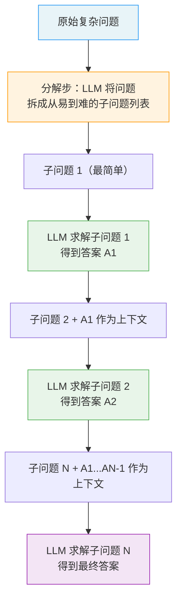
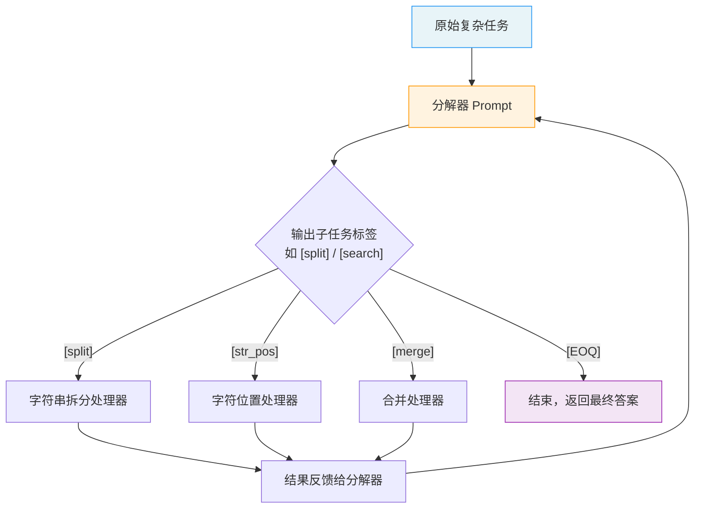

# 分解提示（Decomposition Prompting）

## 概念解释

Decomposition Prompting（分解提示）是一类提示技术的统称，核心思路是：**把一个复杂问题显式地拆成若干更简单的子问题，让 LLM（大语言模型）逐个击破，最后把各步答案组合成完整结果**。可以类比做一道多步应用题——不是直接写答案，而是先列出"第一步求什么、第二步求什么"，一步步算下来，最终得到正确答案。

为什么需要分解提示？因为 LLM 在面对复杂问题时，经常出现"推理链断裂"的情况——中间某个环节出错，后面就全跟着错。Chain-of-Thought（思维链，简称 CoT）虽然鼓励模型展示中间步骤，但它是让模型自己决定怎么拆，拆得好不好完全看运气。分解提示则更进一步：**由人或系统主动规划拆分方式**，把"怎么分步"这件事变成可控的。

分解提示不是某一篇论文的专有名词，而是一系列相关技术的总称。其中最具代表性的两种是：Least-to-Most Prompting（从易到难提示，简称 L2M）和 Decomposed Prompting（分解提示法，简称 DecomP）。它们的共同点是"先拆后解"，区别在于拆分方式和执行机制不同。

## 关键结构

分解提示的工作过程由三个阶段构成：

| 阶段 | 作用 | 关键点 |
|------|------|--------|
| 分解（Decompose） | 把复杂问题拆成多个子问题 | 分解质量直接决定最终效果 |
| 逐步求解（Solve） | 按顺序或按模块解决每个子问题 | 前一步的答案作为后一步的输入 |
| 合并（Synthesize） | 将各步结果整合为最终答案 | 有时最后一步的输出就是最终答案 |

### 阶段 1：分解（Decompose）

分解是整个流程中最关键的环节。分解的方式有两种主要思路：

- **从易到难**（Least-to-Most 思路）：先识别最简单的子问题，然后逐步升级到更复杂的，形成一条从易到难的求解链。
- **模块化分派**（DecomP 思路）：按任务性质将问题拆成不同类型的子任务，每个子任务交给最擅长的"处理器"去完成（可以是另一个 LLM prompt、一段代码函数、或外部工具）。

### 阶段 2：逐步求解（Solve）

子问题按依赖关系逐个执行。关键机制是**上下文传递**：前一个子问题的答案会被拼接到下一个子问题的 prompt 中，让模型在求解后续问题时能"看到"前面的结果。这类似于做数学题时，先算出的中间值会被带入下一步计算。

### 阶段 3：合并（Synthesize）

在许多场景下，最后一个子问题的输出就是最终答案，不需要额外的合并步骤。但如果子问题之间是并行关系（比如从多个角度分析同一个问题），则需要一个额外的合并步骤将各路结果整合。

## 核心原理

### 原理说明

分解提示有两条主流技术路线，下面分别说明。

**路线一：Least-to-Most Prompting（L2M，从易到难提示）**

由 Denny Zhou 等人在 2022 年提出（Google Research）。它的工作方式分两步：

1. **分解步**：给 LLM 一个 prompt，让它把原问题拆成一系列从简单到复杂的子问题。prompt 中通常包含几个分解的示例（Few-Shot 方式）。
2. **求解步**：从最简单的子问题开始，逐个求解。每解完一个，就把问题和答案一起追加到 prompt 中，作为求解下一个子问题的上下文。

L2M 的精妙之处在于：后面的子问题天然可以"看到"前面所有子问题的答案，形成了一条知识递增的求解链。在 SCAN 数据集上，L2M 用仅 14 个示例就达到了 99.7% 的准确率，而 CoT 只有 16%。

**路线二：Decomposed Prompting（DecomP，模块化分解提示）**

由 Tushar Khot 等人在 2022 年提出（Allen AI），发表于 ICLR 2023。它的核心区别是引入了**专用子任务处理器**的概念：

1. **分解器（Decomposer）**：一个专门的 prompt，负责将复杂任务拆成若干带标签的子任务（如 `[split]`、`[str_pos]`、`[merge]`）。
2. **子任务处理器（Handler）**：每种标签对应一个专用处理器，可以是另一个 LLM prompt（有自己的 Few-Shot 示例）、一段 Python 函数、或一个外部 API。
3. **迭代执行**：分解器输出一个子任务 → 对应处理器执行并返回结果 → 结果反馈给分解器 → 分解器输出下一个子任务 → 直到输出 `[EOQ]`（End of Question，结束标记）。

DecomP 的优势在于**模块化和可替换性**：某个子任务 LLM 做不好，可以换成代码函数来做；某类子问题有更好的专用 prompt，直接替换即可。

### Mermaid 图解

以下用两张图分别展示 L2M 和 DecomP 的工作流程。

**Least-to-Most 工作流程：**



L2M 的关键流转在于**答案的逐步累积**：每求解一个子问题，它的答案就会被追加到后续 prompt 中，让模型在解更难的问题时拥有更多已知信息。

**Decomposed Prompting（DecomP）工作流程：**



DecomP 的核心特征是**循环调度**：分解器不是一次性输出所有子任务，而是每次输出一个，等处理器返回结果后再决定下一步。这使得分解过程可以根据中间结果动态调整。

### 运行示例

以下伪代码展示 Least-to-Most 的核心机制——分解步和求解步的 prompt 结构。

```python
# 伪代码，展示 L2M 两阶段 prompt 的核心结构
# 基于 openai>=1.0.0（截至 2026-03）

from openai import OpenAI
import os

client = OpenAI(api_key=os.getenv("OPENAI_API_KEY"))

# ========== 第一阶段：分解 ==========
# prompt 中给出分解示例，引导模型拆解新问题
decompose_prompt = """
Q: 小明有 23 颗糖，给了小红 11 颗，又去商店买了 6 颗，最后还剩多少？
分解为子问题：
1. 小明给了小红糖后还剩多少？
2. 买了新的糖后总共多少？

Q: 一个班有 40 人，其中 60% 是女生，女生中有 3/4 喜欢运动，喜欢运动的女生有多少人？
分解为子问题：
"""

resp1 = client.chat.completions.create(
    model="gpt-4o-mini",
    messages=[{"role": "user", "content": decompose_prompt}],
    temperature=0
)
sub_questions = resp1.choices[0].message.content
# 预期输出：
# 1. 班里有多少女生？
# 2. 喜欢运动的女生有多少？

# ========== 第二阶段：逐步求解 ==========
# 从最简单的子问题开始，答案逐步累积
solve_prompt = f"""
原问题：一个班有 40 人，其中 60% 是女生，女生中有 3/4 喜欢运动，喜欢运动的女生有多少人？

Q: 班里有多少女生？
A: 40 × 60% = 24，班里有 24 个女生。

Q: 喜欢运动的女生有多少？
A:"""

resp2 = client.chat.completions.create(
    model="gpt-4o-mini",
    messages=[{"role": "user", "content": solve_prompt}],
    temperature=0
)
print(resp2.choices[0].message.content)
# 预期输出：24 × 3/4 = 18，喜欢运动的女生有 18 人。
```

上述代码中，第一阶段的 prompt 包含一个分解示例，引导模型对新问题执行相同的分解操作。第二阶段将子问题 1 的答案直接写入 prompt，模型在求解子问题 2 时可以直接引用"24 个女生"这一中间结果。

## 易混概念辨析

| 概念 | 与分解提示的区别 | 更适合关注的重点 |
|------|-----------------|------------------|
| Chain-of-Thought（思维链） | CoT 让模型自由展示推理过程，不主动规划分步方式；分解提示是显式地定义子问题 | 任务不太复杂、不需要严格控制拆分方式时用 CoT |
| Plan-and-Solve Prompting（规划-求解提示） | 先让模型生成一个求解计划再执行，更侧重"规划"阶段 | 缺失步骤（missing step）问题严重时选择 Plan-and-Solve |
| Tree of Thoughts（思维树） | 探索多条推理路径并允许回溯，是"广度搜索"；分解提示是"深度执行" | 需要在多种可能方案中做选择时用 ToT |
| Self-Ask（自问自答） | 模型自发地提出并回答中间问题，不依赖外部示例来定义拆分方式 | 希望全程由模型自主驱动时用 Self-Ask |

核心区别：

- **分解提示**：核心是"显式拆分 + 逐步求解"，拆分方式由人或系统主导
- **Chain-of-Thought**：核心是"展示推理过程"，不强制特定拆分结构。CoT 是一步到位地输出整个推理链，分解提示是分成多次调用逐步完成
- **Plan-and-Solve**：是分解提示的变体之一，区别在于它让模型先自己制定计划（plan），然后按计划执行（solve），计划阶段更加显式
- **Tree of Thoughts**：重点是"探索多种可能性"，而不是"按序逐步求解"

## 适用边界与局限

### 适用场景

1. **多步数学推理**：数学题天然有步骤结构，L2M 在 SCAN、GSM8K 等多步推理基准上表现优异。将复杂计算拆成单步运算，每步出错的概率远低于一次性计算。
2. **需要组合泛化的任务**：当测试问题比训练示例更复杂时（比如示例是 2 步题，测试是 5 步题），分解提示能显著提升泛化能力——这正是 L2M 论文的核心贡献。
3. **多模块协作的复杂任务**：如"从文档中提取关键信息 → 分类 → 生成摘要"这类流水线任务，DecomP 的模块化设计可以为每个环节指派专用处理器。
4. **需要可审计性的场景**：每个子问题的输入输出都可见可检查，出错时能精确定位到具体环节。

### 不适合的场景

1. **简单直接的任务**：如果问题本身就很简单（翻译一个短句、分类一条评论），分解反而增加了不必要的开销和延迟。
2. **高度主观或创意性任务**：写诗、头脑风暴等任务没有明确的步骤结构，强行分解可能限制创造力。

### 局限性

1. **错误级联（Error Cascading）**：前一步答错了，后面的步骤都会基于错误前提继续。这是所有串行分解方法的通病，也被称为 Prompt Drift（提示漂移）。
2. **Token 消耗增加**：每个子问题都需要携带上下文信息，总 token 消耗通常是单次调用的 2-3 倍，延迟也成比例增加。
3. **分解方案的迁移性差**：为某类任务设计的分解方案，换到另一类任务往往不适用，需要重新设计。
4. **知识缺口无法弥补**：2025 年的研究（arXiv:2602.04853）指出，分解提示能帮助模型更好地组织已有知识，但如果模型本身缺乏相关知识，分解也无济于事。

## 常见误区

| 常见误区 | 正确理解 |
|----------|----------|
| "分解提示就是 Chain-of-Thought 的另一种说法" | CoT 是让模型在一次回答中自由展示推理步骤；分解提示是将问题显式拆成多个独立子问题，通常涉及多次 LLM 调用。两者可以结合使用（如 DecomP + CoT），但机制不同。 |
| "子问题拆得越细越好" | 拆得太细会导致 token 浪费和延迟增加，而且过多的中间传递步骤反而增加了出错的机会。通常 3-6 个子问题是比较好的粒度。 |
| "分解提示能让模型回答它本来不会的问题" | 分解提示帮助模型更好地组织和使用它已有的知识，但不能凭空创造新知识。如果模型完全不具备某个领域的知识，分解也救不了。 |
| "所有复杂任务都应该用分解提示" | 对于能力强的模型（如 GPT-4、Claude 3.5），很多以前需要分解的任务现在用 Zero-Shot 或简单 CoT 就能解决。分解提示的边际收益随模型能力提升而递减。 |

## 思考题

<details>
<summary>初级：Least-to-Most 和 DecomP 的核心区别是什么？各自的"分解"发生在哪里？</summary>

**参考答案：**

Least-to-Most 的分解由一个统一的 prompt 完成，所有子问题由同一个 LLM 在同一个上下文中逐步求解，前面的答案自然累积到后续 prompt 中。DecomP 的分解由一个专门的"分解器 prompt"完成，每个子任务可以交给不同的专用处理器（可以是另一个 LLM prompt、代码函数或外部工具），处理器之间相互独立、可替换。简单说：L2M 是"一个模型从头做到尾"，DecomP 是"一个调度器分配给多个专家"。

</details>

<details>
<summary>中级：如果你用分解提示解一道 5 步数学题，第 2 步算错了，后面 3 步的结果会怎样？有什么缓解办法？</summary>

**参考答案：**

后面 3 步大概率全错，因为它们都依赖第 2 步的结果作为输入——这就是错误级联（Error Cascading）问题。缓解办法：(1) 在每步求解后加一个验证环节（如让另一个 LLM 检查答案是否合理）；(2) 对关键步骤多次采样取多数投票（Self-Consistency）；(3) 对数值计算类子任务，交给代码执行器而不是 LLM（DecomP 的模块化思路）；(4) 降低每步的难度，让单步出错概率尽可能低。

</details>

<details>
<summary>中级/进阶：你的 Agent 需要处理用户上传的合同文件，任务是"提取甲乙双方信息、识别关键条款、判断是否存在风险条款、生成摘要"。请设计一个分解方案，说明每步的输入输出，以及你会选择 L2M 还是 DecomP 风格。</summary>

**参考答案：**

推荐 DecomP 风格，因为各子任务性质差异大，适合专用处理器。分解方案：(1) 子任务 1——信息提取：输入为合同全文，输出为甲乙双方名称、地址、联系方式的结构化 JSON，可用专门的信息提取 prompt；(2) 子任务 2——条款识别：输入为合同全文，输出为关键条款列表（付款条件、违约责任、保密条款等），可用法律领域 prompt；(3) 子任务 3——风险判断：输入为子任务 2 的条款列表，输出为各条款的风险等级和理由，可结合规则引擎或法律知识库；(4) 子任务 4——摘要生成：输入为子任务 1-3 的全部输出，输出为结构化摘要。子任务 1 和 2 可并行执行（都只需要原文），子任务 3 依赖子任务 2，子任务 4 依赖前三者。选择 DecomP 而非 L2M 的理由：各步所需的"专业能力"不同，信息提取、法律判断、摘要生成适合用不同的 prompt 甚至不同的模型。

</details>

## 参考资料

1. Zhou, D., Schärli, N., Hou, L., Wei, J., et al. (2022). "Least-to-Most Prompting Enables Complex Reasoning in Large Language Models." arXiv:2205.10625. https://arxiv.org/abs/2205.10625
2. Khot, T., Trivedi, H., Finlayson, M., et al. (2022). "Decomposed Prompting: A Modular Approach for Solving Complex Tasks." ICLR 2023. https://arxiv.org/abs/2210.02406
3. LearnPrompting. "Advanced Decomposition Techniques for Improved Prompting in LLMs." https://learnprompting.org/docs/advanced/decomposition/introduction
4. LearnPrompting. "Decomposed Prompting (DecomP): Breaking Down Complex Tasks for LLMs." https://learnprompting.org/docs/advanced/decomposition/decomp
5. Allen AI. DecomP 官方代码仓库. https://github.com/allenai/DecomP
