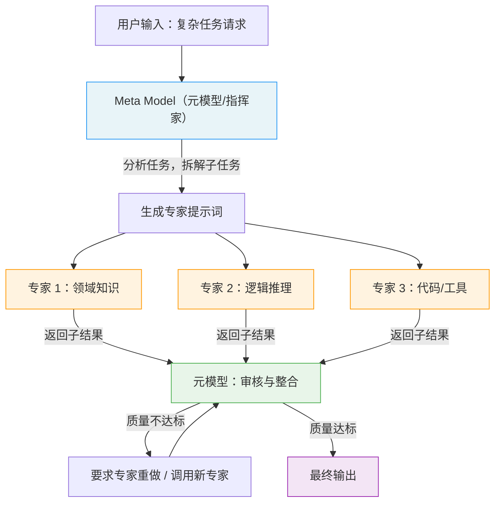

# 元提示（Meta Prompting）

## 概念解释

Meta Prompting（元提示）是一种"用提示词来操控提示词"的高阶提示技术。普通提示词直接让模型做事（"帮我翻译这段话"），而元提示则是让模型先规划怎么做事、拆解任务、生成更好的提示词，再去执行。可以把它理解为：普通提示词是"员工接到一项具体任务"，元提示是"经理拿到一个目标后，先拆解成若干子任务，再分配给合适的人去做"。

元提示诞生的动机很直接：随着 LLM 能处理的任务越来越复杂，单条提示词很难同时兼顾"任务拆解、推理策略选择、格式控制、结果验证"等多个维度。人工设计一条完美提示词既耗时又依赖经验，而且换个任务就得从头来。元提示把这个过程交给模型本身——让模型充当"提示词工程师"，自动化地完成任务分析、策略选择和提示词生成。

目前社区对"Meta Prompting"有两种主流用法，理解这个区分很重要：

- **用法一（Suzgun & Kalai, 2024）**：让一个 LLM 充当"指挥家"（Conductor），把复杂任务拆解成子任务，分配给多个"专家"角色分别处理，最后汇总结果。这是一种**任务编排**技术。
- **用法二（Zhang et al., 2024）**：让 LLM 关注任务的**结构和模式**而非具体内容，用抽象化的结构框架替代具体示例来引导推理。这是一种**结构化推理**技术。

两者的共同点是：都在"提示词之上"再加了一层抽象，让模型不只是执行指令，而是先理解任务的结构再行动。

## 关键结构

Meta Prompting 的运作依赖以下核心组成部分：

| 结构 | 作用 | 说明 |
|------|------|------|
| Meta Model（元模型/指挥家） | 接收任务、拆解规划、分配调度 | 整个流程的控制中心，负责"想清楚怎么做" |
| Expert（专家角色） | 执行具体子任务 | 可以是同一个模型扮演不同角色，也可以是不同的专用模型/工具 |
| 结构化模板 | 定义任务的抽象框架 | 关注"什么类型的问题、用什么结构来解"，而非具体内容 |
| 验证与整合机制 | 检查各专家输出的质量并汇总 | 元模型负责审核、纠错、合并最终结果 |

### 结构 1：Meta Model（元模型/指挥家）

Meta Model 是整个流程的大脑。它不直接解题，而是做三件事：(1) 分析任务需要什么能力；(2) 决定把任务拆成哪些子任务；(3) 为每个子任务生成专门的提示词，交给合适的"专家"去做。Suzgun & Kalai 将其比作交响乐团的指挥——指挥自己不演奏乐器，但决定了整场演出的节奏、分工和质量。

一个关键设计原则是 **"Fresh Eyes"（全新视角）**：只有元模型能看到完整的对话历史，每个被调用的专家只能看到元模型选择性共享给它的信息。这避免了上下文污染，让每个专家专注于自己的子任务。

### 结构 2：Expert（专家角色）

专家是实际执行子任务的角色。它可以是：
- 同一个 LLM 在不同系统提示词下扮演的"人格"（如"你是一个 Python 专家"）
- 专门微调过的模型
- 外部工具（如 Python 解释器、计算器、搜索引擎）

每个专家收到的提示词是由元模型精心构造的，包含该子任务所需的全部上下文，但不包含其他子任务的干扰信息。

### 结构 3：结构化模板

Zhang et al. 的研究强调，元提示的关键不在于给模型看具体的例子（那是 Few-Shot 的思路），而在于给模型一个**抽象的解题框架**。例如，不是展示"2+3=5"这个具体算式，而是告诉模型"数学问题的解题结构是：识别已知量 → 确定关系式 → 代入计算 → 验证结果"。这种结构化的引导方式让同一个模板可以泛化到不同的具体问题上。

## 核心原理

### 原理说明

Meta Prompting 的工作机制可以用"指挥家模式"来理解，分为四步：

**第 1 步：任务接收与分析。** 元模型（指挥家）接收用户的原始请求，分析这个任务的本质是什么、需要哪些能力（数学计算？代码编写？语言翻译？逻辑推理？）。

**第 2 步：任务拆解与角色分配。** 元模型将复杂任务拆成若干可独立处理的子任务，并为每个子任务指定一个专家角色。例如，面对"写一首关于量子力学的十四行诗"的请求，元模型可能拆解为：(1) 请物理学专家列出量子力学的核心概念；(2) 请诗歌专家按十四行诗格式创作。

**第 3 步：专家执行。** 每个专家在自己的独立上下文中执行子任务。专家只看到元模型共享给它的信息（Fresh Eyes 原则），不会被其他子任务的内容干扰。

**第 4 步：结果整合与验证。** 元模型收集所有专家的输出，进行审核和整合。如果发现某个专家的输出有问题（比如事实错误、逻辑矛盾），元模型可以要求该专家重做，或者调用新的专家来修正。最终输出一个经过验证的完整结果。

这套机制之所以有效，核心原因是**角色专注化**：当你告诉一个 LLM "你是一个 Python 专家"时，它的表现确实会比不指定角色时更好。元提示把这个现象系统化——不是给一个角色，而是给 N 个角色，每个角色只做自己最擅长的事。

### Mermaid 图解



图中的核心流转：用户只和元模型交互，元模型在幕后完成任务拆解、专家调度和结果整合。每个专家在独立上下文中工作（Fresh Eyes），彼此之间不直接通信，所有协调由元模型统一管理。验证环节是闭环设计——如果结果不合格，可以反复迭代直到达标。

### 运行示例

以下伪代码展示元提示"指挥家-专家"模式的核心逻辑。

```python
# 伪代码：Meta Prompting 的核心调度逻辑
# 基于 openai>=1.0.0 验证（截至 2026-03）

from openai import OpenAI

client = OpenAI()

def meta_prompt(user_task: str) -> str:
    """元提示的核心流程：指挥家拆解任务 → 专家执行 → 整合结果"""

    # 第 1 步：元模型分析任务并拆解
    decomposition = client.chat.completions.create(
        model="gpt-4o",
        messages=[
            {"role": "system", "content": (
                "你是一个任务编排专家。分析用户的任务，将其拆解为 2-4 个子任务。"
                "为每个子任务指定一个专家角色和具体指令。"
                "以 JSON 格式返回：{\"subtasks\": [{\"expert\": \"角色\", \"instruction\": \"指令\"}]}"
            )},
            {"role": "user", "content": user_task}
        ]
    ).choices[0].message.content

    subtasks = parse_json(decomposition)["subtasks"]

    # 第 2 步：每个专家在独立上下文中执行子任务（Fresh Eyes）
    expert_results = []
    for task in subtasks:
        result = client.chat.completions.create(
            model="gpt-4o",
            messages=[
                # 每个专家只看到自己的角色和指令，不看其他专家的内容
                {"role": "system", "content": f"你是一个{task['expert']}。"},
                {"role": "user", "content": task["instruction"]}
            ]
        ).choices[0].message.content
        expert_results.append({"expert": task["expert"], "output": result})

    # 第 3 步：元模型整合并验证所有专家的输出
    final = client.chat.completions.create(
        model="gpt-4o",
        messages=[
            {"role": "system", "content": (
                "你是最终审核者。综合以下各专家的输出，"
                "检查是否有矛盾或错误，整合为一个完整、准确的最终回答。"
            )},
            {"role": "user", "content": str(expert_results)}
        ]
    ).choices[0].message.content

    return final
```

上述代码对应三个阶段：元模型拆解（`decomposition`）、专家独立执行（`for task in subtasks`）、结果整合验证（`final`）。每个专家的 `messages` 列表是独立的，不包含其他专家的对话——这就是 Fresh Eyes 原则在代码层面的体现。实际工程中还需要加入重试逻辑、错误处理和结果校验。

## 易混概念辨析

| 概念 | 与 Meta Prompting 的区别 | 更适合关注的重点 |
|------|--------------------------|------------------|
| Few-Shot Prompting（少样本提示） | 通过提供具体示例引导模型，关注"内容"；Meta Prompting 提供抽象框架，关注"结构" | 任务格式明确、有现成示例可用时 |
| Chain-of-Thought（思维链） | 让模型展示推理步骤，是单一模型的推理增强；Meta Prompting 是多角色协作的任务编排 | 需要透明推理过程的单步骤任务 |
| APE（自动提示工程） | APE 是自动搜索最优提示词的算法，Meta Prompting 是更广义的"用提示词操控提示词"框架 | 需要批量优化提示词性能时 |
| Multi-Agent（多智能体） | Multi-Agent 是多个独立 Agent 协作，各有自己的记忆和工具；Meta Prompting 通常是同一个模型扮演多个角色 | 需要持久化记忆、独立工具调用的复杂系统 |

核心区别：

- **Meta Prompting**：核心是"让模型在提示词层面做规划和调度"，是一种提示工程技术
- **Few-Shot Prompting**：核心是"用具体示例教模型做事"，提供的是内容而非结构
- **APE**：核心是"自动化搜索最优提示词"，可以看作 Meta Prompting 思想的一种算法实现
- **Multi-Agent**：核心是"多个独立智能体协作"，是系统架构层面的设计，复杂度远高于 Meta Prompting

## 适用边界与局限

### 适用场景

1. **复杂多步骤任务**：需要结合多种能力（如"先查资料、再分析、再写报告"），Meta Prompting 的任务拆解能力可以把复杂任务变成多个简单子任务，每个子任务都能高质量完成。
2. **跨领域综合问题**：一个问题涉及多个领域知识（如"用物理概念写诗"），通过分配不同领域专家角色，比让单一角色勉强应对效果好得多。
3. **需要验证和自纠错的场景**：元模型的审核整合环节天然支持结果验证，适合对准确性有要求的任务（如数学推理、代码生成）。
4. **提示词批量生产**：需要为多种业务场景快速生成高质量提示词时，Meta Prompting 可以自动化这个过程。

### 不适合的场景

1. **简单直接的任务**：一句话就能说清楚的任务（如"把这段英文翻译成中文"），用 Meta Prompting 反而画蛇添足，增加延迟和成本。
2. **模型基础能力不足的情况**：如果底层模型本身对某个领域理解很差，Meta Prompting 无论怎么拆解和编排，也无法超越模型的能力上限。
3. **实时性要求极高的场景**：Meta Prompting 需要多轮 LLM 调用（拆解 → 执行 → 整合），延迟是普通提示词的 3-5 倍，不适合对响应时间敏感的场景。

### 局限性

1. **成本倍增**：每个子任务都是一次独立的 API 调用，一个复杂任务可能触发 5-10 次调用，Token 消耗和费用相应倍增。
2. **编排质量取决于元模型能力**：元模型如果拆解任务不合理（比如遗漏关键子任务、分配了不合适的专家角色），整体结果就会出错。目前只有 GPT-4 级别的强模型才能胜任元模型角色。
3. **错误传播风险**：如果某个专家的输出有错，且元模型在整合阶段未能发现，错误会被带入最终结果。链条越长，出错概率越高。

## 常见误区

| 常见误区 | 正确理解 |
|----------|----------|
| "Meta Prompting 就是让 AI 帮我写提示词" | 写提示词只是 Meta Prompting 最表面的用法。它的核心价值在于任务拆解、多角色编排和结果验证的完整框架，不只是生成一段文字。 |
| "Meta Prompting 可以替代 Fine-Tuning" | Meta Prompting 在推理时增强模型表现，但不改变模型参数。对于需要极高精度、或涉及模型完全不了解的领域知识的任务，Fine-Tuning 仍然不可替代。 |
| "只有 GPT-4 才能用 Meta Prompting" | GPT-4 级别的模型做"元模型/指挥家"效果最好，但专家角色可以用较小的模型甚至工具（如 Python 解释器）。关键是元模型要够强，专家角色可以灵活选择。 |
| "Meta Prompting 和 Multi-Agent 是一回事" | Meta Prompting 是提示工程层面的技术，通常在单次交互中完成；Multi-Agent 是系统架构层面的设计，涉及持久记忆、独立工具和跨轮对话。两者可以结合，但不是一回事。 |

## 思考题

<details>
<summary>初级：Meta Prompting 中"元模型"和"专家"各自负责什么？为什么要让专家在独立上下文中工作（Fresh Eyes 原则）？</summary>

**参考答案：**

元模型负责任务分析、拆解、角色分配和最终结果整合验证；专家负责在自己的专业领域内执行具体子任务。Fresh Eyes 原则的核心目的是避免上下文污染——如果专家看到其他子任务的内容，可能会受到干扰而偏离自己的专注领域。每个专家只看到与自己子任务相关的信息，能更专注、更准确地完成工作。

</details>

<details>
<summary>中级：假设你用 Meta Prompting 处理一个任务，但最终结果质量很差。可能的原因有哪些？你会如何排查？</summary>

**参考答案：**

可能的原因有三个层面：(1) 元模型层面——任务拆解不合理，遗漏了关键子任务，或者为子任务分配了不合适的专家角色；(2) 专家层面——某个专家的输出质量低（可能是提示词不够具体、模型能力不足、或给定的上下文信息不完整）；(3) 整合层面——元模型未能发现专家输出中的错误或矛盾，直接拼接了有问题的结果。排查方法：逐步检查每个专家的独立输出，定位质量瓶颈在哪个环节，然后针对性优化该环节的提示词或换用更强的模型。

</details>

<details>
<summary>中级/进阶：你负责一个客服系统，需要处理退货、技术支持、投诉升级三类工单。请设计一个 Meta Prompting 方案：元模型如何判断工单类型？每类工单分配什么专家？如何处理边界模糊的工单？</summary>

**参考答案：**

方案设计：(1) 元模型首先分析工单内容，判断属于退货/技术支持/投诉升级中的哪一类，如果明确则直接分配对应专家；(2) 退货类分配"退货流程专家"（熟悉退货政策、物流流程），技术支持类分配"技术诊断专家"（熟悉产品功能和故障排除），投诉升级类分配"客户关系专家"（擅长情绪安抚和补偿方案）；(3) 对于边界模糊的工单（如"产品有问题想退货但也很生气"），元模型可以同时调用技术诊断专家和客户关系专家，先判断技术问题是否可解决，再决定走退货还是维修路线，整个过程中客户关系专家负责沟通语气的把控。元模型最终整合两个专家的建议，输出一个兼顾问题解决和客户体验的完整回复。

</details>

## 参考资料

1. Suzgun, M. & Kalai, A. T. (2024). "Meta-Prompting: Enhancing Language Models with Task-Agnostic Scaffolding." arXiv:2401.12954. https://arxiv.org/abs/2401.12954
2. Zhang, Y. et al. (2024). "Meta Prompting for AI Systems." ICLR 2024 BGPT Workshop. arXiv:2311.11482. https://arxiv.org/abs/2311.11482
3. Prompt Engineering Guide - Meta Prompting. https://www.promptingguide.ai/techniques/meta-prompting
4. Suzgun, M. meta-prompting GitHub 仓库（官方实现）. https://github.com/suzgunmirac/meta-prompting
5. OpenAI Cookbook - Enhance your prompts with meta prompting. https://cookbook.openai.com/examples/enhance_your_prompts_with_meta_prompting

---
