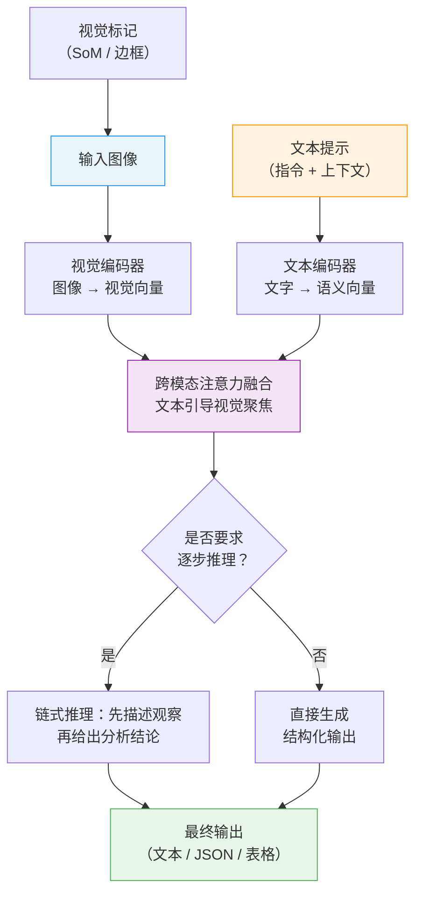

# 多模态提示（Multimodal Prompting）

## 概念解释

Multimodal Prompting（多模态提示）是一种面向多模态大语言模型（Multimodal LLM，即同时能处理图像、文本等多种输入的大模型）的提示设计技术。它的核心思路是：在提示词中同时使用图像和文本两种信息，通过精心安排图像位置、编写结构化文本指令、在图上添加视觉标记等手段，引导模型更准确地"看懂"图片并完成分析推理。

在多模态提示出现之前，让 AI 分析图像主要靠两条路：一是专门训练的计算机视觉模型，只能做预设好的任务（比如分类、检测），灵活性差；二是先用 OCR 或图像描述模型把图转成文字，再交给语言模型处理，信息损失严重。2023 年 GPT-4V 发布后，大语言模型第一次具备了直接"看图说话"的能力，但人们很快发现：同样一张图，提示词写法不同，模型的分析质量天差地别。多模态提示正是为解决"怎么和视觉模型高效沟通"这个问题而发展起来的一套方法论。

在 Agent 系统中，多模态提示的应用越来越广：Agent 需要理解用户上传的截图来执行操作（Computer Use，计算机操作）、需要分析文档中的表格和图表来提取数据、需要识别产品图片来做质量检测——这些场景都离不开精心设计的多模态提示。

## 关键结构

多模态提示的效果取决于四个核心要素的配合：

| 要素 | 作用 | 关键考量 |
|------|------|----------|
| 图像位置（Image Placement） | 决定图像在提示中的摆放顺序 | 图像前置（先图后文）通常效果最好 |
| 文本指令结构（Text Instruction） | 用分层、具体的文字引导模型分析方向 | 具体任务指令远优于"描述这张图" |
| 视觉标记（Visual Marking） | 在图上添加数字、边框等标注来指向关键区域 | 标记要有针对性，过多反而干扰 |
| 上下文补充（Context） | 提供背景知识、输出格式要求等额外信息 | 领域知识能显著提升专业任务准确率 |

### 要素 1：图像位置（Image Placement）

图像在提示中的位置会显著影响模型理解效果。根据 Anthropic 和 Microsoft 的官方文档，**图像前置**（即先放图片，再写文字指令）通常效果最好。原理类似于文本提示中"长文档放在查询前面"的最佳实践——模型先建立对图像内容的理解，再根据后续文字指令聚焦到具体任务上。

处理多张图像时，应为每张图显式编号（如"图 1：""图 2："），并在文字指令中用编号引用，避免模型搞混不同图片。

### 要素 2：文本指令结构（Text Instruction）

有效的文本指令通常采用三层结构：

- **任务定义**：一句话说明要做什么（如"分析这张 X 光片中的异常区域"）
- **具体要求**：列出需要关注的细节（如"依次检查肺部左叶和右叶，标注可疑阴影的位置和大小"）
- **输出格式**：明确期望的结果形式（如"用 JSON 格式输出，包含 region、finding、confidence 三个字段"）

模糊的指令（如"看看这张图"）会导致模型输出宽泛且不可控；具体的指令能让模型的注意力集中在你真正关心的部分。

### 要素 3：视觉标记（Visual Marking）

Visual Prompting（视觉提示）是指在送入模型之前，先在图像上添加可视化标记来引导模型注意力。最有代表性的方法是 Microsoft 提出的 **Set-of-Mark（SoM）Prompting**：用分割模型（如 SAM）把图像切成多个区域，然后在每个区域上覆盖数字标签或彩色边框，再把标记后的图像和文字指令一起送给模型。

实验表明，SoM 在零样本设置下就能超越经过完整微调的专用模型在视觉定位任务上的表现。

### 要素 4：上下文补充（Context）

补充领域背景能显著提升模型的推理质量。告诉模型"这是一张工业产品的质检照片，需要检查表面划痕"比单纯说"分析这张图片"更有效。上下文还包括：参考图像（如正常产品和缺陷产品的对比图）、任务中的领域术语解释、以及模型应该做出的假设。

## 核心原理

### 原理说明

多模态提示的工作机制可以分为三步理解：

**第 1 步：多模态编码。** 模型内部有两个编码器：视觉编码器（Vision Encoder）把图像转换成一组向量表示（可以理解为"模型眼中的图像特征"），文本编码器把提示文字转换成语义向量。两组向量进入同一个向量空间，模型就能同时"看到"图片和"读到"文字。

**第 2 步：跨模态融合。** 模型通过注意力机制（Attention）在视觉向量和文本向量之间建立关联。文本指令中提到"左上角的红色区域"，模型就会把注意力集中到图像对应位置的视觉特征上。这就是为什么具体的文字描述比模糊的指令效果好——具体描述能更精确地引导注意力。

**第 3 步：推理与输出。** 融合后的信息进入解码器，模型按照文本指令中定义的任务和格式要求生成最终输出。如果提示中包含 Chain-of-Thought（链式思维）指令（如"请逐步分析"），模型会先输出推理过程，再给出结论，这能显著减少幻觉。

多模态提示的本质是：**通过精心设计的文本指令和视觉标记来操纵模型的注意力分配**，让模型把计算资源集中在你关心的图像区域和分析维度上。

### Mermaid 图解



图中的关键流转在"跨模态注意力融合"节点：文本指令的具体程度直接决定了视觉特征被关注的精确度。如果文本只说"看看这张图"，注意力会分散到整张图像；如果文本说"检查图像右下角标记 3 处的裂纹"，注意力会精准聚焦到对应区域。视觉标记（左侧输入）通过修改图像本身来进一步强化这种聚焦效果。

### 运行示例

以下示例展示多模态提示的核心结构——如何将图像和分层文本指令组合送入 API。

```python
# 基于 anthropic>=0.25.0 验证（截至 2026-03）
import anthropic

client = anthropic.Anthropic()  # 需设置 ANTHROPIC_API_KEY 环境变量

# 使用可公开访问的图片 URL，避免示例依赖本地文件
image_url = "https://images.unsplash.com/photo-1518770660439-4636190af475?auto=format&fit=crop&w=1200&q=80"

# 多模态提示的核心结构：图像在前，分层文本指令在后
message = client.messages.create(
    model="claude-sonnet-4-20250514",
    max_tokens=1024,
    messages=[{
        "role": "user",
        "content": [
            # 第一部分：图像（前置）
            {
                "type": "image",
                "source": {
                    "type": "url",
                    "url": image_url,
                },
            },
            # 第二部分：分层文本指令
            {
                "type": "text",
                "text": (
                    "你是一名产品质检专家。这是一张电路板的质检照片。\n\n"
                    "请按以下步骤分析：\n"
                    "1. 整体外观：焊点是否均匀，有无明显歪斜\n"
                    "2. 缺陷检测：逐区域检查是否有虚焊、短路、元器件缺失\n"
                    "3. 给出结论：合格/不合格，附原因\n\n"
                    "输出格式：JSON，包含 overall_status、defects（数组）、conclusion 字段"
                )
            }
        ],
    }],
)

print(message.content[0].text)
```

上述代码展示了多模态提示的三个核心要素：图像前置、角色上下文（"产品质检专家"）、分层任务指令（三步分析 + 输出格式约束）。`content` 列表中图像排在文本之前，对应"图像前置"原则。

## 易混概念辨析

| 概念 | 与多模态提示的区别 | 更适合关注的重点 |
|------|---------------------|------------------|
| Visual Prompting（视觉提示） | 专指在图像上添加标记（边框、数字等）的技术，是多模态提示的子集 | 关注如何通过修改图像本身来引导模型注意力 |
| Multimodal RAG（多模态检索增强生成） | 关注如何检索相关图文信息来增强生成，多模态提示关注如何设计单次提示 | 关注检索策略和多模态索引构建 |
| Image Captioning（图像描述） | 是一种具体任务（让模型描述图片内容），多模态提示是完成该任务的方法 | 关注描述的质量评估标准 |
| Prompt Tuning for VLM（视觉语言模型的提示调优） | 通过训练学习可微的提示向量，修改了模型参数；多模态提示不改参数 | 关注参数高效微调方法 |

核心区别：

- **多模态提示**：不改模型参数，通过设计图像+文本的输入组合来引导模型行为，重点是"怎么写提示"
- **Visual Prompting**：多模态提示中专门处理图像标注的子技术，重点是"怎么改图"
- **Multimodal RAG**：在多模态提示的基础上增加了检索环节，重点是"怎么找到相关图文"
- **Prompt Tuning**：需要训练数据和计算资源来学习提示向量，属于参数微调范畴

## 适用边界与局限

### 适用场景

1. **文档与表格理解**：发票识别、合同信息提取、财务报表分析等场景。文档中同时包含视觉布局和文本内容，多模态提示能帮模型同时理解格式和数据，用分步指令引导逐字段提取。
2. **产品质检与缺陷检测**：在图上标注可疑区域，配合领域上下文（"这是 PCB 板焊接检测"），让模型逐区域判断缺陷类型。相比训练专用模型，多模态提示可以零样本适应新产品线。
3. **UI/UX 分析与 Computer Use**：Agent 需要理解屏幕截图来执行操作。Anthropic 的测试表明，给 Claude 配备"裁剪放大"工具后，对 UI 元素的识别准确率有显著提升。
4. **教育与知识讲解**：给一张概念图或实验照片，配合提示让模型用指定难度级别来解释内容，适合个性化教学场景。

### 不适合的场景

1. **纯文本任务**：如果任务只涉及文字处理（翻译、摘要、分类），引入图像不仅无益反而浪费 token，增加成本和延迟。
2. **需要像素级精度的专业视觉任务**：如医学影像的精确测量、卫星图像的亚像素定位，当前多模态模型的空间分辨率不够，应使用专用视觉模型。

### 局限性

1. **图像分辨率限制**：模型处理图像时会内部缩放，细小文字或微小缺陷可能在缩放中丢失。高分辨率图像可以先裁剪关键区域再送入模型。
2. **空间推理能力有限**：模型对"左/右/上/下"等空间关系的理解不够精确，可能把"左边的杯子"和"右边的杯子"搞混。视觉标记（数字编号）可以部分缓解此问题。
3. **跨图一致性差**：分析多张图像时，模型可能对第一张和第五张图使用不同的术语或分析标准。需要在提示中明确要求统一标准。
4. **成本与延迟**：图像输入的 token 消耗远高于文本（一张图通常折算为数百到数千 token），大规模应用成本较高，推理速度也慢于纯文本。

## 常见误区

| 常见误区 | 正确理解 |
|----------|----------|
| "把图片丢给模型就行，它能自动找到重点" | 模型的注意力由文本指令和视觉标记共同引导。不指定关注点，模型会给出泛泛的描述，遗漏你真正关心的细节。 |
| "图片放在提示的哪个位置都无所谓" | Anthropic 和 Microsoft 的官方文档都建议图像前置（先图后文）。图像放在文本之后时效果通常会下降，尤其是单图场景。 |
| "在图上标记越多越好，模型能看得更仔细" | 过多的标记会导致图像杂乱，反而干扰模型的视觉识别。标记应有针对性，只标注真正需要分析的关键区域。 |
| "多模态提示能替代专业视觉模型" | 多模态提示的优势是灵活性和零样本泛化，但在精度要求极高的专业场景（如医学影像精确测量），仍然需要经过微调的专用模型。 |

## 思考题

<details>
<summary>初级：多模态提示中"图像前置"原则的依据是什么？在什么情况下可以不遵守这个原则？</summary>

**参考答案：**

图像前置的依据是：模型先处理图像建立视觉理解，再根据后续文字指令聚焦到具体任务，两者的对齐效果更好。这和文本提示中"长文档放在查询前面"是同一个道理。不遵守的情况：当需要多轮交互、在对话中途插入新图像时，图像自然会出现在之前文本的后面，此时模型仍能正常处理。Anthropic 的文档也指出，图像放在文本后面"仍然表现良好"，只是前置效果更优。

</details>

<details>
<summary>中级：Set-of-Mark（SoM）Prompting 和直接在文本中描述区域位置（如"图片左上角的红色物体"）相比，各有什么优劣？</summary>

**参考答案：**

SoM 的优势：(1) 通过数字标签建立了明确的"标记-描述"对应关系，消除了空间描述的歧义；(2) 对于模型空间推理能力弱的情况仍然有效；(3) 研究表明零样本效果可超越微调模型。SoM 的劣势：(1) 需要额外的图像处理步骤（分割 + 标注），增加了流程复杂度；(2) 标记本身会遮挡图像内容；(3) 需要预先知道哪些区域值得标注。文本描述的优势是简单直接、不修改原图，但依赖模型的空间理解能力，在复杂场景下容易产生定位偏差。

</details>

<details>
<summary>中级/进阶：你需要设计一个 Agent，自动分析用户上传的电商产品图片并生成商品描述。请设计多模态提示方案，考虑以下问题：(1) 如何处理不同类别的商品（服装、电子产品、食品）？(2) 如何保证描述风格一致？(3) 如何减少幻觉？</summary>

**参考答案：**

(1) 采用两阶段策略：第一阶段用一个通用多模态提示让模型识别商品类别；第二阶段根据类别选择对应的专用提示模板（服装关注材质、版型、搭配场景，电子产品关注参数、接口、外观做工，食品关注配料、包装、保质期）。(2) 在系统提示中定义统一的描述模板和风格规范（字数、语气、必填字段），用 Few-Shot 给出 2-3 个标准描述示例。(3) 减少幻觉的三个手段：要求模型只描述图中可见的内容、使用"先观察再总结"的链式推理提示、在输出格式中增加 confidence 字段让模型自评不确定性。

</details>

## 参考资料

1. Anthropic. "Vision - Claude API Docs." https://platform.claude.com/docs/en/build-with-claude/vision
2. Microsoft Learn. "Image prompt engineering techniques - Azure OpenAI." https://learn.microsoft.com/en-us/azure/ai-services/openai/concepts/gpt-4-v-prompt-engineering
3. Yang et al. "Set-of-Mark Prompting Unleashes Extraordinary Visual Grounding in GPT-4V." arXiv:2310.11441 https://arxiv.org/abs/2310.11441
4. NVIDIA Developer. "Vision-Language Model Prompt Engineering Guide for Image and Video Understanding." https://developer.nvidia.com/blog/vision-language-model-prompt-engineering-guide-for-image-and-video-understanding/
5. Keskar et al. "Evaluating Multimodal Vision-Language Model Prompting Strategies for Visual Question Answering." WACV 2025 Workshop. https://openaccess.thecvf.com/content/WACV2025W/LLVMAD/papers/Keskar_Evaluating_Multimodal_Vision-Language_Model_Prompting_Strategies_for_Visual_Question_Answering_WACVW_2025_paper.pdf
6. Hugging Face. "Vision Language Models (Better, faster, stronger)." 2025. https://huggingface.co/blog/vlms-2025
