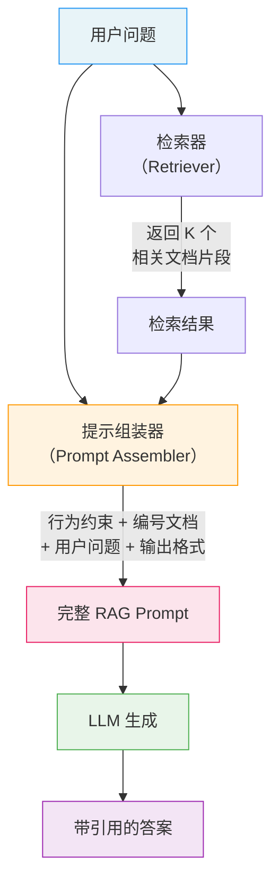

# 检索增强提示（RAG Prompting）

## 概念解释

RAG Prompting（检索增强提示）是一种专门为 RAG（Retrieval-Augmented Generation，检索增强生成）系统设计提示词的技术。它的核心操作是：先从外部知识库检索出与用户问题相关的文档片段，再用精心设计的提示模板把这些片段和用户问题组织成一个结构清晰的 prompt，送给 LLM（Large Language Model，大语言模型）生成答案。

为什么需要专门的"RAG 提示"技术？因为普通的 prompt 只包含用户问题，模型只能依赖训练数据来回答，遇到实时信息、专业领域知识或私有数据时极易产生 Hallucination（幻觉，即模型编造不存在的事实）。而 RAG 提示通过动态注入真实的外部文档，给模型提供了可参考的"证据"，从根本上降低了幻觉风险。

RAG 提示和普通的"把文档粘贴到问题后面"有本质区别。一个好的 RAG 提示需要解决三个问题：怎么组织检索到的多个文档片段（上下文注入）、怎么告诉模型正确使用这些文档而不是自行发挥（行为约束指令）、怎么让模型在答案中标注信息来源（引用归因）。这三个问题的设计质量，直接决定了 RAG 系统的最终效果。

## 关键结构

RAG 提示由四个关键组成部分协同工作：

| 结构 | 作用 | 说明 |
|------|------|------|
| 行为约束指令 | 定义模型如何使用检索上下文 | 明确告诉模型"只根据提供的资料回答"，是防止幻觉的核心手段 |
| 上下文注入区 | 承载检索到的文档片段 | 用清晰的分隔符和编号组织多个文档，方便模型定位信息 |
| 用户问题区 | 放置原始用户查询 | 与上下文区域明确隔开，避免模型混淆"参考资料"和"需要回答的问题" |
| 输出格式要求 | 规定答案的格式和归因方式 | 指定模型是否需要标注来源、用什么格式引用 |

### 结构 1：行为约束指令

行为约束指令是 RAG 提示区别于普通提示的关键。它告诉模型两件事：**必须做什么**（严格基于提供的资料回答）和**不能做什么**（不要使用训练数据中的知识进行补充）。

典型的约束指令：

- "仅基于以下参考资料回答问题，不要使用你自己的知识"
- "如果参考资料中不包含答案，请明确说明'根据提供的资料无法回答'"

缺少约束指令时，模型倾向于把检索文档当作"参考"而非"唯一依据"，仍然会混入训练数据中的信息，导致答案不可控。

### 结构 2：上下文注入区

上下文注入区负责把检索到的文档片段以结构化方式呈现给模型。三种常见的注入方式：

- **直接拼接**：把所有文档文本直接拼在一起，最简单但模型难以区分不同文档的边界。
- **编号标记**：为每个文档编号（如"[资料 1]""[资料 2]"），模型可以在回答时引用编号。这是目前业界推荐的做法。
- **元数据增强**：除了编号和内容，还附加来源、日期、相关度评分等元数据，帮助模型判断信息的可信度和时效性。

### 结构 3：用户问题区

用户问题区看似简单，但在 RAG 提示中有一个关键设计要点：必须用明确的分隔符（如"【用户问题】""---"或 XML 标签）将问题和上下文隔开。研究表明，当问题和上下文混在一起时，模型的回答准确率明显下降。

### 结构 4：输出格式要求

输出格式要求决定了答案的可追溯性。常见的归因格式包括：

- **行内引用**：在答案句子末尾标注 `[资料 1]` 或 `[来源 2]`。
- **尾部引用列表**：答案结束后统一列出所有参考来源。
- **无引用模式**：适用于不需要追溯来源的场景（如内部 FAQ）。

## 核心原理

### 原理说明

RAG Prompting 的工作机制分为五步：

**第 1 步：用户提问。** 用户输入一个自然语言问题，这个问题同时送往两个处理流：检索器和提示组装器。

**第 2 步：文档检索。** Retriever（检索器）根据用户问题的语义，从知识库中找出 K 个最相关的文档片段。常用的检索方式包括 Dense Retrieval（密集向量检索，用 Embedding 模型计算语义相似度）和 Sparse Retrieval（稀疏检索，如 BM25 关键词匹配）。这一步的质量是整个 RAG 系统效果的基础。

**第 3 步：上下文组装。** 提示组装器将检索到的文档片段按设计好的模板格式化——添加编号、分隔符、元数据——然后和行为约束指令、用户问题拼接成完整的 prompt。这一步是 RAG Prompting 的核心环节。

**第 4 步：模型生成。** LLM 接收完整 prompt 后，在行为约束指令的引导下，基于注入的文档上下文生成答案。模型此时有了"外部证据"可以参考，不需要完全依赖训练数据。

**第 5 步：归因输出。** 如果 prompt 中包含了引用格式要求，模型会在答案中标注信息来源。后处理模块可以进一步校验引用的准确性。

关键点：第 3 步的提示组装质量直接影响第 4 步的生成效果。同样的检索结果、同样的模型，仅仅因为提示模板不同，答案质量可以差距巨大。这也是为什么 RAG Prompting 是一个独立的技术方向，而不仅仅是"把文档粘贴到 prompt 里"。

### Mermaid 图解



图中的关键流转在提示组装器（Prompt Assembler）节点——它接收两路输入（用户问题 + 检索结果），输出一个结构完整的 RAG Prompt。这个节点的设计质量决定了后续 LLM 能否正确利用检索到的信息。如果组装不当（比如缺少行为约束指令、文档之间没有分隔符），即使检索结果完全正确，模型也可能忽略文档内容或产生幻觉。

### 运行示例

以下伪代码展示 RAG Prompting 的核心结构——如何将检索结果组装成结构化 prompt。

```python
# RAG Prompting 的核心结构演示（伪代码）
# 不依赖特定框架，展示提示组装逻辑

def build_rag_prompt(query: str, retrieved_docs: list[dict]) -> str:
    """
    将用户问题和检索结果组装成 RAG Prompt。

    参数:
        query: 用户的原始问题
        retrieved_docs: 检索到的文档列表，每个文档包含 content 和 source 字段
    返回:
        组装完成的 RAG Prompt 字符串
    """
    # 第一部分：行为约束指令
    system_instruction = (
        "你是一个专业的问答助手。请严格遵守以下规则：\n"
        "1. 仅基于【参考资料】中的内容回答问题\n"
        "2. 回答时用 [资料 N] 标注信息来源\n"
        "3. 如果参考资料中没有相关信息，回答"根据提供的资料无法回答"\n"
        "4. 不要添加参考资料以外的知识\n"
    )

    # 第二部分：上下文注入区（编号标记方式）
    context_block = "【参考资料】\n"
    for i, doc in enumerate(retrieved_docs, 1):
        context_block += f"[资料 {i}] 来源：{doc['source']}\n"
        context_block += f"{doc['content']}\n\n"

    # 第三部分：用户问题区（用分隔符隔开）
    question_block = f"【用户问题】\n{query}\n"

    # 第四部分：输出格式要求
    output_instruction = "【回答要求】\n请基于参考资料回答，标注引用来源编号。\n"

    # 组装完整 prompt
    return f"{system_instruction}\n{context_block}\n{question_block}\n{output_instruction}"


# 使用示例
docs = [
    {"content": "向量数据库通过 Embedding 将文本转为高维向量进行相似度检索。", "source": "技术文档 A"},
    {"content": "BM25 是一种基于词频的稀疏检索算法，适合精确关键词匹配。", "source": "技术文档 B"},
]

prompt = build_rag_prompt("向量检索和关键词检索有什么区别？", docs)
# prompt 可直接作为 LLM API 的输入
```

`build_rag_prompt` 函数对应 Mermaid 图中的"提示组装器"节点。四个部分的拼接顺序（约束指令 → 上下文 → 问题 → 输出要求）是经过实践验证的推荐结构。实际生产中还需要处理文档截断（超过 token 限制时的裁剪策略）和文档去重。

## 易混概念辨析

| 概念 | 与 RAG Prompting 的区别 | 更适合关注的重点 |
|------|------|------|
| RAG 系统架构 | RAG 系统包含检索、重排、生成等完整管线；RAG Prompting 只关注"生成"阶段的提示词设计 | 端到端的系统设计，包括向量数据库选型、Embedding 模型选择等 |
| Context Engineering（上下文工程） | 上下文工程范围更广，涵盖系统指令、对话历史、工具定义等所有上下文管理；RAG Prompting 是其中专门处理检索文档注入的子集 | 整体上下文管理策略，包括 token 预算分配和上下文压缩 |
| Few-Shot Prompting（少样本提示） | Few-Shot 注入的是"示例"来教模型学格式和规律；RAG Prompting 注入的是"证据"来提供事实依据 | 示例选择策略和格式一致性 |
| Fine-Tuning（微调） | 微调通过修改模型参数让模型内化知识；RAG Prompting 在推理时动态注入外部知识，不改变模型本身 | 有大量高质量标注数据、任务固定且精度要求极高时选择微调 |

核心区别：

- **RAG Prompting**：关注的是"如何把检索到的文档有效地喂给模型"，核心是提示模板设计
- **RAG 系统架构**：关注的是端到端管线，提示设计只是其中一环
- **Context Engineering**：关注的是所有类型的上下文管理，RAG 提示设计是其子问题
- **Few-Shot Prompting**：注入的是"示例"用于格式引导，RAG Prompting 注入的是"证据"用于事实增强

## 适用边界与局限

### 适用场景

1. **知识密集型问答**：用户问题涉及专业领域知识（法律条文、医疗指南、产品手册），模型训练数据不足以覆盖。通过检索注入最新的权威文档，模型可以给出有据可查的答案。
2. **时效性要求高的场景**：信息频繁更新（API 文档、政策法规、新闻资讯），靠模型训练数据必然过时。RAG 提示可以动态注入最新文档，无需重新训练模型。
3. **需要答案可追溯的场景**：金融合规、法律咨询、学术综述等场景要求每个结论都能追溯到来源文档。RAG 提示的归因机制天然满足这一需求。

### 不适合的场景

1. **纯创意生成任务**：写诗、编故事、头脑风暴等不需要事实依据的任务，注入检索文档反而会限制模型的创造力。
2. **知识库质量差或覆盖不足**：如果检索到的文档本身就是错误的或不相关的，再好的提示设计也救不了。RAG Prompting 的效果上限由检索质量决定。
3. **实时对话中延迟敏感的场景**：检索 + 文档注入会增加 prompt 长度，导致推理延迟和成本上升。对响应速度要求极高的闲聊场景不适合。

### 局限性

1. **检索质量瓶颈**：提示设计再好，如果检索器返回的是不相关文档，模型要么被误导，要么只能回答"无法基于资料回答"。优化 RAG 系统时，改进检索器的收益通常大于改进提示模板。
2. **Lost in the Middle 现象**：研究表明，当注入的上下文较长时，LLM 倾向于关注开头和结尾的文档，忽略中间部分的信息。需要通过重排序策略（把最相关的文档放在开头和结尾）来缓解。
3. **Token 成本放大**：每次请求都需要注入检索文档，输入 token 数可能是普通提示的 3-10 倍。大规模部署时的 API 成本是一个现实约束。
4. **归因准确性有限**：模型经常综合多个文档的信息来生成一个句子，精确到句子级别的来源标注仍然困难。2025 年的研究（如 CiteFix）表明，即使是先进模型的引用准确率也只有约 74%。

## 常见误区

| 常见误区 | 正确理解 |
|----------|----------|
| "RAG 提示就是把检索到的文档粘贴在问题后面" | 有效的 RAG 提示需要精心设计行为约束指令、文档编号分隔、输出格式要求。直接拼接文本的效果远不如结构化模板，模型可能忽略文档或混淆文档边界。 |
| "检索到的文档越多，答案越准确" | 注入过多文档会导致 token 浪费、模型注意力分散，甚至触发"Lost in the Middle"效应。实践中 3-7 个高相关文档通常优于 15-20 个文档。关键是相关性而非数量。 |
| "有了 RAG 提示就不会产生幻觉了" | RAG 提示大幅降低了幻觉风险，但无法完全消除。模型仍可能对检索文档进行错误推断、跨文档错误组合，或在无关信息中"发现"并不存在的联系。仍需要配合输出验证机制。 |
| "提示模板优化比检索优化更重要" | 检索质量是 RAG 系统效果的天花板。如果检索器返回了错误的文档，提示模板再好也无法生成正确答案。通常应该先确保检索质量达标，再优化提示设计。 |

## 思考题

<details>
<summary>初级：RAG Prompting 中的"行为约束指令"解决了什么问题？如果去掉这条指令，会发生什么？</summary>

**参考答案：**

行为约束指令解决的是"模型选择性忽略检索文档，转而使用自身训练数据回答"的问题。去掉约束指令后，模型会把注入的文档当作"可选参考"而非"唯一依据"，在答案中混入训练数据中的信息——这些信息可能已过时或与检索文档矛盾，导致答案不可控、来源不可追溯。

</details>

<details>
<summary>中级：你的 RAG 系统检索到了 10 个文档片段，但 LLM 的回答只引用了第 1 个和第 10 个文档的内容，忽略了中间 8 个。可能的原因是什么？如何改善？</summary>

**参考答案：**

最可能的原因是"Lost in the Middle"现象——LLM 在处理长上下文时，注意力集中在开头和结尾，忽略中间内容。改善方法：(1) 减少注入的文档数量，只保留相关度最高的 3-5 个；(2) 对检索结果做重排序（Re-ranking），把最重要的文档放在开头和结尾位置；(3) 将长文档拆分为更短的段落，降低单次注入的上下文长度；(4) 在提示中为每个文档添加编号和摘要，帮助模型快速定位关键信息。

</details>

<details>
<summary>中级/进阶：你正在为一个法律咨询系统设计 RAG 提示。用户提问"租房合同到期后房东不退押金怎么办？"，检索到了 3 条相关法律条文和 2 篇律师解读文章。请设计提示模板的大致结构，并说明你在归因设计上的考虑。</summary>

**参考答案：**

提示结构：(1) 行为约束——"严格基于以下法律条文和专业解读回答，每个结论必须标注依据来源，禁止给出法律条文中未涉及的建议"；(2) 上下文注入——将法律条文和律师文章分开两组编号，如"[法条 1][法条 2][法条 3]"和"[解读 1][解读 2]"，便于用户区分权威程度；(3) 用户问题区；(4) 输出格式——要求模型在每个建议后标注引用来源，并在答案末尾附加免责声明"以上内容仅供参考，具体情况请咨询执业律师"。归因设计的核心考虑：法律场景对来源准确性要求极高，应区分"法律条文"和"律师解读"的权威等级，避免模型把个人解读混同为法律规定。

</details>

## 参考资料

1. Prompt Engineering Guide. "Retrieval Augmented Generation (RAG)." https://www.promptingguide.ai/techniques/rag
2. Stack AI. "Prompt Engineering for RAG Pipelines: The Complete Guide." https://www.stackai.com/blog/prompt-engineering-for-rag-pipelines-the-complete-guide-to-prompt-engineering-for-retrieval-augmented-generation
3. Tensorlake. "Citation-Aware RAG: How to add Fine Grained Citations in Retrieval and Response Synthesis." https://www.tensorlake.ai/blog/rag-citations
4. Wang et al. "Enhancing Retrieval-Augmented Generation: A Study of Best Practices." arXiv:2501.07391, 2025
5. Oracle AI Blog. "Enhancing RAG Systems with Advanced Prompting Techniques." https://blogs.oracle.com/ai-and-datascience/enhancing-rag-with-advanced-prompting
