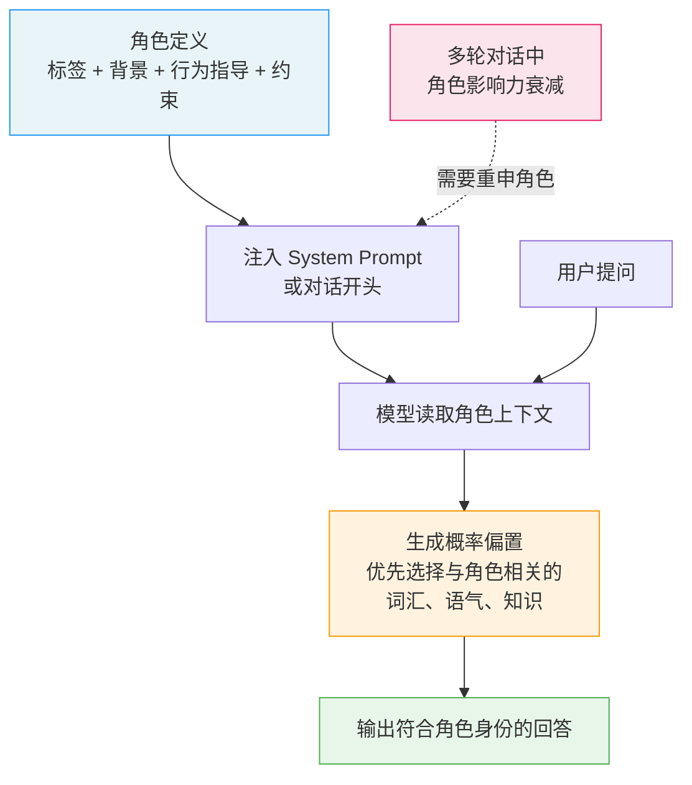

# 角色扮演提示（Role Prompting）

## 概念解释

Role Prompting（角色扮演提示，也叫 Persona Prompting / 人设提示）是一种在提示词中为大语言模型指定一个具体身份或角色的技术。写法上通常是在 System Prompt（系统提示词）或用户消息的开头加一句"你是一位……"，让模型以该身份的视角、语气和知识侧重来生成回答。

为什么需要它？直接向 LLM 提问，模型的回答往往偏通用、偏中立。比如你问"如何优化代码性能"，模型可能给一堆笼统建议；但如果你先说"你是一位有 10 年经验的后端工程师"，模型会自动倾向于从工程实战角度出发，给出更具体、更有深度的回答。角色定义本质上是一种**上下文压缩**——用一句话就能隐式传递大量背景信息（专业领域、沟通风格、知识水平），省去逐条说明的麻烦。

需要注意的是，模型并不会真的"变成"某个专家。它只是根据训练数据中与该角色相关的文本分布，调整自己的生成策略，优先输出符合该身份语境的内容。这意味着角色扮演能改善输出的风格和视角，但**不能保证事实准确性**——一个"医生"角色的 LLM 仍然可能给出医学错误。

## 关键结构

一个有效的角色扮演提示由以下要素组成：

| 要素 | 作用 | 说明 |
|------|------|------|
| 角色标签（Role Label） | 定位身份 | 告诉模型"你是谁"，如"资深 Python 工程师" |
| 背景信息（Background） | 增加深度 | 补充经验、专长、工作环境等细节 |
| 行为指导（Behavior Guide） | 约束风格 | 指定沟通方式、思维习惯、输出要求 |
| 约束条件（Constraints） | 划定边界 | 明确角色不能做什么、不涉及哪些领域 |

### 要素 1：角色标签（Role Label）

角色标签是整个提示词的起点，直接决定模型会"激活"哪类知识和表达方式。标签越具体，效果越好。对比两种写法：

- 模糊："你是一位专家" → 模型不知道该侧重哪个领域
- 具体："你是一位有 10 年分布式系统经验的后端工程师" → 模型能锁定技术领域、经验层次和专业用语

### 要素 2：背景信息（Background）

背景信息为角色标签补充深度。例如不仅说"你是一位医生"，还可以加上"你在三甲医院内科工作了 15 年，擅长用通俗语言向患者解释病情"。这些细节帮助模型调整回答的专业程度和用词选择。

### 要素 3：行为指导（Behavior Guide）

行为指导明确角色在回答时的具体做法。例如："先给结论，再给原因""用类比解释复杂概念""每个建议附带一个实际案例"。行为指导和角色标签的区别在于：角色标签说"你是谁"，行为指导说"你该怎么做"。

### 要素 4：约束条件（Constraints）

约束条件划定角色的能力边界，防止模型越界。例如"作为健康咨询助手，你不能诊断疾病，只能提供一般性健康知识""遇到紧急症状时，必须建议用户立即就医"。约束条件在面向用户的 Agent 应用中尤为关键，涉及安全和合规。

## 核心原理

### 原理说明

Role Prompting 的工作机制可以拆解为三步：

**第 1 步：角色注入。** 用户在 System Prompt 或对话开头写入角色定义（标签 + 背景 + 行为指导 + 约束）。这段文字成为模型生成时的"上下文锚点"。

**第 2 步：生成偏置。** 模型的训练数据中包含大量不同身份的文本（医学论文、技术博客、法律文件等）。当模型读到"你是一位医生"时，它会调整 Token 的生成概率分布，使医学术语、临床思维方式相关的 Token 被优先选中。这不是真的"切换人格"，而是条件概率分布的偏移（Conditional Distribution Shift）。

**第 3 步：风格化输出。** 基于偏置后的概率分布，模型生成符合该角色语气、用词和知识侧重的回答。如果角色定义中包含行为指导（如"用类比解释"），模型还会调整回答的结构和表达方式。

关键要点：角色定义的影响力在长对话中会逐渐衰减。研究发现，某些模型在多轮对话后会偏离角色设定（社区称之为"人格崩坏"）。应对方法是在关键轮次重申角色，或在 System Prompt 中加入强化指令。

### Mermaid 图解



图中的关键流转：角色定义通过 System Prompt 注入后，影响模型对每个 Token 的生成概率。虚线箭头表示在多轮对话中需要定期"刷新"角色定义以防止人格崩坏。用户提问和角色上下文共同决定最终输出。

### 运行示例

以下示例展示 Role Prompting 的核心结构——如何通过 System Prompt 注入角色，以及同一问题在不同角色下的输出差异。

```python
# 基于 openai>=1.0.0 验证（截至 2026-03）
import os
from openai import OpenAI

client = OpenAI(api_key=os.getenv("OPENAI_API_KEY"))

def ask_with_role(role_prompt: str, question: str) -> str:
    """以指定角色身份回答问题"""
    response = client.chat.completions.create(
        model="gpt-4o-mini",
        messages=[
            {"role": "system", "content": role_prompt},
            {"role": "user", "content": question},
        ],
        temperature=0.7,
        max_tokens=300,
    )
    return response.choices[0].message.content

# 同一问题，不同角色 → 不同视角的回答
question = "如何提高团队的工作效率？"

# 角色 A：技术管理者
answer_a = ask_with_role(
    "你是一位有 8 年经验的技术团队 Tech Lead。你擅长用工程思维分析管理问题，回答时优先考虑工具链和流程优化。",
    question,
)

# 角色 B：组织心理学顾问
answer_b = ask_with_role(
    "你是一位组织心理学顾问，专注于团队动力学和员工心理健康。你回答时优先关注人的因素，而非工具或流程。",
    question,
)

print("【Tech Lead 视角】")
print(answer_a)
print("\n【心理学顾问视角】")
print(answer_b)
# Tech Lead 倾向于谈 CI/CD、代码审查、自动化工具
# 心理学顾问倾向于谈沟通信任、心理安全感、激励机制
```

上述代码中，`role_prompt` 作为 system message 注入，`question` 作为 user message。两次调用使用完全相同的问题，唯一区别是角色定义——模型会根据角色身份选择不同的知识视角和表达方式来回答。

## 易混概念辨析

| 概念 | 与 Role Prompting 的区别 | 更适合关注的重点 |
|------|--------------------------|------------------|
| System Prompt（系统提示词） | System Prompt 是角色定义的载体，但也可以写任务说明、格式要求等非角色内容 | 整体指令设计，不限于角色 |
| Few-Shot Prompting（少样本提示） | 通过示例引导模型行为，不涉及身份分配 | 输出格式和任务模式的约束 |
| Jailbreaking（越狱提示） | 恶意利用角色扮演绕过模型安全限制 | 安全对齐和防护机制 |
| Agent 人设（Agent Persona） | Agent 人设是 Role Prompting 在 Agent 系统中的工程化应用，通常更复杂、包含工具调用权限等 | Agent 系统架构设计 |

核心区别：

- **Role Prompting**：为单次或多轮对话设定身份，核心是"身份驱动输出风格"
- **System Prompt**：Role Prompting 通常写在 System Prompt 里，但 System Prompt 的功能更广，还包括任务说明、输出格式、安全规则等
- **Few-Shot Prompting**：用示例定义"怎么做"，Role Prompting 用身份定义"以谁的视角做"。两者可以组合使用
- **Jailbreaking**：本质是 Role Prompting 的滥用——通过构造特殊角色（如"DAN"）诱导模型绕过安全限制

## 适用边界与局限

### 适用场景

1. **风格化内容生成**：需要特定语气、视角或写作风格时，角色定义比逐条描述风格要求高效得多。例如品牌文案、技术博客、教学内容等。
2. **客服和对话应用**：为 AI 助手设定清晰的身份（"友善的售后顾问""耐心的学习辅导员"），能提升用户的信任感和交互体验。
3. **多视角分析**：同一问题让模型分别以不同角色回答（如"财务总监""技术负责人""用户体验设计师"），获得多维度的分析。
4. **Agent 系统中的角色分工**：多 Agent 协作时，每个 Agent 通过 Role Prompting 承担不同职责（规划者、执行者、审查者）。

### 不适合的场景

1. **需要精确事实答案的任务**：角色扮演不会提升模型的事实准确性。让模型扮演"数学教授"不会让它更擅长解方程。
2. **任务与角色无关时**：Zheng et al.（2024）的研究表明，对于与角色身份无直接关联的任务，添加角色定义的效果基本随机，甚至可能降低性能。

### 局限性

1. **效果因模型和任务而异**：同一角色定义在不同模型上的表现差异很大。2024-2025 年的多项研究表明，Role Prompting 对风格类任务效果显著，但对事实类和推理类任务效果不稳定。
2. **可能强化偏见和刻板印象**：训练数据中的社会偏见会通过角色扮演被放大。例如性别化的角色标签可能导致性别刻板输出。Zheng et al.（2024）发现性别中性角色的整体表现优于性别化角色。
3. **长对话中角色一致性衰减**：模型在多轮交互后可能逐渐偏离角色设定，需要工程手段（如定期重申角色）来维持。
4. **安全风险**：恶意用户可能利用角色扮演进行 Jailbreaking（越狱攻击），诱导模型输出有害内容。

## 常见误区

| 常见误区 | 正确理解 |
|----------|----------|
| "模型真的变成了那个专家，回答一定准确" | 模型只是调整了生成概率分布，优先输出与该角色相关的语言模式。角色扮演影响的是风格和视角，不是事实准确性。"医生角色"的 LLM 仍然可能给出医学错误。 |
| "角色描述越详细越好，写得越长效果越好" | 过度详细可能引入噪音，甚至让模型对无关细节（如角色的名字、年龄）过度敏感。研究发现无关的人设细节可导致性能下降高达 30 个百分点。简洁但精准的定义（身份 + 关键专长 + 行为要求）最有效。 |
| "加了角色就一定比不加好" | Zheng et al.（2024）测试了 162 种角色定义，发现在事实问答任务上，添加角色的效果和不添加相比基本随机。角色扮演的真正价值在于风格引导和视角定位，不是万能增益。 |
| "定义好角色后就不用管了，模型会一直保持" | 多轮对话中角色影响力会衰减。需要在关键节点重申角色设定，或在 System Prompt 中加入"在所有回答中严格保持角色"等强化指令。 |

## 思考题

<details>
<summary>初级：Role Prompting 改变的是模型的什么？它不能改变什么？</summary>

**参考答案：**

Role Prompting 改变的是模型的**生成概率分布**——让与指定角色相关的词汇、语气、知识框架更容易被选中。它不能改变模型的**事实准确性**和**推理能力上限**。一个"数学教授"角色不会让模型在数学推理上变得更强，只会让它用更学术化的语言来表述回答。

</details>

<details>
<summary>中级：你要为一个面向老年用户的健康咨询 Agent 设计角色定义。请列出角色标签、背景信息、行为指导和约束条件各应该怎么写，并说明为什么约束条件在这个场景中特别重要。</summary>

**参考答案：**

- **角色标签**：健康科普助手（不能用"医生"，避免用户把 AI 建议等同于医嘱）
- **背景信息**：有多年健康教育经验，擅长用通俗易懂的方式解释医学概念
- **行为指导**：用简短句子、避免专业术语、多用日常类比、每次只解释一个概念、主动询问用户是否理解
- **约束条件**：不诊断疾病、不推荐具体药物、遇到紧急症状必须建议立即就医、不替代医生的治疗建议

约束条件在此场景中特别重要，因为：(1) 老年用户可能更容易把 AI 回答当作权威医嘱；(2) 健康领域的错误建议可能造成实际伤害；(3) 涉及法律和伦理合规。

</details>

<details>
<summary>中级/进阶：2024 年的研究发现，Role Prompting 在事实问答任务上的效果"基本随机"。如果你正在开发一个需要高准确率的知识问答系统，你还会使用 Role Prompting 吗？如果用，怎么用？如果不用，用什么替代？</summary>

**参考答案：**

会用，但不是为了提升准确率，而是为了控制输出风格和用户体验。具体做法：(1) 用 RAG（检索增强生成）从知识库中检索事实依据，保证准确性；(2) 用 Role Prompting 控制回答的语气和表达方式（如"你是一位严谨的技术文档编写者，回答必须基于提供的参考资料，不确定时明确说明"）；(3) 在约束条件中加入"只根据检索到的内容回答，不编造信息"。这样 Role Prompting 负责"怎么说"，RAG 负责"说什么"，各司其职。

</details>

## 参考资料

1. Learn Prompting. "Role Prompting: Guide LLMs with Persona-Based Tasks." https://learnprompting.org/docs/advanced/zero_shot/role_prompting
2. Zheng et al. "When 'A Helpful Assistant' Is Not Really Helpful: Personas in System Prompts Do Not Improve Performances of Large Language Models." EMNLP 2024 Findings. https://aclanthology.org/2024.findings-emnlp.888/
3. PromptHub Blog. "Role-Prompting: Does Adding Personas to Your Prompts Really Make a Difference?" https://www.prompthub.us/blog/role-prompting-does-adding-personas-to-your-prompts-really-make-a-difference
4. Kong et al. "Persona is a Double-edged Sword: Enhancing the Zero-shot Reasoning by Ensembling the Role-playing and Neutral Prompts." arXiv:2408.08631, 2024. https://arxiv.org/html/2408.08631v1
5. Schmidt et al. "Two Tales of Persona in LLMs: A Survey of Role-Playing and Persona-based Prompting." EMNLP 2024 Findings. https://aclanthology.org/2024.findings-emnlp.969.pdf
