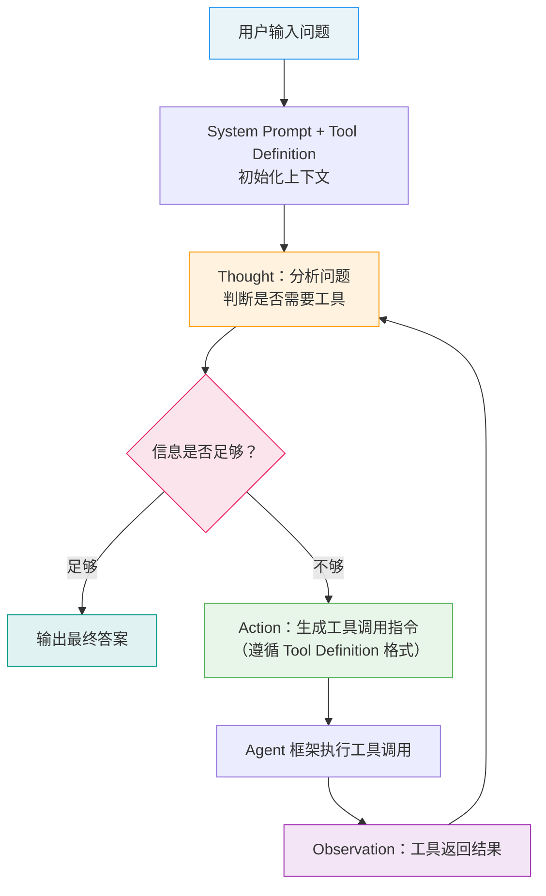
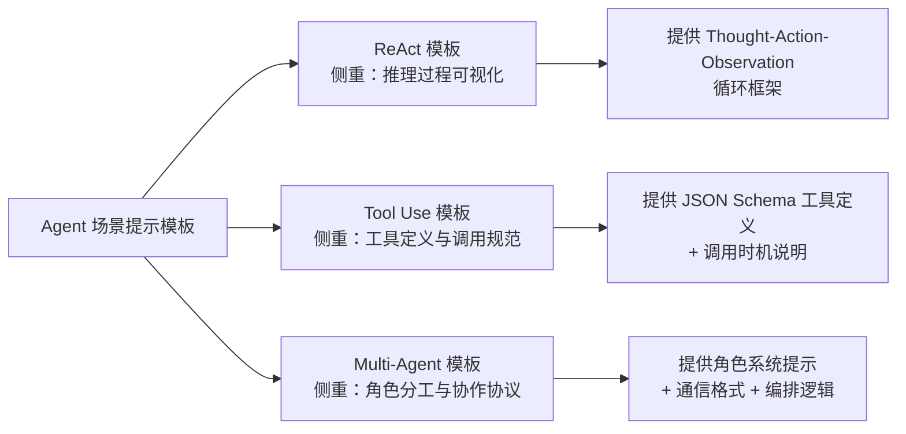

# Agent 场景提示模板（Agent Prompt Templates）

## 概念解释

Agent 场景提示模板是一套用于指导大语言模型在智能体（Agent）应用中完成"推理 → 行动 → 观察"循环的标准化提示词结构。它不是一条提示词，而是一类提示词的设计模式——告诉模型"你该怎么思考、什么时候调工具、拿到结果后怎么继续"。

在 Agent 出现之前，LLM 的使用方式主要有两种：一种是直接生成答案，但模型经常编造事实（Hallucination，幻觉）；另一种是直接调用函数，但模型不会解释为什么要调、调完了该做什么。这两种方式都无法应对"既需要推理，又需要与外部工具交互"的复杂任务。Agent 提示模板的核心贡献在于：用结构化的提示词把"思考过程"和"工具调用"串联起来，让模型的每一步决策都有据可查、可追踪、可调试。

目前业界主流的 Agent 提示模板分为三类：ReAct 模板（推理-行动循环）、Tool Use 模板（工具调用规范）、Multi-Agent 模板（多智能体协作协议）。三者不是互斥关系——一个完整的 Agent 应用通常同时使用多种模板。

## 关键结构

Agent 提示模板的设计围绕六个核心要素展开：

| 要素 | 作用 | 说明 |
|------|------|------|
| System Prompt（系统提示） | 定义 Agent 的身份、能力边界和行为约束 | 整个提示模板的"宪法"，所有行为都在它划定的范围内发生 |
| Thought（思考） | 展示模型的推理过程 | Agent 的"内心独白"，决定下一步做什么、为什么这么做 |
| Action（行动） | 执行具体操作 | 调用工具、查询数据库或与其他 Agent 通信 |
| Observation（观察） | 接收外部反馈 | 工具返回的结果或其他 Agent 的回复，作为下一轮思考的输入 |
| Tool Definition（工具定义） | 描述可用工具的规格 | 包含工具名称、功能说明、参数类型和调用时机 |
| Collaboration Protocol（协作协议） | 规定多 Agent 间的通信规则 | 定义谁先谁后、信息怎么流转、何时终止 |

### 要素 1：System Prompt（系统提示）

System Prompt 是 Agent 提示模板的根基。它不只是"你是一个 AI 助手"这样的角色声明，而是需要明确五个方面：核心任务（做什么）、可用能力（有哪些工具）、行为约束（不能做什么）、输出格式（结果长什么样）、安全护栏（如何拒绝有害请求）。Anthropic 的官方文档指出，Role Prompting（角色提示）是 System Prompt 最有效的用法——给模型一个具体的专家角色，比泛泛的"你是助手"要有效得多。

### 要素 2：Thought（思考）

Thought 是 ReAct 模板的核心环节。一个有效的 Thought 应包含四个部分：任务分析（用户到底想要什么）、信息评估（当前信息够不够）、计划制定（下一步调什么工具）、反思纠正（上一步结果不理想时调整策略）。Thought 的价值不只是提升准确率，更重要的是让整个推理过程可视化，便于开发者调试。

### 要素 3：Action 与 Observation（行动与观察）

Action 是 Thought 的执行产物，通常表现为工具调用。它必须严格遵循 Tool Definition 中的格式规范，否则工具无法解析。Observation 是工具执行后返回的结果，它会被拼接回 prompt 中作为下一轮 Thought 的输入。实践中，Observation 应做摘要或筛选，避免过长的原始数据消耗太多 Token（令牌，LLM 的计费和上下文计量单位）。

## 核心原理

### 原理说明

Agent 提示模板的核心机制是 **Thought-Action-Observation 循环**（简称 TAO 循环）。整个过程如下：

**第 1 步：初始化。** 用户输入问题，System Prompt 和 Tool Definition 已经预置在上下文中。模型接收到完整的 prompt 后开始第一轮推理。

**第 2 步：推理（Thought）。** 模型分析用户问题，判断是否需要外部信息。如果当前信息足够，直接输出最终答案；如果不够，规划下一步应该调用什么工具、传什么参数。

**第 3 步：行动（Action）。** 模型按照 Tool Definition 的格式生成工具调用指令。Agent 框架（如 LangChain、LlamaIndex）解析这个指令并执行实际的工具调用。

**第 4 步：观察（Observation）。** 工具返回结果，Agent 框架将结果拼接回 prompt 中。

**第 5 步：循环或终止。** 模型根据 Observation 判断：如果信息足够回答用户问题，输出最终答案并终止循环；如果还需要更多信息，回到第 2 步继续推理。

这套机制之所以有效，原因在于：Thought 让模型"展示工作过程"，减少了跳步导致的错误；Observation 提供了实时反馈，让模型可以自我纠正；而严格的格式约束确保了工具调用的可靠性。

### Mermaid 图解



图中的关键流转在于 H → C 的回路：Observation 会被拼接回上下文，触发新一轮 Thought。这个循环可能执行 1 次就结束（简单问题），也可能执行 5-10 次（复杂的多步骤任务）。开发者通常会设置最大循环次数防止无限循环。

下图展示三类模板的关系和各自的侧重点：



ReAct 模板解决"怎么推理"，Tool Use 模板解决"怎么调工具"，Multi-Agent 模板解决"怎么分工协作"。三者经常组合使用——比如一个 Multi-Agent 系统中的每个 Agent 内部都可能采用 ReAct + Tool Use 的结构。

### 运行示例

以下伪代码展示 ReAct 模板的核心结构——System Prompt 如何定义 TAO 循环的格式。

```python
# 伪代码：ReAct 模板的核心提示词结构

REACT_SYSTEM_PROMPT = """你是一个能够使用工具解决问题的 AI 助手。

可用工具：
- Search: 搜索网络信息。参数：query（搜索关键词）
- Calculator: 数学计算。参数：expression（数学表达式）

工作流程：
1. Thought：分析当前情况，规划下一步
2. Action：调用合适的工具，格式为 Action: 工具名[参数]
3. Observation：查看工具返回结果
4. 重复以上步骤直到能给出最终答案

示例：
Question: 2024 年中国 GDP 总量是多少万亿美元？
Thought: 这是一个需要最新数据的问题，我需要搜索。
Action: Search[2024年中国GDP总量]
Observation: 根据国家统计局数据，2024年中国GDP约为18.3万亿美元。
Thought: 已获得所需数据，可以回答。
Final Answer: 2024 年中国 GDP 总量约为 18.3 万亿美元。
"""
```

以下展示 Tool Use 模板的关键部分——JSON Schema 格式的工具定义。

```python
# 伪代码：Tool Use 模板的工具定义结构（以 OpenAI / Anthropic 格式为例）

TOOL_DEFINITION = {
    "name": "web_search",
    "description": (
        "搜索网络上的最新信息。"
        "当用户询问时事、新闻或需要实时数据时使用。"
        "不要用于回答常识性问题。"  # 明确"何时不该用"
    ),
    "input_schema": {
        "type": "object",
        "properties": {
            "query": {
                "type": "string",
                "description": "搜索关键词，尽量具体"
            }
        },
        "required": ["query"]
    }
}

# OpenAI 官方建议：工具定义要通过"实习生测试"
# ——一个不了解系统背景的人，仅凭这段描述就能正确调用工具
```

上述代码只展示提示词结构本身，未包含 API 调用逻辑。ReAct 模板的核心是 System Prompt 中的 Thought → Action → Observation 格式约定；Tool Use 模板的核心是 JSON Schema 格式的工具定义。实际运行时，Agent 框架负责解析 Action 并执行工具调用。

## 易混概念辨析

| 概念 | 与 Agent 场景提示模板的区别 | 更适合关注的重点 |
|------|---------------------------|------------------|
| Prompt Template（通用提示模板） | 泛指所有结构化提示词模板，Agent 场景模板是其子集 | 关注变量占位和格式统一，不涉及工具调用和循环推理 |
| Function Calling（函数调用） | 是 Tool Use 模板的底层实现机制，不包含推理循环 | 关注 API 层面的工具定义和调用协议，不关心 Thought 过程 |
| Chain-of-Thought（思维链，CoT） | 只关注推理过程的展示，不涉及工具调用和外部交互 | 关注"展示推理步骤"以提升复杂推理准确率 |
| Agent Framework（Agent 框架） | 是运行 Agent 提示模板的软件基础设施，不是提示词本身 | 关注代码实现、工具注册、消息路由等工程问题 |

核心区别：

- **Agent 场景提示模板**：定义模型"该怎么思考和行动"的提示词结构，是 Agent 的"大脑指令"
- **Function Calling**：模型调用外部函数的技术能力，是 Tool Use 模板的实现基础，但没有 Thought 和循环机制
- **Chain-of-Thought**：可以嵌入 ReAct 模板的 Thought 环节中，两者是组合关系而非替代关系
- **Agent Framework**：LangChain、LlamaIndex 等框架负责执行提示模板定义的流程，模板是"设计图"，框架是"施工队"

## 适用边界与局限

### 适用场景

1. **需要外部数据的问答任务**：用户提问涉及实时信息（股价、天气、新闻），模型必须调用搜索或数据库工具才能回答。ReAct + Tool Use 模板让模型先推理"需要什么信息"，再精准调用工具获取。
2. **多步骤任务规划与执行**：如"帮我分析这份销售数据并生成报告"，需要依次完成数据查询、清洗、分析、报告生成。ReAct 模板的循环结构天然支持多步骤分解和逐步验证。
3. **多角色协作的复杂任务**：如软件开发流程中的需求分析、代码生成、测试和审查，每个环节需要不同专长。Multi-Agent 模板通过角色分工和协作协议来协调。
4. **需要可解释性的企业应用**：金融、医疗等领域要求决策过程可审计，Thought 环节让每一步推理都有据可查。

### 不适合的场景

1. **简单的直接问答**：对于"中国的首都是哪里"这类问题，TAO 循环是多余的开销，直接 Zero-Shot 即可。
2. **对延迟极度敏感的实时场景**：每轮循环都需要一次 API 调用，多轮循环会导致几秒甚至十几秒的延迟，不适合要求毫秒级响应的场景。
3. **上下文窗口紧张的任务**：每轮 Thought + Action + Observation 都会消耗 Token，如果输入本身就很长（如整篇论文），留给循环的空间可能不够。

### 局限性

1. **Token 成本倍增**：相比直接回答，TAO 循环可能导致 Token 消耗增加 2-5 倍。Multi-Agent 场景中，信息在多个 Agent 间传递会进一步放大这个问题。
2. **模型依赖性强**：同一套提示模板在不同模型上效果差异很大。OpenAI 官方指出，推理模型（如 o3）适合高层级指导，GPT 系列模型需要精确指令——换模型往往要重新调整模板。
3. **错误级联风险**：如果模型在某一轮选错了工具或传错了参数，后续所有步骤都会基于错误的 Observation 继续推理，且模型自我纠错的能力有限。

## 常见误区

| 常见误区 | 正确理解 |
|----------|----------|
| "ReAct、Tool Use、Multi-Agent 是三选一的关系" | 三者是互补的，实际项目中经常组合使用。一个 Multi-Agent 系统中的每个 Agent 内部通常都采用 ReAct + Tool Use 结构。 |
| "工具定义写得越详细越好" | OpenAI 官方建议工具定义要通过"实习生测试"——简洁到一个不了解背景的人也能正确使用。过长的描述反而增加 Token 消耗和理解难度。 |
| "Thought 输出越多，准确率越高" | Thought 的质量比数量更重要。关键是 Action 的准确性和 Observation 的信息质量。冗余的 Thought 只会浪费 Token。 |
| "Multi-Agent 一定比单 Agent 强" | Multi-Agent 引入了协调开销和错误传播风险。只有任务确实需要多种不同专长时，Multi-Agent 才有优势。简单任务用 Multi-Agent 是杀鸡用牛刀。 |
| "提示模板写好一次就不用改了" | 模型版本升级、任务需求变化都可能导致现有模板失效。应该建立提示词版本管理和持续评估机制。 |

## 思考题

<details>
<summary>初级：ReAct 模板中 Thought、Action、Observation 三者各自的作用是什么？如果去掉 Thought 环节，会发生什么？</summary>

**参考答案：**

Thought 负责推理和规划，Action 负责执行操作（如调用工具），Observation 负责接收外部反馈。如果去掉 Thought，模型会直接从问题跳到工具调用，失去了"先想清楚再动手"的环节。这会导致两个问题：一是工具选择可能不准确（没有分析就盲目调用）；二是推理过程不可见，开发者无法调试模型为什么做出了某个决策。ReAct 论文的实验也证实，去掉 Thought 会导致任务成功率明显下降。

</details>

<details>
<summary>中级：一个 Agent 有 10 个工具可用。用户问了一个简单问题，但模型总是调用错误的工具。你会从哪些方面排查和优化？</summary>

**参考答案：**

排查方向：(1) 检查工具定义的 description 是否清晰，特别是"何时使用"和"何时不使用"的边界是否明确；(2) 检查 System Prompt 中是否有关于工具选择优先级的指导；(3) 检查是否存在功能重叠的工具导致模型困惑；(4) 查看 Thought 输出中模型对问题的理解是否正确。优化方向：精简工具描述使其通过"实习生测试"；在 System Prompt 中添加工具选择的 Few-Shot 示例；合并功能重叠的工具；考虑是否模型能力不足需要换用更强的模型。OpenAI 的官方建议指出，工具数量在 100 个以内时模型通常能正确选择，但工具越多歧义越大。

</details>

<details>
<summary>中级/进阶：你要设计一个"智能客服 Agent"，需要处理订单查询、退货申请、产品咨询三类问题，并能在无法解决时转接人工。请描述你会如何设计 System Prompt 和 Tool Definition，以及为什么选择 ReAct + Tool Use 而非 Multi-Agent 方案。</summary>

**参考答案：**

System Prompt 设计：定义角色为"电商客服专员"；列出四个工具（订单查询、退货处理、产品知识库搜索、转接人工）；明确行为约束（不承诺未经确认的退款、不透露内部系统信息）；规定输出格式（回复要简洁友好，包含订单号等关键信息）。Tool Definition 设计：每个工具的 description 要说明"什么情况下调用"（如"订单查询"要注明"用户提供了订单号或询问订单状态时调用"），参数类型和必填项要明确。选择 ReAct + Tool Use 而非 Multi-Agent 的理由：客服场景虽然有三类问题，但处理逻辑相对固定，一个 Agent 配合不同工具就够了。Multi-Agent 的协调开销（Agent 间传递信息、编排执行顺序）会增加延迟和复杂度，而客服场景对响应速度要求较高。只有当业务复杂到一个 Agent 的 System Prompt 无法合理描述所有逻辑时（如上百种业务场景），才值得拆分为 Multi-Agent。

</details>

## 参考资料

1. Yao, S., et al. (2023). "ReAct: Synergizing Reasoning and Acting in Language Models." ICLR 2023. https://react-lm.github.io/
2. OpenAI. "Function calling - OpenAI API." https://developers.openai.com/api/docs/guides/function-calling
3. OpenAI. "GPT-4.1 Prompting Guide." https://cookbook.openai.com/examples/gpt4-1_prompting_guide
4. Anthropic. "Prompt engineering overview - Claude API Docs." https://docs.anthropic.com/en/docs/build-with-claude/prompt-engineering/overview
5. Anthropic. "Effective Context Engineering for AI Agents." https://www.anthropic.com/engineering/effective-context-engineering-for-ai-agents
6. Prompt Engineering Guide. "ReAct Prompting." https://www.promptingguide.ai/techniques/react
7. Prompt Engineering Guide. "Function Calling in AI Agents." https://www.promptingguide.ai/agents/function-calling
