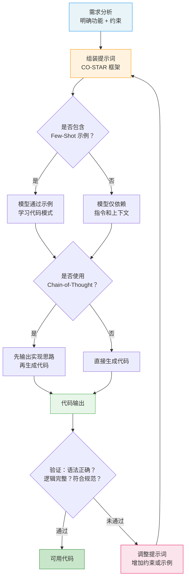

# 代码生成场景提示（Code Generation Prompts）

## 概念解释

代码生成场景提示是指在使用大语言模型生成代码时，通过精心设计提示词的结构、上下文和约束条件，让模型输出语法正确、逻辑清晰、符合项目规范的代码。它不是简单地告诉模型"帮我写个函数"，而是把需求分析、技术约束、代码风格、输出格式等信息系统性地组织成一份"需求说明书"，让模型在明确的约束空间内生成代码。

代码生成提示之所以需要专门研究，是因为代码和自然语言有本质区别：自然语言允许模糊表达，代码必须语法精确、逻辑严密、依赖明确。2025 年 arXiv 上的研究（"Prompt engineering and framework: implementation to increase code reliability"）指出，代码生成任务需要严格遵守语法规则、逻辑正确性和领域特定约束，这使得通用的提示词技巧无法直接套用。

在 Agent 系统和 AI 辅助编程工具（如 GitHub Copilot、Cursor）中，代码生成提示是最高频的应用场景之一。开发者每天通过提示词让 LLM 生成数据处理脚本、API 接口、单元测试、代码重构等，提示词质量直接决定了生成代码能否"复制粘贴就能跑"。

## 关键结构

代码生成提示词的效果取决于六个核心维度的配合，业界常用 CO-STAR 框架（由新加坡 GovTech 数据科学团队提出）来组织这些维度：

| 维度 | 英文 | 作用 | 代码生成中的具体表现 |
|------|------|------|---------------------|
| 上下文 | Context | 交代背景信息 | 编程语言、版本、依赖库、运行环境 |
| 目标 | Objective | 明确要做什么 | 功能需求、输入输出定义、边界条件 |
| 风格 | Style | 约束代码风格 | PEP 8、命名约定、注释规范 |
| 语气 | Tone | 设定严谨程度 | 生产级代码 vs. 快速原型 |
| 受众 | Audience | 明确代码使用者 | 初级开发者 vs. 团队内部 vs. 开源社区 |
| 输出格式 | Response | 规定输出形式 | 完整函数 vs. 代码片段、是否含 Docstring |

### 维度 1：上下文（Context）

上下文是代码生成的"舞台背景"，告诉模型在什么技术栈下工作。一个完整的上下文应包含：

- **编程语言和版本**：如 Python 3.10+、TypeScript 5.0
- **依赖库及版本**：如 pandas==2.0.1、fastapi==0.104.0
- **运行环境**：如 Linux 服务器、边缘设备、GPU 集群
- **项目约束**：如已有的代码风格指南、框架选型

缺少上下文是代码生成质量不稳定的首要原因。同一个"写排序函数"的需求，在 Python 和 Rust 中、在性能敏感场景和快速脚本场景中，最优实现完全不同。

### 维度 2：目标（Objective）

目标是"你要什么"的精确描述，应包含四个方面：

- **功能描述**：做什么事（如"计算两个列表的交集"）
- **输入定义**：参数类型、取值范围、数据格式
- **输出定义**：返回值类型、格式、边界情况的处理方式
- **约束条件**：时间复杂度、不能使用的库、安全性要求

### 维度 3：代码示例（Few-Shot Examples）

CO-STAR 框架本身不单独列出示例，但在代码生成场景中，Few-Shot（少样本提示）是最重要的杠杆之一。一个好的代码示例比三页文字描述更有效。示例应该：

- 与目标任务**相似但不完全相同**（避免模型直接复制）
- 展示期望的代码风格、注释方式、错误处理模式
- 包含完整的函数签名、类型提示和文档字符串

## 核心原理

### 原理说明

代码生成提示的工作机制可以概括为"约束空间收窄"——通过逐层添加约束，将模型的输出可能性从"任意代码"收窄到"符合你要求的代码"：

**第 1 步：需求分析。** 开发者明确要实现什么功能，涉及哪些边界条件和技术约束。这一步决定了提示词需要包含哪些信息。

**第 2 步：提示词组装。** 按 CO-STAR 框架将上下文、目标、风格、示例等信息组织成结构化提示词。使用分隔符（如 `###`、`===` 或 XML 标签）将不同部分明确区隔，帮助模型识别各段的作用。

**第 3 步：推理与生成。** 模型接收提示词后，在所有约束条件的交集范围内生成代码。如果使用了 Chain-of-Thought（思维链，让模型先描述实现思路再写代码），模型会先规划算法方案，再进行编码。

**第 4 步：验证与迭代。** 检查生成的代码是否语法正确、逻辑完整、符合规范。如果不符合，调整提示词（如增加约束、补充示例）后重新生成。

关键参数选择：代码生成任务应使用较低的 Temperature（温度参数，控制输出随机性，0.0-0.3），确保输出的确定性和可预测性。高 Temperature 会让代码出现不必要的随机变化。

### Mermaid 图解



图中的核心流转在于两个判断节点：是否包含 Few-Shot 示例决定了模型理解需求的精度，是否使用 Chain-of-Thought 决定了复杂任务中代码逻辑的清晰度。当验证未通过时，迭代回到提示词组装环节，形成"生成-验证-优化"的闭环。

### 运行示例

以下示例展示代码生成提示词的核心结构——如何用 CO-STAR 框架组装一个完整的代码生成请求。

```python
# 基于 openai>=1.0.0 验证（截至 2026-03）
import os
from openai import OpenAI

client = OpenAI(api_key=os.getenv("OPENAI_API_KEY"))

# CO-STAR 框架组装代码生成提示词
code_gen_prompt = """
### Context（上下文）
使用 Python 3.10+，依赖 pandas>=2.0。代码遵循 PEP 8 规范。

### Objective（目标）
编写函数 clean_user_data(df: pd.DataFrame) -> pd.DataFrame，功能如下：
- 输入：包含 user_id, age, email 列的 DataFrame
- 处理：删除缺失值，过滤 age<0 或 age>150 的行，验证 email 格式
- 输出：清洗后的 DataFrame，重置索引

### Style（风格）
- 蛇形命名法（snake_case）
- 函数包含完整的类型提示和 Docstring
- 中文注释解释每步操作

### Response（输出格式）
返回完整可运行的 Python 函数，包含必要的 import 语句。

### Example（示例）
以下是类似任务的参考实现：

def clean_order_data(df: pd.DataFrame) -> pd.DataFrame:
    \"\"\"清洗订单数据，删除无效记录。\"\"\"
    # 删除缺失值
    df = df.dropna()
    # 过滤异常价格
    df = df[df["price"] >= 0]
    return df.reset_index(drop=True)
"""

# 调用 API，低温度确保代码确定性
response = client.chat.completions.create(
    model="gpt-4o-mini",
    messages=[{"role": "user", "content": code_gen_prompt}],
    temperature=0.2,
    max_tokens=800
)

print(response.choices[0].message.content)
```

上述代码中，提示词用 `###` 分隔符将 CO-STAR 各维度显式标记，模型可以明确识别每段的作用。`temperature=0.2` 确保输出稳定可复现。示例部分提供了一个风格相近但功能不同的函数，引导模型模仿其代码结构。

## 易混概念辨析

| 概念 | 与代码生成提示的区别 | 更适合关注的重点 |
|------|---------------------|------------------|
| 自然语言提示（NL Prompts） | 对输出格式容忍度高，允许模糊表达 | 文本生成、摘要、翻译等自然语言任务 |
| Copilot 自定义指令（Custom Instructions） | 是代码生成提示的项目级持久化形式 | 通过 `.github/copilot-instructions.md` 统一团队规范 |
| Fine-Tuning（微调） | 修改模型参数，效果更稳定但成本高 | 精度要求极高、任务固定、有大量标注代码时选择 |
| Agentic Code Generation（Agent 代码生成） | 模型不仅生成代码，还能自动测试、修复、迭代 | GitHub Copilot Agent Mode、Cursor Composer 等工具 |

核心区别：

- **代码生成提示**：人工编写结构化提示词，单次请求生成代码，核心是"约束空间设计"
- **Copilot 自定义指令**：把代码生成提示的通用部分固化为项目配置文件，相当于"默认上下文"
- **Fine-Tuning**：改变模型本身的代码生成能力，核心是"参数更新"
- **Agentic Code Generation**：将代码生成嵌入 Agent 循环，模型能自主测试和修复代码，是 2024-2025 年的主流趋势

## 适用边界与局限

### 适用场景

1. **数据处理与 ETL 脚本**：数据清洗、格式转换、SQL 查询等任务有固定模式（读取-清洗-转换-输出），提供一个 Few-Shot 示例后 LLM 能快速适配到新数据源。
2. **API 接口与 Web 服务骨架**：Web 框架的路由、请求响应结构高度标准化，CO-STAR 提示能让 LLM 生成符合框架规范的接口代码。
3. **单元测试生成**：测试代码有固定的"准备-执行-断言"模式，结构化提示词能高效生成覆盖边界条件的测试用例。
4. **代码迁移与重构**：语言迁移（如 Python 转 Rust）、同步转异步等任务有明确的映射关系，提示词中指定源语言和目标语言的风格差异后效果良好。

### 不适合的场景

1. **大规模系统架构设计**：LLM 的上下文窗口无法容纳整个项目的代码库，难以理解跨模块的依赖关系，容易生成"局部正确但全局冲突"的代码。
2. **安全敏感的核心逻辑**：加密算法、权限验证等安全关键代码不应依赖 LLM 生成，因为模型可能引入已知漏洞模式或不安全的实现。
3. **性能极致优化**：需要底层硬件知识（如 SIMD 指令、内存对齐）的性能优化代码，超出了多数 LLM 的可靠生成能力。

### 局限性

1. **提示词质量决定上限**：代码生成的效果高度依赖提示词设计。上下文缺失、约束模糊、示例质量差都会导致输出质量骤降，团队需要持续积累和维护提示词库。
2. **生成的代码必须人工审查**：LLM 生成的代码在语法上通常正确，但可能存在隐含的逻辑漏洞、性能问题或安全风险。2025 年的行业共识是"AI 写代码、人审代码"。
3. **上下文窗口的 token 竞争**：Few-Shot 示例、代码上下文、约束说明都消耗 token，在复杂任务中需要权衡各部分的 token 分配。

## 常见误区

| 常见误区 | 正确理解 |
|----------|----------|
| "提示词越长、细节越多，生成的代码越好" | 结构比长度更重要。一个组织清晰、包含高质量示例的简洁提示词，效果往往优于冗长但结构混乱的提示词。研究表明结构化框架（如 CO-STAR）比堆砌描述更有效。 |
| "提高 Temperature 能让代码更有创意" | 代码生成应使用低 Temperature（0.0-0.3）。高 Temperature 会让代码出现不必要的随机变化——变量名不一致、多余的逻辑分支、非标准的 API 用法——这些不是"创意"而是 Bug 来源。 |
| "给一个完全相同的示例效果最好" | Few-Shot 示例应与目标任务**相似但不相同**。完全相同的示例会让模型直接复制而不是理解模式；相似但不同的示例才能帮助模型学到可迁移的代码模式。 |
| "一次提示就能生成完美的生产代码" | 生产级代码生成是迭代过程：先生成初版代码，通过测试和审查发现问题，再调整提示词重新生成。GitHub Copilot 的 Agent Mode 就是将这个迭代过程自动化。 |
| "有了 Few-Shot 示例就不需要写任务说明了" | 任务说明和示例是互补关系。清晰的任务说明 + 少量高质量示例的组合，效果优于大量示例但缺少明确说明的情况。 |

## 思考题

<details>
<summary>初级：CO-STAR 框架的六个维度分别是什么？在代码生成场景中，哪两个维度最关键？</summary>

**参考答案：**

CO-STAR 的六个维度是 Context（上下文）、Objective（目标）、Style（风格）、Tone（语气）、Audience（受众）、Response（输出格式）。在代码生成中，Context 和 Objective 最关键——Context 确定技术栈和约束，Objective 定义功能需求和输入输出，这两者缺失会直接导致生成的代码无法使用。

</details>

<details>
<summary>中级：你需要让 LLM 生成一个 FastAPI 接口，但生成的代码总是缺少错误处理和类型提示。你会如何调整提示词？</summary>

**参考答案：**

三个方向：(1) 在 Objective 中显式声明"必须包含 try-except 错误处理和 HTTP 异常返回"；(2) 在 Few-Shot 示例中提供一个包含完整错误处理和类型提示的接口示例，让模型模仿其模式；(3) 在 Response 维度中明确要求"函数参数和返回值必须有类型注解，包含 Pydantic 模型定义"。如果问题仍然存在，可以使用 Chain-of-Thought 策略，先让模型列出"这个接口可能遇到的异常情况"，再基于这个清单生成代码。

</details>

<details>
<summary>中级/进阶：你的团队有 50 个微服务，每个服务有不同的技术栈（Python/Go/TypeScript）。如何设计一套可复用的代码生成提示词体系，避免每次都从零写提示词？</summary>

**参考答案：**

采用分层模板策略：(1) **基础层**——创建通用的 CO-STAR 模板，包含团队统一的代码规范（注释风格、错误处理标准、Git 提交规范）；(2) **语言层**——针对 Python/Go/TypeScript 各建一套语言特定模板，包含该语言的命名约定、依赖管理方式、类型系统要求；(3) **场景层**——针对常见任务（CRUD 接口、数据处理、单元测试）建立场景模板，每个模板包含 1-2 个高质量 Few-Shot 示例。同时，将这些模板固化为项目配置文件（如 `.github/copilot-instructions.md` 或 Cursor Rules），让 AI 工具自动加载，开发者只需写具体需求即可。

</details>

## 参考资料

1. Prompt Engineering Guide. "Prompting Techniques." https://www.promptingguide.ai/techniques
2. "Guidelines to Prompt Large Language Models for Code Generation: An Empirical Characterization." arXiv:2601.13118, 2025. https://arxiv.org/html/2601.13118v1
3. GitHub Docs. "Best practices for using GitHub Copilot." https://docs.github.com/en/copilot/get-started/best-practices
4. Portkey Blog. "COSTAR Prompt Engineering: What It Is and Why It Matters." https://portkey.ai/blog/what-is-costar-prompt-engineering/
5. "Prompt engineering and framework: implementation to increase code reliability based guideline for LLMs." arXiv, 2025. https://arxiv.org/html/2506.10989v1

---

<!--
=============================================================================
  内容准确性自查清单（发布前逐项检查）
=============================================================================

## 事实准确性
- [x] 概念定义准确，没有复制官方原文
- [x] 核心原理描述正确，没有把相关概念混为一谈
- [x] CO-STAR 框架来源标注正确（GovTech Singapore）
- [x] 适用边界与局限的描述客观准确

## 图表准确性
- [x] Mermaid 图与文字描述一致
- [x] 图中的节点、关系、方向没有逻辑错误
- [x] 图中标注了关键判断节点

## 代码准确性
- [x] 最小示例展示了 CO-STAR 框架的实际用法
- [x] 代码片段包含必要 import
- [x] 代码逻辑与讲解一致
- [x] 依赖库版本号已标注

## 辨析与误区
- [x] 易混概念的边界讲清楚了
- [x] 常见误区确实是高频误解，不是凑数
- [x] "正确理解"部分表达准确、不绝对化

## 引用准确性
- [x] 所有参考资料真实存在且可访问
- [x] 未编造论文、作者、年份或链接
- [x] 参考资料与正文内容真实相关

## 内容完整性
- [x] YAML 头部所有必填字段已填写
- [x] 各章节内容完整，无占位符残留
- [x] 已包含 Mermaid 图
- [x] 卡片整体风格是知识卡片，不是工具教程
=============================================================================
-->
