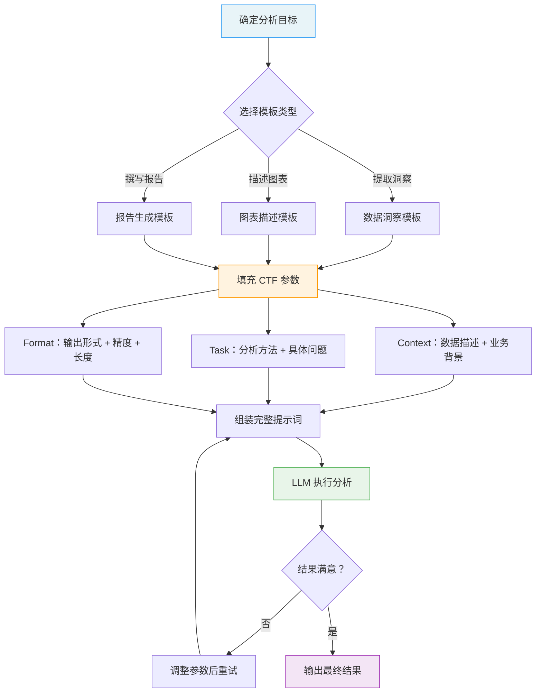

# 数据分析场景提示词模板（Data Analysis Prompt Templates）

## 概念解释

数据分析提示词模板是一套预定义的提示词框架，把"数据背景、分析任务、输出格式"三个关键信息组织成固定结构，让 LLM（大语言模型）能快速、准确地从原始数据中提取关键洞察、描述图表或生成分析报告。你可以把它理解为数据分析的"填空式说明书"——分析师只需在框架里填入具体数据和目标，不必每次都从零开始调试提示词措辞。

这套方法出现的背景很直接：没有模板时，同一份数据交给不同的人写提示词，AI 给出的分析角度、详细程度、输出格式可能天差地别。一个人问"分析下销售数据"，另一个人写了 200 字的详细指令，结果自然不同。更麻烦的是，好的提示词写法全靠个人经验，无法在团队中复用和积累。结构化的模板把这些经验固化下来，让提示词的质量从"看人"变成"看模板"。

在 Agent 应用开发中，数据分析模板属于 Prompt Engineering（提示词工程）的场景化应用。它不改变模型本身的能力，而是通过更精确的指令让模型在数据分析任务上发挥得更好——减少歧义、约束格式、明确期望。

## 关键结构

数据分析提示词模板的核心是 CTF 结构——Context（上下文）、Task（任务）、Format（格式）。这三个要素缺一不可，共同决定了 AI 分析结果的质量。

| 要素 | 作用 | 缺失时的典型后果 |
|------|------|-----------------|
| Context（上下文） | 告诉 AI 数据是什么、业务背景是什么、受众是谁 | AI 输出的分析缺乏针对性，可能答非所问 |
| Task（任务） | 明确要做什么类型的分析、关注哪些指标、回答哪些问题 | AI 输出泛泛而谈，缺少具体洞察 |
| Format（格式） | 约束输出的组织形式、数字精度、长度限制 | AI 自由发挥，输出格式混乱，后续难以使用 |

### 要素 1：Context（上下文）

上下文不是简单地说"这是销售数据"，而是要回答五个关键问题：

- **数据来源**：数据从哪来的？是内部系统导出还是第三方平台？
- **字段含义**：每个字段代表什么？取值范围多大？（比如"age 字段，取值 18-65，缺失率约 3%"）
- **时间范围**：数据覆盖多长时间？是日粒度还是月粒度？
- **业务背景**：这次分析要解决什么业务问题？
- **目标受众**：分析结果给谁看？给高管看要简洁，给分析师看要详细。

### 要素 2：Task（任务）

任务指令决定了 AI 会从什么角度切入数据。模糊的指令（如"分析这些数据"）会得到模糊的结果。有效的任务指令需要具体到：

- 分析方法：趋势分析、对比分析、异常检测、关联分析中的哪种？
- 关注维度：重点看哪些指标？（销售额、转化率、留存率……）
- 具体问题：需要回答的 3-5 个明确问题（如"Q4 环比增长率是多少？"）

### 要素 3：Format（格式）

格式约束直接决定了输出能不能被后续流程使用。需要明确的方面包括：

- **组织形式**：表格、分点列表、段落、JSON 中的哪种？
- **数字精度**：保留几位小数？百分比还是绝对值？
- **长度限制**：每个部分多少字？总长度多少？
- **语言风格**：正式报告还是口语化简报？

## 核心原理

### 原理说明

数据分析提示词模板的工作机制可以用四步概括：

**第 1 步：选择模板。** 根据分析目标确定使用哪种模板——是做数据洞察提取、图表描述生成，还是分析报告撰写。不同模板的侧重点不同：洞察提取关注"发现了什么"，图表描述关注"怎么呈现"，报告生成关注"怎么组织和表达"。

**第 2 步：填充参数。** 在模板的 CTF 框架中填入具体内容。上下文部分填入数据描述和业务背景，任务部分填入分析方法和具体问题，格式部分填入输出要求。这一步的关键是"具体"——越具体，AI 的输出越精准。

**第 3 步：发送给 LLM 执行。** 组装好的提示词发送给模型，模型根据上下文理解数据含义，根据任务指令选择分析角度，根据格式约束组织输出。

**第 4 步：评估与迭代。** 检查输出结果是否满足要求。如果洞察不够深入，调整任务指令让它更具体；如果格式不对，强化格式约束。通常 1-2 轮迭代就能达到满意结果。

这套机制有效的根本原因是：它把数据分析的"隐性经验"（什么样的提示词能得到好结果）转化成了"显性结构"（固定的 CTF 框架），消除了每次从头摸索的成本。

### Mermaid 图解



图中有两个关键流转点：一是模板选择（根据分析目标决定用哪种模板），二是迭代循环（结果不满意时调整参数重试，而不是换模板）。实际使用中，大多数情况下只需要 1-2 轮迭代。

### 运行示例

以下示例展示如何用 Python 实现一个简单的数据分析提示词模板引擎，核心是 CTF 三要素的参数化组装。

```python
# 基于 openai>=1.0.0 验证（截至 2026-03）
import os
from openai import OpenAI

client = OpenAI(api_key=os.getenv("OPENAI_API_KEY"))

def build_analysis_prompt(context: dict, task: dict, fmt: dict) -> str:
    """按 CTF 结构组装数据分析提示词"""
    prompt = f"""【Context 上下文】
数据描述：{context['data_description']}
业务背景：{context['business_context']}
目标受众：{context['audience']}

【Task 任务】
分析方法：{task['method']}
关注指标：{', '.join(task['metrics'])}
具体问题：
"""
    for i, q in enumerate(task['questions'], 1):
        prompt += f"{i}. {q}\n"

    prompt += f"""
【Format 格式】
输出形式：{fmt['structure']}
数字精度：{fmt['precision']}
长度限制：{fmt['length']}
"""
    return prompt

# 组装提示词
prompt = build_analysis_prompt(
    context={
        "data_description": "2024 年全年电商销售数据，15000 条记录，字段：日期、产品类别、销售额、客户年龄段、地区",
        "business_context": "为 2025 年 Q1 营销策略提供数据支持",
        "audience": "营销部门负责人，需要快速理解关键趋势"
    },
    task={
        "method": "趋势分析 + 细分对比",
        "metrics": ["月度销售额", "品类占比", "客户年龄段分布"],
        "questions": [
            "全年销售额的月度趋势是什么？是否有明显季节性？",
            "哪三个品类销售额最高？增速如何？",
            "哪个年龄段客户贡献了最多收入？"
        ]
    },
    fmt={
        "structure": "Markdown 表格，每个问题一行，列为：问题 | 关键发现 | 建议",
        "precision": "金额保留整数，百分比保留 1 位小数",
        "length": "每个发现不超过 50 字，每条建议不超过 30 字"
    }
)

# 调用 LLM
response = client.chat.completions.create(
    model="gpt-4o",
    messages=[
        {"role": "system", "content": "你是一位数据分析师，擅长从数据中提取关键洞察并给出可操作建议。"},
        {"role": "user", "content": prompt}
    ],
    temperature=0.2  # 低温度保证分析结果稳定
)

print(response.choices[0].message.content)
```

`build_analysis_prompt` 函数就是模板引擎的核心——接收三个字典（context、task、format），输出一段结构化的提示词。实际项目中可以把不同场景的默认参数预设好，分析师只需覆盖需要修改的部分。

## 三大场景模板

数据分析中最常用的三种模板，分别对应"发现什么""怎么呈现""怎么汇报"三个阶段。

### 模板一：数据洞察提取

从原始数据中找到关键发现、趋势和异常。

```
【Context】
- 数据来源：[来源名称]，时间范围 [开始]-[结束]，共 [N] 条记录
- 关键字段：[字段1（含义）]、[字段2（含义）]、...
- 业务背景：[这次分析要解决什么问题]

【Task】
- 分析方法：[趋势分析 / 对比分析 / 异常检测 / 关联分析]
- 关注指标：[指标1]、[指标2]、[指标3]
- 需回答的问题：
  1. [具体问题1]
  2. [具体问题2]
  3. [具体问题3]

【数据样本】（可选，粘贴前 5-10 行或摘要统计）
[数据内容]

【Format】
- 每个问题分别作答，结构：发现 → 原因推测 → 建议
- 数字保留 [N] 位小数，百分比用 % 表示
- 总字数不超过 [N] 字
```

### 模板二：图表描述生成

根据数据和分析目标，生成可视化图表的代码或详细描述。

```
【Context】
- 数据结构：X 轴 = [时间/分类/数值]，Y 轴 = [指标名称（单位）]
- 数据系列：[系列1]、[系列2]（如有多条线/多组柱状）
- 数据量级：[大概范围，如"Y 轴 0-500 万"]

【Task】
- 推荐图表类型：[折线图 / 柱状图 / 散点图 / 饼图 / 热力图]
- 视觉重点：[需要突出的数据点或趋势]
- 辅助元素：[是否需要趋势线、参考线、标注]

【Format】
- 输出形式：[Python matplotlib 代码 / ECharts 配置 / 自然语言描述]
- 语言要求：[图表标签用中文/英文]
- 代码要求：[完整可运行 / 只写核心逻辑]
```

### 模板三：分析报告生成

把分析结果组织成面向特定受众的结构化报告。

```
【Context】
- 报告目的：[这份报告要传达什么信息]
- 目标受众：[高管 / 分析师 / 产品经理 / 全员]
- 核心分析结果：[粘贴前置分析的输出]

【Task】
- 报告结构：
  1. 执行摘要（[N] 字）：最关键的 [N] 个发现
  2. 详细分析（[N] 字）：[需要展开的维度]
  3. 问题与建议（[N] 字）：可操作的改进方向
  4. 附录（可选）：支持数据表格

【Format】
- 语言风格：[简洁直接 / 正式 / 口语化]
- 数字精度：[整数 / 1位小数 / 2位小数]
- 是否包含图表引用：[是/否]
- 总字数限制：[N] 字
```

## 易混概念辨析

| 概念 | 与数据分析提示词模板的区别 | 更适合关注的重点 |
|------|--------------------------|-----------------|
| Few-Shot Prompting（少样本提示） | 通过示例引导模型学习任务规律，侧重"给例子"；数据分析模板侧重"给结构" | 输出格式不确定时，用 Few-Shot 给几个参考输出 |
| Chain-of-Thought（思维链） | 要求模型展示推理过程，侧重"怎么想"；数据分析模板侧重"分析什么、怎么输出" | 复杂统计推理任务，可与模板组合使用 |
| RAG（检索增强生成） | 从外部知识库检索信息再生成，侧重"找信息"；数据分析模板侧重"对已有数据做分析" | 分析时需要引用外部基准数据或行业报告 |

核心区别：

- **数据分析提示词模板**：核心是用 CTF 结构化框架指导 AI 对已有数据做分析，解决"怎么提问"的问题
- **Few-Shot Prompting**：核心是用输入-输出示例引导模型，解决"输出长什么样"的问题。两者可以组合——在模板中嵌入 1-2 个分析示例
- **Chain-of-Thought**：核心是让模型展示推理步骤，解决"怎么推导"的问题。在复杂数据分析中，可以在 Task 部分加入"请逐步推理"的指令

## 适用边界与局限

### 适用场景

1. **周期性业务报告**：每周/每月需要更新的 KPI 分析、销售报告、运营日报。任务高度重复且结构化，模板能节省 60% 以上的提示词调试时间。
2. **多受众报告生成**：同一份数据需要为高管、分析师、产品经理生成不同风格的报告。只需切换 Context 中的"目标受众"和 Format 中的"语言风格"参数。
3. **团队标准化协作**：多人共同使用 AI 做数据分析时，统一的模板能保证分析口径和输出格式一致，减少沟通成本。
4. **快速探索性分析**：拿到一份新数据集，用洞察提取模板快速了解数据的分布、趋势和异常，作为深入分析前的预热。

### 不适合的场景

1. **需要复杂统计建模的任务**：回归分析、因果推断、时间序列预测等需要严格统计方法的场景。LLM 在数学计算上不够可靠，模板无法弥补这个能力短板。
2. **涉及敏感数据的场景**：如果使用云端 API，原始数据会被上传到第三方服务器。包含个人隐私、商业机密的数据不适合直接放入提示词。

### 局限性

1. **模板不能替代分析判断**：模板解决的是"怎么提问"，不能替代分析师对业务逻辑的理解。如果 Task 中的问题本身就问错了方向，再好的模板也得不到有用的洞察。
2. **LLM 的数值计算能力有限**：模型在精确计算（如求和、求标准差）上可能出错。涉及精确数值的分析，应该用 Code Interpreter（代码解释器）或让 LLM 生成代码而非直接计算。
3. **上下文窗口限制**：大数据集无法直接粘贴到提示词中。实际使用时，通常需要先用代码生成摘要统计（均值、中位数、分布等），再将摘要喂给模板。

## 常见误区

| 常见误区 | 正确理解 |
|----------|----------|
| "提示词写得越详细越好，信息越多结果越准" | 信息要"充分"但不要"冗余"。无关细节会分散模型注意力，降低核心问题的回答质量。CTF 框架的价值正在于帮你筛选出真正关键的信息。 |
| "一个通用模板就能覆盖所有数据分析场景" | 不同场景（财务分析、用户行为分析、竞品分析）对 Task 和 Format 的要求差异很大。建议建立场景化模板库，每种场景一个专用模板。 |
| "用了模板就不需要人工审核 AI 的输出" | LLM 可能在业务逻辑理解上出错，或对异常数据处理不当。模板提升的是提问质量，不能保证回答 100% 正确。关键数字和结论必须人工验证。 |
| "不指定输出格式也没关系，只要分析对就行" | 格式约束直接影响结果的可用性。不指定格式，AI 可能输出长段落，你还得手动提取关键数据。明确的格式（表格、JSON、分点列表）能大幅降低后续处理成本。 |

## 思考题

<details>
<summary>初级：CTF 框架中的三个要素分别解决什么问题？如果只能保留一个，你会保留哪个？</summary>

**参考答案：**

Context 解决"AI 理解数据和背景"的问题，Task 解决"AI 知道要做什么分析"的问题，Format 解决"输出结果能直接用"的问题。如果只能保留一个，应该保留 Task——因为没有明确的任务指令，AI 不知道该做什么分析，Context 和 Format 再好也白搭。但实际使用中三者缺一不可。

</details>

<details>
<summary>中级：你的数据集有 50 万行，远超 LLM 的上下文窗口限制。你会如何修改数据洞察提取模板来应对这种情况？</summary>

**参考答案：**

两种策略：(1) 预处理策略——先用 Python/SQL 对数据做聚合和摘要统计（均值、分布、Top N、异常值等），把摘要结果而非原始数据放入 Context；(2) 分块策略——将数据按维度（如按月、按品类）拆分成多个子集，分别用模板分析，最后再用报告生成模板汇总各子集的分析结果。实践中通常组合使用：先聚合得到概览，再针对有问题的子集做深入分析。

</details>

<details>
<summary>中级/进阶：你的团队有 5 个分析师，分别负责销售、产品、营销、财务、客服五个方向。如何设计一套模板管理机制，让模板既能统一标准，又能适配各方向的特殊需求？</summary>

**参考答案：**

设计两层模板架构：(1) 基础层——一个通用的 CTF 骨架模板，定义标准的三段式结构、通用的格式规范（数字精度、长度限制等）、统一的输出约束；(2) 场景层——每个方向基于骨架模板派生出专用模板，预填该方向常用的分析方法、关注指标和输出格式。例如销售方向预设"趋势分析 + 品类对比"，财务方向预设"同比环比 + 成本结构分析"。同时建立模板版本管理：每个模板标注版本号和最后更新日期，修改时创建新版本而非覆盖旧版本，便于回溯。定期组织跨方向的模板评审，将各方向验证有效的改进合并回基础层。

</details>

## 参考资料

1. OpenAI. "Prompt Engineering Best Practices." https://platform.openai.com/docs/guides/prompt-engineering
2. Prompt Engineering Guide. "Prompting Techniques." https://www.promptingguide.ai/techniques
3. Towards Data Science. "Become a Better Data Scientist with These Prompt Engineering Tips and Tricks." https://towardsdatascience.com/become-a-better-data-scientist-with-these-prompt-engineering-hacks/
4. Juma (Team-GPT). "17 ChatGPT Prompts For Data Analysis." https://juma.ai/blog/chatgpt-prompts-for-data-analysis
5. Fabio Vivas. "CTF Framework: Context, Task, Format." https://fvivas.com/en/ctf-framework-prompts-llm/
6. DigitalOcean. "Prompt Engineering Best Practices: Tips, Tricks, and Tools." https://www.digitalocean.com/resources/articles/prompt-engineering-best-practices
