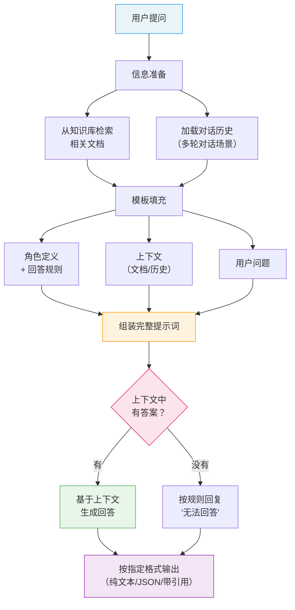

# 知识问答场景（QA Prompt Templates）

## 概念解释

QA Prompt Templates（问答提示模板）是一类专为"问答"场景设计的提示词结构，核心目标是让大语言模型基于你提供的信息来回答问题，而不是靠猜。你给模型一段参考资料 + 一个问题，模型在资料范围内作答——这就是知识问答场景的基本逻辑。

为什么需要专门的模板？因为直接把问题扔给 LLM，模型会用自己"记住"的知识回答，而这些知识可能过时、不准确，甚至是模型编造的（这就是所谓的 Hallucination，幻觉）。问答模板通过明确的结构——角色定义、参考资料、回答规则、输出格式——把模型的回答行为框定在可控范围内。

在实际 Agent 应用中，知识问答模板是最常用的提示词类型之一。无论是 RAG（Retrieval-Augmented Generation，检索增强生成）系统中的答案生成环节，还是企业客服机器人、文档助手，底层都在用某种形式的 QA 模板来组织提示词。

## 关键结构

一个完整的 QA 提示模板由四层结构组成，缺一不可：

| 结构层 | 作用 | 缺失后果 |
|--------|------|----------|
| 角色定义（Role） | 告诉模型"你是谁"，设定回答的语气和专业度 | 回答风格不稳定，时而口语化时而学术化 |
| 上下文（Context） | 提供参考资料、检索文档或对话历史 | 模型只能靠自己的"记忆"回答，幻觉风险飙升 |
| 回答规则（Instructions） | 约束模型的回答行为，比如"只基于资料回答""不知道就说不知道" | 模型可能编造信息或偏离主题 |
| 输出格式（Format） | 规定回答的结构，比如纯文本、JSON、带引用标注 | 输出格式随机，后续系统无法解析 |

### 结构 1：角色定义（Role）

角色定义放在 System Prompt（系统提示词）中，是整个对话过程中保持不变的指令。它回答的是"模型应该扮演谁"这个问题。

一个好的角色定义包含三个层面：身份（"你是一个法律领域的知识助手"）、能力边界（"你只能基于提供的文档回答"）、行为准则（"如果文档中没有相关信息，明确告知用户"）。角色定义越具体，模型的行为越稳定。

### 结构 2：上下文（Context）

上下文是模型回答问题的"原材料"。根据场景不同，上下文可能是：

- **检索文档**：RAG 系统从知识库中检索出的相关文档片段
- **对话历史**：多轮对话中之前的问答记录
- **结构化数据**：表格、JSON 等格式的数据

上下文的质量直接决定回答质量——垃圾进、垃圾出。

### 结构 3：回答规则（Instructions）

回答规则是防止模型"跑偏"的关键。常见规则包括：

- "只基于提供的文档内容回答，不要使用你自己的知识"
- "如果文档中没有相关信息，回答'根据现有资料无法回答此问题'"
- "在回答中用 [1]、[2] 标注信息来源"
- "如果多个文档信息冲突，指出冲突并说明各文档的观点"

### 结构 4：输出格式（Format）

输出格式决定了回答的可用性。常见的格式约束：

- **纯文本**：适合面向终端用户的场景
- **JSON**：适合需要程序解析的场景（如 API 返回值）
- **带引用的文本**：适合需要可追溯性的专业场景（法律、医学）

## 核心原理

### 原理说明

QA 提示模板的工作原理可以用一句话概括：**通过结构化的提示词，将模型的注意力锚定在给定的上下文上，使其在回答时优先参考上下文内容，而不是依赖自身参数中存储的知识。**

具体的工作流程分四步：

**第 1 步：信息准备。** 根据用户问题，从外部知识库检索相关文档（RAG 场景），或者加载对话历史（多轮对话场景）。这一步决定了模型能"看到"什么信息。

**第 2 步：模板填充。** 将角色定义、检索到的上下文、回答规则、用户问题按固定顺序组装成完整的提示词。顺序通常是：角色 → 规则 → 上下文 → 问题。

**第 3 步：模型推理。** LLM 接收完整提示词后，在上下文范围内寻找与问题相关的信息，生成回答。由于提示词中明确要求"基于文档回答"，模型会优先引用上下文中的内容。

**第 4 步：输出格式化。** 模型按照模板中指定的格式输出结果。如果要求 JSON 格式，后续系统可以直接解析；如果要求带引用标注，用户可以追溯信息来源。

关键点：模板中"不知道就说不知道"这条规则非常重要。没有这条规则，当上下文中找不到答案时，模型会倾向于用自己的知识"补上"一个听起来合理的答案——这正是幻觉的来源。

### Mermaid 图解



图中最关键的分支在"上下文中有答案？"这个判断节点。一个好的 QA 模板必须同时覆盖两条路径：有答案时准确回答，没答案时明确拒绝。很多初学者只设计了"有答案"的路径，忽略了"没答案"时的降级处理，导致模型在信息不足时编造内容。

### 运行示例

以下示例展示三种最常用的 QA 模板结构——基础问答、带引用问答和多轮对话问答。

```python
# 基于 openai>=1.0.0 验证（截至 2026-03）
import os
from openai import OpenAI

client = OpenAI(api_key=os.getenv("OPENAI_API_KEY"))

# ========== 模板 1：基础 RAG 问答 ==========
# 四层结构：角色 + 规则 + 上下文 + 问题

system_prompt = """你是一个技术文档助手。
规则：
1. 只基于【参考资料】中的内容回答
2. 如果参考资料中没有相关信息，回答"根据现有资料无法回答此问题"
3. 用简洁的中文回答"""

context = """【参考资料】
[文档1] Python 列表推导式比等价的 for 循环快约 50%，因为列表推导式在底层使用了优化的 C 代码。
[文档2] NumPy 数组运算速度是纯 Python 列表的 10-100 倍，原因是 NumPy 使用连续内存布局和向量化操作。"""

user_message = f"""{context}

问题：Python 中有哪些提升性能的方法？"""

response = client.chat.completions.create(
    model="gpt-4o-mini",
    messages=[
        {"role": "system", "content": system_prompt},
        {"role": "user", "content": user_message}
    ],
    temperature=0.3  # 低温度 = 更确定性的回答
)
print(response.choices[0].message.content)


# ========== 模板 2：带引用标注的问答 ==========
# 在规则中要求标注来源编号

system_prompt_cited = """你是一个学术助手。
规则：
1. 基于提供的参考资料回答问题
2. 在每条信息后用 [文档X] 标注来源
3. 如果多个文档信息冲突，分别列出各文档的观点
4. 回答末尾列出引用的文档清单"""

# 调用方式与模板 1 相同，只是 system_prompt 不同


# ========== 模板 3：多轮对话问答 ==========
# 对话历史作为上下文，模型能理解指代关系

messages = [
    {"role": "system", "content": "你是一个 Python 编程助手。基于对话上下文回答问题。"},
    {"role": "user", "content": "Python 的装饰器是什么？"},
    {"role": "assistant", "content": "装饰器是一种用 @符号标记的语法糖，本质是一个接收函数并返回新函数的高阶函数。"},
    # 第二轮：用户说"它"，模型需要从历史中理解"它"指装饰器
    {"role": "user", "content": "它和中间件有什么区别？"}
]

response = client.chat.completions.create(
    model="gpt-4o-mini",
    messages=messages,
    temperature=0.5
)
print(response.choices[0].message.content)
```

三个模板的差异集中在 System Prompt 的规则部分：模板 1 强调"不知道就说不知道"，模板 2 增加了引用标注要求，模板 3 依靠对话历史实现上下文理解。实际项目中，这三种模板经常组合使用——比如 RAG 系统中同时要求基于文档回答（模板 1）并标注引用（模板 2）。

## 易混概念辨析

| 概念 | 与 QA 模板的区别 | 更适合关注的重点 |
|------|------------------|------------------|
| RAG（检索增强生成） | RAG 是一套完整的技术架构（检索 + 生成），QA 模板只是其中"生成"环节的提示词设计 | RAG 关注整个链路，QA 模板关注提示词结构 |
| Few-Shot Prompting（少样本提示） | Few-Shot 通过示例教模型"怎么做"，QA 模板通过上下文告诉模型"基于什么回答" | Few-Shot 适合格式引导，QA 模板适合知识约束 |
| System Prompt（系统提示词） | System Prompt 是 QA 模板的一个组成部分（角色定义层），不是全部 | System Prompt 是通用概念，QA 模板是特定场景的应用 |

核心区别：

- **QA 模板**：解决"让模型基于给定信息回答"的问题，核心是上下文约束
- **RAG**：解决"去哪里找信息"的问题，QA 模板是 RAG 流程中的一个环节
- **Few-Shot Prompting**：解决"让模型理解任务格式"的问题，可以嵌入 QA 模板中使用

## 适用边界与局限

### 适用场景

1. **企业知识库问答**：员工查询公司制度、产品文档、操作手册。QA 模板确保回答来自官方文档，不会出现"AI 编的公司政策"。
2. **客服与技术支持**：用户咨询产品功能、故障排查。多轮对话模板让 AI 能理解"上次说的那个问题"这样的指代，提供连贯的支持体验。
3. **需要信息溯源的专业领域**：法律咨询、医学信息查询、学术文献问答。带引用模板让每条回答都可追溯到原始文档，满足专业场景的严谨性要求。

### 不适合的场景

1. **开放式创意生成**：写诗、编故事、头脑风暴等任务不需要基于特定资料回答，QA 模板的上下文约束反而会限制模型的创造力。
2. **实时计算类问题**：模型无法执行真正的数学运算或代码执行，即使提供了数据上下文，涉及精确计算的问题仍需依赖外部工具。

### 局限性

1. **上下文质量瓶颈**：QA 模板能约束模型"只看你给的资料"，但如果资料本身不准确或不相关，模型的回答也不会好。"垃圾进、垃圾出"依然适用。
2. **Token 消耗与成本**：每次请求都要把参考资料塞进提示词，文档越多 token 消耗越大。一个包含 5 篇文档的 QA 请求，token 用量可能是普通对话的 5-10 倍。
3. **"不知道"的边界模糊**：即使模板要求"不知道就说不知道"，模型对"知不知道"的判断并不完美。上下文中有部分相关信息时，模型可能会过度推断。

## 常见误区

| 常见误区 | 正确理解 |
|----------|----------|
| "把检索到的文档全部塞进提示词就行" | 文档数量和质量需要平衡。过多文档会稀释重点、增加成本，模型对靠前的文档关注度更高（位置偏见）。通常选 Top 3-5 篇最相关的文档即可。 |
| "写了'不要编造'模型就不会编造" | 这条规则能降低幻觉概率，但不能完全消除。模型仍可能在"部分相关"的场景下过度推断。关键文档不存在时，建议在应用层增加二次校验。 |
| "QA 模板 = RAG" | QA 模板只是提示词层面的设计，RAG 还包含检索、向量化、重排序等工程组件。一个优秀的 RAG 系统需要检索和生成两端都优化，只优化提示词是不够的。 |
| "多轮对话只要保留全部历史就好" | 对话历史越长，token 消耗越大，且模型对早期对话的"记忆"会衰减。实际项目中需要对历史进行摘要压缩或滑动窗口截断，在完整性和成本之间取平衡。 |

## 思考题

<details>
<summary>初级：QA 提示模板的四层结构分别是什么？如果去掉"回答规则"这一层，最可能出现什么问题？</summary>

**参考答案：**

四层结构：角色定义（Role）、上下文（Context）、回答规则（Instructions）、输出格式（Format）。去掉回答规则后，模型不再受"只基于文档回答"的约束，当上下文中信息不足时，模型会倾向于用自己的知识"补充"答案，导致幻觉风险大幅增加。同时，模型也不知道在"不知道"的情况下该如何处理，可能给出含糊或错误的回答。

</details>

<details>
<summary>中级：你在设计一个法律咨询 QA 系统，要求所有回答都必须标注法律条文来源。但测试中发现模型经常漏掉引用标注，你会如何优化模板？</summary>

**参考答案：**

三个优化方向：(1) 在回答规则中将引用要求前置并加粗强调，比如"每一条法律建议后面必须紧跟 [条文X] 标注，没有标注的建议视为无效"；(2) 在输出格式中指定 JSON 结构，将 citations 作为必填字段，后端校验缺失引用时自动拒绝并重新请求；(3) 用 Few-Shot 方式给 1-2 个带引用的回答示例，让模型从示例中"看到"引用格式长什么样。三种方法组合使用效果最好。

</details>

<details>
<summary>中级/进阶：一个企业知识库 QA 系统上线后，用户反馈"明明知识库里有答案，AI 却说找不到"。请分析可能的原因，并说明哪些属于 QA 模板的问题、哪些不属于。</summary>

**参考答案：**

可能原因分三类。属于 QA 模板问题的：(1) 回答规则过于严格，比如要求"完全匹配"才回答，而文档中的表述和用户问题用词不同；(2) 上下文组织不当，相关文档放在了提示词末尾，被模型忽略（位置偏见）。不属于 QA 模板问题的：(1) 检索环节没有召回正确文档（检索算法或向量化模型的问题）；(2) 文档分块（Chunking）不合理，相关信息被切断在两个块中，单个块信息不完整；(3) 文档内容本身表述不清，模型理解有偏差。排查时应先确认检索环节是否返回了正确文档，再检查模板设计。

</details>

## 参考资料

1. Prompt Engineering Guide. "Question Answering with LLMs." https://www.promptingguide.ai/prompts/question-answering
2. OpenAI. "Prompt Engineering - Best Practices." https://platform.openai.com/docs/guides/prompt-engineering
3. Haystack Documentation. "Retrieval Augmented Generation (RAG) Question Answering." https://docs.cloud.deepset.ai/docs/generative-question-answering
4. Lewis et al. (2020). "Retrieval-Augmented Generation for Knowledge-Intensive NLP Tasks." https://arxiv.org/abs/2005.11401
5. Evaluating Prompt Engineering Techniques for RAG in Small Language Models (2025). https://arxiv.org/abs/2602.13890
6. Scout Blog. "Top 5 LLM Prompts for Retrieval-Augmented Generation (RAG)." https://www.scoutos.com/blog/top-5-llm-prompts-for-retrieval-augmented-generation-rag
