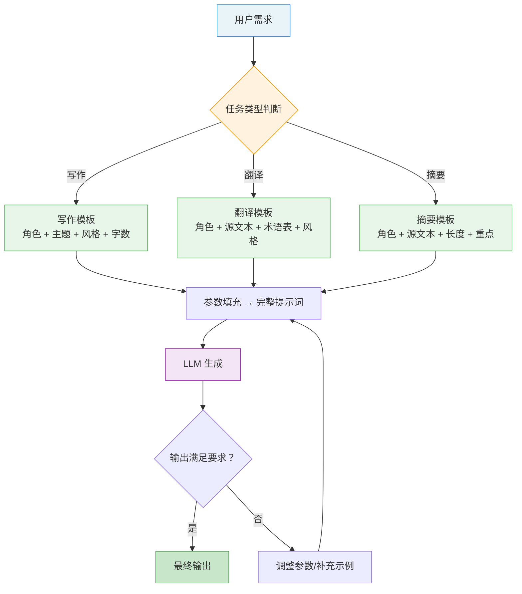

# 文本生成场景（Writing/Translation/Summarization）

## 概念解释

文本生成场景模板是一套针对写作（Writing）、翻译（Translation）、摘要（Summarization）三类常见文本任务的标准化提示词框架。它的核心思路是：把"角色定义 + 任务描述 + 约束条件 + 输出格式"封装成可复用的模板，每次使用时只需填入具体参数（主题、源文本、目标语言等），就能稳定产出高质量文本。

为什么需要模板？直接对 LLM（大语言模型）说"写一篇文章"或"翻译这段话"，输出质量完全靠运气——模型不知道你要什么风格、多长篇幅、面向谁。OpenAI 官方 Prompt Engineering Guide 明确建议：提示词应当包含清晰的角色、具体的约束和期望的输出格式。模板就是把这些最佳实践固化下来，让每次生成都有章可循。

与传统的"想到什么写什么"式提示相比，模板化提示词的本质区别在于**参数化**：可变部分（主题、字数、风格）和不变部分（角色定义、输出结构）分离，类似于编程中的函数——定义一次，调用多次。

## 关键结构

文本生成模板由五个核心要素组成，它们的配合决定了输出质量：

| 要素 | 作用 | 说明 |
|------|------|------|
| 角色定义（Role） | 设定模型的身份和专业视角 | 如"你是资深科技记者"会激活新闻写作相关知识 |
| 任务描述（Task） | 明确要完成的具体工作 | 回答"做什么"，越具体越好 |
| 约束条件（Constraints） | 限定输出的边界 | 字数、风格、目标读者、禁止内容等 |
| 参考输入（Reference） | 提供源材料或背景信息 | 翻译和摘要的源文本，写作的关键数据 |
| 输出格式（Format） | 定义期望的输出结构 | 如"标题 + 导语 + 正文 + 结论" |

### 要素 1：角色定义（Role）

角色定义是模板的"身份声明"。不同角色会让模型激活不同的知识和表达方式：

- "你是一位资深科技记者" → 激活新闻写作风格、事实核查意识
- "你是一位专业英中翻译" → 激活术语一致性、中文表达习惯
- "你是一位编辑，擅长提炼核心信息" → 激活信息压缩、逻辑梳理能力

Google Prompt Engineering 白皮书将这种做法归类为 System Prompting（系统提示），即用全局指令设定模型的行为基调。

### 要素 2：任务描述（Task）

任务描述回答"在这个角色的基础上，具体要做什么"。模糊的任务描述是输出质量差的首要原因：

- 模糊："写一篇关于 AI 的文章" → 模型不知道写多长、什么角度、给谁看
- 清晰："写一篇 800 字的深度分析，分析 AI 对编程工作的影响，目标读者是程序员" → 方向明确

### 要素 3：约束条件（Constraints）

约束条件是控制输出的"参数面板"，常见维度包括：

- **字数/段落数**：如"800-1000 字"或"3-4 个段落"
- **文体风格**：正式/非正式、学术/通俗、幽默/严肃
- **目标读者**：初学者/专家/管理者
- **禁止内容**：避免敏感话题、特定表达方式

### 要素 4：参考输入（Reference）

对不同任务类型，参考输入的形式不同：

- **写作**：关键词列表、数据素材、背景信息
- **翻译**：待翻译的源文本 + 术语表（Glossary，专业术语的统一翻译对照表）
- **摘要**：待摘要的完整文档 + 重点关注方向

OpenAI 的研究表明，提供参考文本能显著减少 Hallucination（幻觉，指模型编造不存在的信息）。

### 要素 5：输出格式（Format）

通过结构化指令定义期望的输出形式，例如：

```
请按以下格式输出：
1. 标题
2. 核心观点（一句话）
3. 正文（3-4 个段落）
4. 关键要点（列表形式）
```

## 核心原理

### 原理说明

文本生成模板的工作机制分为四步：

**第 1 步：需求解析。** 根据用户的任务需求，确定任务类型（写作/翻译/摘要），选择对应的模板。

**第 2 步：参数填充。** 将具体参数（主题、源文本、风格、字数等）填入模板的可变位置，生成完整的提示词。这一步类似于调用函数时传入参数。

**第 3 步：模型生成。** LLM 接收完整提示词后，根据角色定义激活对应领域知识，在约束条件的限制下生成内容，并按指定格式组织输出。

**第 4 步：质量校验。** 检查输出是否满足要求（字数、格式、风格）。如果不满足，调整参数或补充示例后重新生成。

关键点：模板的价值不在于"写一个很长的提示词"，而在于**把有效的提示策略固化为可复用的结构**。Google 白皮书强调，好的提示词应当"简洁且清晰"，模板帮助实现的正是这一点——每次使用时不需要重新思考提示结构，只需关注具体参数。

### Mermaid 图解



图中的核心流转：不同任务类型对应不同模板，但都经过"参数填充 → 生成 → 校验"的统一流程。校验不通过时回到参数调整环节，形成迭代优化闭环。

### 运行示例

以下示例展示三种模板的最小结构——如何用参数化方式组织提示词。

```python
# 基于 openai>=1.0.0 验证（截至 2026-03）
import os
from openai import OpenAI

client = OpenAI(api_key=os.getenv("OPENAI_API_KEY"))

# ========== 写作模板 ==========
writing_template = """你是一位资深科技记者。
请围绕"{topic}"撰写一篇深度分析文章。
目标读者：{audience}
风格：{style}
字数：{word_count}
输出结构：标题 → 导语（1-2 句） → 正文（3 段） → 结论
"""

# ========== 翻译模板 ==========
translation_template = """你是专业英中翻译。
请将以下英文翻译成中文：
{source_text}
风格：{style}
术语表：API Key = API 密钥, Token = 令牌, Rate Limit = 速率限制
要求：避免直译，符合中文表达习惯。直接输出译文。
"""

# ========== 摘要模板 ==========
summary_template = """你是专业编辑，擅长提炼核心信息。
请为以下文本创建{length}字摘要：
{source_text}
重点关注：{focus}
输出结构：核心观点（1-2 句） → 关键细节（3-5 条） → 结论（1 句）
"""

# 使用写作模板
prompt = writing_template.format(
    topic="AI 对编程工作的影响",
    audience="程序员",
    style="深度分析，兼具可读性",
    word_count="800-1000 字"
)

response = client.chat.completions.create(
    model="gpt-4o-mini",
    messages=[{"role": "user", "content": prompt}],
    temperature=0.7   # 写作任务用较高温度增加创意性
)
print(response.choices[0].message.content)
```

三个模板对应三种任务类型，结构一致：角色 → 任务 → 约束 → 输出格式。`temperature` 参数根据任务类型调整：写作 0.7（鼓励创意）、翻译 0.3（保持一致性）、摘要 0.5（平衡准确与流畅）。

## 易混概念辨析

| 概念 | 与文本生成模板的区别 | 更适合关注的重点 |
|------|---------------------|------------------|
| Few-Shot Prompting（少样本提示） | 通过示例引导模型，强调"给例子看" | 格式约束、分类任务 |
| Chain-of-Thought（思维链） | 引导模型展示推理过程，强调"怎么想" | 复杂推理、多步计算 |
| Prompt Chaining（提示链） | 多个提示词任务串联执行，强调"多步协作" | 多阶段工作流，如"写作 → 翻译 → 摘要" |
| System Prompting（系统提示） | 设定全局行为规范，是模板中的一个组成部分 | 安全防护、一致性控制 |

核心区别：

- **文本生成模板**：面向特定任务类型的完整提示词框架，核心是"参数化复用"
- **Few-Shot Prompting**：一种通用的提示技术，可以作为模板的组成部分（在模板中嵌入示例）
- **Chain-of-Thought**：关注推理过程，通常用于逻辑/数学任务，而非写作翻译摘要
- **Prompt Chaining**：将多个模板串联使用，是模板的上层应用方式

## 适用边界与局限

### 适用场景

1. **批量内容生产**：电商需要为数百个商品写描述，新闻编辑室需要快速生成报道。模板化提示保证风格统一、效率可控。
2. **多语言翻译与本地化**：软件界面文案、技术文档的翻译需要术语一致。模板中内置术语表能有效保障翻译质量。
3. **文档摘要与信息提炼**：从合同、研究报告、会议记录中提取核心信息。模板指定关注重点和输出结构，避免摘要跑偏。
4. **团队协作标准化**：多人使用同一套模板，确保不同人产出的内容风格一致，降低新人上手成本。

### 不适合的场景

1. **高度创意的文学创作**：诗歌、小说等需要突破模板限制的场景，过度结构化会扼杀创意。
2. **需要实时信息的任务**：模板无法弥补模型知识截止日期的限制，涉及最新事件的写作需要结合 RAG（检索增强生成）。

### 局限性

1. **初期设计成本**：一个好模板需要反复测试才能找到最优的角色描述、约束条件和输出格式组合，可能需要数十次迭代。
2. **模型版本依赖**：不同模型（或同一模型的不同版本）对同一模板的响应可能不同。OpenAI 建议生产环境固定模型快照版本（如 `gpt-4.1-2025-04-14`）。
3. **输出可控性有限**：即使有明确的字数约束，模型的实际输出长度仍可能偏离目标，需要后处理验证。

## 常见误区

| 常见误区 | 正确理解 |
|----------|----------|
| "提示词越长越好，把所有要求都写进去" | 简洁清晰优先。Google 白皮书强调"如果你自己都觉得指令难以遵循，模型也会挣扎"。冗余信息会增加成本并可能引起模型混淆 |
| "一个万能模板适用所有场景" | 写作、翻译、摘要的核心需求不同：写作需要创意空间，翻译需要术语一致，摘要需要信息压缩。每种任务都需要专门设计的模板 |
| "有了模板就不需要迭代了" | 模板是起点而非终点。实际使用中需要根据输出效果持续调整参数，Prompt Engineering 本质上是一个迭代过程 |
| "示例（Few-Shot）越多越好" | 通常 1-2 个高质量示例就足够。过多示例会占用上下文窗口、增加 token 成本，且可能导致 Over-prompting（过度提示）现象 |
| "翻译和写作可以用同样的 temperature" | 不同任务适合不同的温度参数。写作用 0.7 增加创意，翻译用 0.3 保持一致性，摘要用 0.5 平衡准确与流畅 |

## 思考题

<details>
<summary>初级：文本生成模板的五个核心要素分别是什么？为什么"角色定义"对输出质量有显著影响？</summary>

**参考答案：**

五个核心要素是：角色定义、任务描述、约束条件、参考输入、输出格式。角色定义的影响在于它决定了模型激活哪部分知识和表达方式。"科技记者"会触发新闻写作风格和事实核查意识，"专业翻译"会触发术语一致性和目标语言表达习惯。没有角色定义时，模型使用"通用助手"模式，输出往往缺乏针对性。

</details>

<details>
<summary>中级：如果你要为一个电商平台设计"商品描述生成模板"，需要包含哪些参数？temperature 应该设多少？请说明理由。</summary>

**参考答案：**

参数应包括：商品名称、商品特点/卖点列表、目标受众（如年轻人/家庭主妇）、文案风格（如活泼/专业）、字数限制、禁止内容（如夸大宣传）。temperature 建议设 0.6-0.7：商品描述需要一定创意来吸引顾客，但又不能太天马行空导致与商品实际不符。如果追求统一的品牌调性，可以降到 0.5。

</details>

<details>
<summary>中级/进阶：你需要设计一个三步 Prompt Chaining（提示链）工作流：先用中文写一篇产品介绍，再翻译成英文，最后生成一个 50 字的英文摘要。每一步应该如何设计模板？步骤之间如何传递信息以保持一致性？</summary>

**参考答案：**

三步设计：(1) 写作模板：角色设为"产品文案专家"，约束字数 300-500 字，指定输出结构；(2) 翻译模板：角色设为"专业中英翻译"，将第一步的输出作为源文本传入，附上产品相关术语表确保关键词翻译一致；(3) 摘要模板：角色设为"英文编辑"，将第二步的英文翻译作为源文本，限制 50 字。信息传递的关键是：在翻译模板中内置术语表（确保品牌名、产品特性等关键词的翻译统一），在摘要模板中指定"保留产品核心卖点"作为重点关注方向。每一步的 temperature 依次为 0.7、0.3、0.5。

</details>

## 参考资料

1. OpenAI. "Prompt Engineering Guide." https://platform.openai.com/docs/guides/prompt-engineering
2. OpenAI. "Text Generation Guide." https://platform.openai.com/docs/guides/text
3. Lee Boonstra / Google. "Whitepaper on Prompt Engineering." https://www.kaggle.com/whitepaper-prompt-engineering
4. DAIR.AI. "Prompt Engineering Guide - Text Summarization." https://www.promptingguide.ai/prompts/text-summarization
5. DAIR.AI. "Prompt Engineering Guide - Examples." https://www.promptingguide.ai/introduction/examples

---
